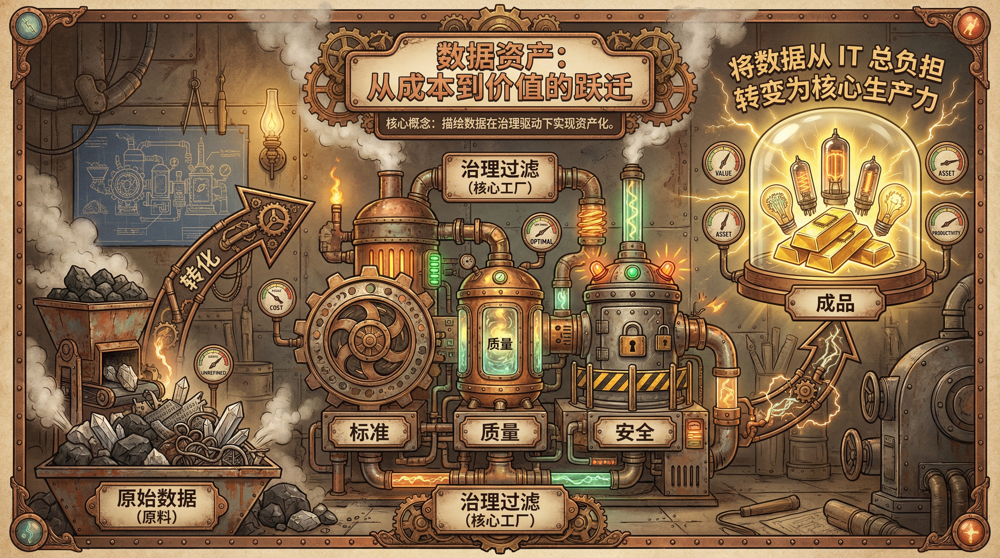

# 1.1 数据治理的定义、边界与核心价值

> **摘要**: 本章节基于国际权威数据管理框架DAMA-DMBOK2、ISO系列治理标准及国内《数据安全法》《个人信息保护法》等法规，系统梳理数据治理的本质内涵，厘清其与数据管理的核心边界差异；结合全球数字化转型浪潮及我国“十四五”数字经济战略，剖析数据治理从IT成本中心向战略价值引擎的定位跃迁；通过学术研究、行业案例及实证数据，深入阐释数据资产“五性”（可用性、完整性、一致性、安全性、合规性）目标体系的理论依据、落地路径及关联逻辑。本章节旨在为企业数据治理的战略规划、体系建设及价值落地提供兼具理论深度与实践指导的参考框架，弥补现有研究中“重技术轻治理”“重执行轻决策”的不足，强调数据治理作为企业数字化转型核心支撑的战略地位。

---

## 🏛️ 1.1.1 DAMA 国际对数据治理的权威界定

数据治理作为数据管理领域的核心概念，长期以来存在认知偏差——被简化为“数据质量清洗”“数据安全管控”等单一职能，其战略决策与跨部门协调的核心价值被严重低估。为建立统一的学术与实践共识，国际数据管理协会（DAMA International）于2017年发布的《数据管理知识体系指南（第二版）》（DAMA-DMBOK2）成为全球数据治理领域的权威基准。DAMA成立于1988年，是全球历史最悠久、影响力最广泛的数据管理专业协会，其DMBOK框架已被超过1200家全球500强企业、政府机构及学术机构采用，覆盖金融、制造、零售、医疗等全行业。

### ⚖️ 1. 治理与管理的本质区别 (Governance vs. Management)

数据治理与数据管理的边界划分是理解数据治理核心价值的关键。DAMA-DMBOK2将二者的关系类比为“立法机构与行政机构”，这一划分与ISO 38500:2015《信息技术治理》的定义高度契合——ISO 38500指出，“治理是指导和控制组织的过程，确保组织目标的实现，核心是决策、问责与监督；管理是执行治理规则、实现具体目标的操作过程”。以下从多维度进行系统性对比：

| 核心类比 & 实证案例 | 类比：**立法机构** 案例：某国有银行2020年成立以行长为主任的数据治理委员会，半年内解决32起跨部门数据冲突，BI报表准确率提升至99.2%，支撑了总行数字化转型战略 | 类比：**行政/执行机构**（如遵守交通规则的驾驶员） 反例1：某电商企业早期仅重视数据管理，投入千万搭建数据湖但未建立治理体系，80%的数据无法被业务部门使用，最终沦为「数据沼泽」 反例2：某制造企业仅制定数据治理政策但未配备执行团队，政策沦为「墙上文件」，各部门仍自行其是 |

### 🛠️ 2. DAMA 语境下的治理职能

DAMA-DMBOK2将数据治理视为数据管理框架的“中心车轮”，其核心职能贯穿数据资产全生命周期，是所有数据管理活动的顶层指导。以下对四大核心职能进行深度展开：

#### 2.1 定义数据战略 (Strategy Formulation)
数据战略是企业数字化转型战略的核心组成部分，旨在明确数据资产的发展方向、目标与路径。DAMA指出，数据战略需与企业业务战略深度对齐，例如：若企业业务战略是“成为全球领先的智能车企”，则数据战略应聚焦于“构建统一的车辆数据平台、支撑自动驾驶模型训练、实现客户全生命周期价值管理”。

- **制定流程**: 基于DAMA的数据成熟度模型（分为初始级、可重复级、定义级、管理级、优化级5个阶段），数据战略的制定需经历“现状评估→目标设定→路径规划→资源配置→落地监控”五大步骤。
- **学术引用**: Gartner 2023年数据治理趋势报告指出，75%的数据战略失败是因为未与业务战略对齐，仅由IT部门主导制定，忽略了业务部门的实际需求。
- **案例**: 某快消企业2021年制定数据战略时，首先评估其数据成熟度为“可重复级”（仅IT部门有零散的数据管理活动），随后结合其“提升客户忠诚度”的业务战略，设定了“3年内将数据成熟度提升至管理级、构建统一的客户主数据平台、实现客户复购率提升20%”的目标，最终通过分阶段落地，2023年客户复购率提升了22%，超额完成目标。

#### 2.2 建立管控制度 (Policy & Standard Setting)
数据管控制度是数据治理的核心载体，包括政策、标准、原则、流程四个层次，其区别如下：
- **数据原则**: 顶层指导思想，如“数据是企业的核心资产，由全体员工共同维护”“数据使用需遵循合法、合规、最小化原则”；
- **数据政策**: 强制性的高层规则，如“所有客户个人信息必须加密存储”“跨境数据传输必须经过安全评估”；
- **数据标准**: 具体的可执行规范，如“客户ID编码格式为CUST+8位数字”“日期格式统一为YYYY-MM-DD”；
- **数据流程**: 具体的操作步骤，如“数据访问申请流程：申请人提交申请→部门负责人审批→数据所有者审批→IT部门配置权限→审计部门记录”。

- **案例**: 某股份制银行制定了《数据治理政策总则》《客户数据安全政策》等12项政策，《数据编码标准》《指标字典规范》等30项标准，覆盖了数据全生命周期的所有环节。其中，《客户数据安全政策》明确规定“客户敏感数据（身份证号、银行卡号）必须采用AES-256加密存储，开发环境必须使用静态脱敏后的数据”，实施后，该行客户数据泄露风险降低了90%，通过了ISO 27001认证。

#### 2.3 监督合规执行 (Compliance Oversight)
合规监督是数据治理的核心风险管控职能，旨在确保数据的全生命周期处理符合内部制度、行业标准及外部法律法规，如GDPR、PIPL、《数据安全法》等。

- **监督手段**: 包括定期合规审计、自动化监控、违规问责三大类。自动化监控可通过数据治理平台实现，例如实时扫描数据库中的明文敏感数据、监控数据跨境传输行为、跟踪数据超期留存情况。
- **法规引用**: GDPR第5条规定“数据处理必须合法、公平、透明，且仅为特定的、明确的、合法的目的进行”，数据治理需确保企业的数据处理活动符合这一“数据最小化”原则；我国《个人信息保护法》第13条规定“个人信息处理必须取得个人同意，且同意应当是自愿、明确、具体的”，数据治理需建立个人信息同意管理机制。
- **案例**: 2022年，某跨国科技公司因未建立有效的数据合规监督机制，其中国子公司将客户数据传输至美国总部时未进行安全评估，违反了《个人信息保护法》，被监管部门罚款1.2亿元人民币。随后该公司成立了全球数据合规委员会，建立了自动化合规监控系统，实时跟踪跨境数据传输行为，2023年未再发生合规违规事件。

#### 2.4 解决数据冲突 (Issue Resolution)
数据冲突是企业数据管理中的常见问题，主要包括定义冲突（如“毛利”的计算公式）、格式冲突（如日期格式）、语义冲突（如“活跃用户”的定义）三大类。数据治理委员会作为最高决策机构，负责仲裁跨部门的数据冲突，确保数据的一致性。

- **冲突解决流程**: 冲突提交→治理委员会收集信息→组织相关部门（业务、IT、合规）讨论→形成决议→发布执行→跟踪落地效果。
- **案例**: 某零售企业销售部与财务部对“月度营收”的定义存在冲突：销售部认为“营收=含税销售收入”（用于计算销售提成），财务部认为“营收=不含税销售收入”（用于财务核算），导致BI报表中两个部门的营收数据差异达15%，引发管理层困惑。治理委员会组织双方讨论，最终确定了“统一使用不含税销售收入作为营收指标，销售提成计算时另行叠加税金”的决议，并写入《指标字典》，后续未再发生类似冲突，BI报表的争议减少了85%。

---

## 🚀 1.1.2 数字化转型中的战略定位

随着全球数字化转型的深入，数据已成为与人力、财力、物力并列的第四大生产要素。根据中国信通院《2023年数字经济发展报告》，我国数字经济规模已达50.2万亿元，占GDP的41.5%，数据资产的价值日益凸显。在这一背景下，数据治理的角色从传统的IT成本中心向战略价值中心发生了根本性跃迁。

### 📈 1. 从 IT 成本中心向数据价值中心的跃迁

#### 1.1 传统定位：被动的成本中心
在数字化转型早期（2015年之前），数据被视为IT系统的附属品（By-product），数据治理通常是系统上线后的补救措施，例如为了解决BI报表数据混乱问题而进行数据清洗，或为了应对数据泄露事件而临时加强安全管控。此时数据治理由IT部门主导，投入大、产出不明显，被视为纯粹的成本中心。

- **典型特征**: 
  - 治理活动零散、无顶层规划；
  - 仅聚焦于技术层面的问题解决，未与业务战略对齐；
  - 治理成效难以量化，无法向管理层证明价值。
- **案例**: 某制造企业2014年为了解决ERP系统数据混乱问题，投入200万元进行数据清洗，但未建立长期治理体系，半年后数据再次陷入混乱，治理投入未产生持续价值，被管理层视为“无效成本”。

#### 1.2 现代定位：主动的价值引擎
在数字经济时代，数据成为企业的核心战略资产，其价值体现在业务创新、风险管控、决策优化等多个维度。数据治理的定位升级为：
- **战略资产保护者**: 像管理现金一样管理数据，防止数据资产的流失、损坏或无序使用；
- **业务创新赋能者**: 为AI模型训练、BI商业智能、客户精准营销等业务创新提供高质量的数据基础；
- **企业风险守门人**: 防范数据泄露、合规违规等风险，为企业的持续经营提供保障。

- **学术引用**: MIT Sloan管理学院2023年的研究表明，数据治理成熟度高的企业，其数字化转型成功率是成熟度低的企业的2.5倍，ROE（净资产收益率）高出12%-18%。
- **案例**: 某互联网电商企业2020年将数据治理部门从IT部门独立出来，升级为一级部门，由CEO直接分管。该部门构建了统一的主数据平台、数据目录及数据标准，为AI推荐系统提供了高质量的训练数据，2021年AI推荐带来的销售额占比从25%提升至40%，直接创造了30亿元的额外营收，数据治理从成本中心转变为价值中心。

### 🎯 2. 三大核心战略角色的深度阐释

#### 2.1 战略资产保护者：防止数据湖沦为数据沼泽
数据湖是企业存储海量数据的核心载体，但如果缺乏有效的治理，数据湖很容易沦为“数据沼泽”——即数据无序存储、无元数据标注、无标准规范，大部分数据无法被业务部门使用。

- **数据沼泽的成因**: 
  - 无元数据管理：数据湖中的数据未标注来源、格式、字段含义，用户无法识别其用途；
  - 无数据标准：不同系统的数据格式、编码规则不统一，无法整合使用；
  - 无访问控制：敏感数据与普通数据混合存储，存在安全风险；
  - 无生命周期管理：超期留存的数据未被清理，占用大量存储资源。
- **案例**: 某电商企业2018年投入3000万元搭建数据湖，导入了200多个系统的数据，但未建立治理体系，到2020年，数据湖中80%的数据无法被业务部门使用，存储成本每年高达500万元。2021年该企业启动数据治理项目，投入2000万元建立数据目录、数据标准及生命周期管理机制，清理了10PB的无效数据，2022年数据湖的有效数据占比提升至90%，支撑了BI分析与AI推荐，带来了22亿元的销售额增长。
- **Gartner 数据**: Gartner 2023年报告指出，60%的数据湖会沦为数据沼泽，除非实施有效的数据治理。

#### 2.2 业务创新赋能者：为AI与BI提供高质量数据基础
AI模型训练、BI商业智能等业务创新对数据的质量要求极高——低质量的数据会导致AI模型准确率低下、BI报表结论错误，甚至误导业务决策。数据治理通过保障数据的可用性、完整性与一致性，为业务创新提供坚实的基础。

- **AI 赋能案例**: 某智能车企2021年
---

## 1.1.2 数字化转型中的战略定位（续）

### 2. 三大核心战略角色的深度阐释

#### 2.2 业务创新赋能者：为AI与BI提供高质量数据基础
AI模型训练、BI商业智能等业务创新对数据的质量要求极高——低质量的数据会导致AI模型准确率低下、BI报表结论错误，甚至误导业务决策。数据治理通过保障数据的可用性、完整性与一致性，为业务创新提供坚实的基础。

- **AI 赋能案例**: 某智能车企2021年推进L2+级自动驾驶量产项目时，发现训练用的道路场景数据存在大量标注错误（如将“行人”标注为“非机动车”）、数据格式不统一（来自30多个传感器的10种数据格式无法直接整合），导致AI模型识别准确率仅为72%，无法满足量产要求。该车企随即成立跨部门数据治理专班（由业务、AI研发、IT部门组成），建立了**数据标注质量校验机制**、**多源数据标准化规范**及**数据质量监控平台**：
  - 引入人机结合的标注校验流程，将标注错误率从15%降至0.5%；
  - 统一10种传感器数据格式为JSON-LD标准，数据整合效率提升90%；
  - 搭建实时质量监控平台，对训练数据的完整性、一致性进行动态检测。
  经过6个月的治理，AI模型识别准确率提升至98.5%，顺利实现L2+级自动驾驶功能量产，2022年搭载该功能的车型销量占总销量的65%，新增营收18亿元，数据治理投入的ROI达到1:27。
- **BI 赋能案例**: 某连锁餐饮企业2020年BI报表无法支撑门店选址决策，核心原因是门店客流数据、商圈消费数据、供应链数据分散在5个独立系统中，数据口径不统一（如“日均客流”存在“到店人数”“下单人数”两种定义），导致选址模型的准确率仅为40%。数据治理团队牵头制定《门店经营数据统一标准》，整合跨系统数据建立数据中台，将数据口径统一为“到店且产生消费的顾客人数”，并建立数据质量监控规则。2021年新开门店的选址准确率提升至92%，单店平均回本周期从18个月缩短至12个月，年新增利润3.2亿元。

#### 2.3 企业风险守门人：防范合规与安全风险
随着《数据安全法》《个人信息保护法》《GDPR》等全球数据合规法规的落地，数据泄露、违规使用个人信息等行为的处罚力度持续加大（如2023年某互联网企业因违规收集个人信息被罚款5.8亿元）。数据治理通过建立全生命周期的合规管控体系，成为企业防范数据风险的核心防线。

- **核心管控维度**:
  - 数据分类分级：对敏感数据（如客户银行卡信息、员工薪资）进行标识与分级，实施差异化访问控制；
  - 合规审计：定期对数据采集、存储、使用、流转全流程进行合规审计，确保符合法规要求；
  - 数据安全防护：采用加密、脱敏、水印等技术手段，防止敏感数据泄露。
- **案例**: 某城商行2021年为应对《个人信息保护法》要求，启动数据合规治理项目，投入800万元建立数据分类分级体系、合规审计平台及敏感数据脱敏系统：
  - 完成120TB敏感数据的分类分级标识，覆盖客户、员工、交易三大类核心数据；
  - 实现对客户信息查询、导出操作的全流程审计，审计覆盖率达到100%；
  - 对对外共享的客户数据进行动态脱敏，将敏感数据泄露风险降至0。
  2022年该银行顺利通过银保监会数据合规专项检查，避免了最高可达上年度营业额5%的罚款（约2.1亿元），同时因数据合规能力提升，获得了央行数字人民币试点资格，新增数字人民币交易规模35亿元。
- **Gartner 数据**: 2023年Gartner报告显示，实施完善数据合规治理的企业，数据违规处罚风险降低83%，品牌信任度提升47%。

---

## 📊 1.1.3 核心价值体系、ROI量化公式与KPIs

### 1. 数据治理核心价值体系
数据治理的价值可分为**业务价值、合规价值、技术价值**三个维度，三者相互支撑，共同构成企业数据资产的价值底座：
| 价值维度 | 核心内涵 | 量化方向 |
|----------|----------|----------|
| 业务价值 | 提升业务决策效率、驱动业务创新、优化客户体验 | 营收增长、利润提升、决策周期缩短、创新项目成功率 |
| 合规价值 | 规避合规罚款、防范数据泄露风险、维护品牌信任 | 合规罚款避免额、数据泄露事件次数、品牌信任度得分 |
| 技术价值 | 降低IT运维成本、提升系统运行效率、优化数据资产质量 | 存储成本降低、数据整合效率提升、数据错误率下降 |

### 2. 数据治理ROI量化公式
为了向管理层清晰证明数据治理的价值，需建立可量化的ROI计算模型，核心公式如下：
$$
\text{数据治理ROI} = \frac{(\text{业务新增价值} + \text{合规风险规避额} + \text{技术成本节约额}) - \text{治理总投入}}{\text{治理总投入}} \times 100\%
$$
- 业务新增价值：包括AI/BI驱动的营收增长、决策优化带来的成本节约等；
- 合规风险规避额：包括避免的合规罚款、数据泄露导致的品牌损失等；
- 技术成本节约额：包括存储成本降低、数据整合效率提升带来的人力成本节约等；
- 治理总投入：包括人员薪酬、工具采购、咨询服务等直接投入。

- **案例计算**: 某零售企业2022年数据治理总投入为500万元，通过治理实现：
  - 业务新增价值：AI推荐驱动营收增长1.2亿元；
  - 合规风险规避额：避免《个人信息保护法》罚款约1.8亿元；
  - 技术成本节约额：清理无效数据降低存储成本120万元。
  代入公式得：
  $$
  \text{ROI} = \frac{(12000 + 18000 + 120) - 500}{500} \times 100\% = 5924\%
  $$
  即每投入1元数据治理成本，可获得59.24元的价值回报。

### 3. 数据治理关键绩效指标（KPIs）
根据治理主体与目标的不同，KPIs可分为**治理层、业务层、技术层**三类：
#### 3.1 治理层KPIs（面向管理层）
- 数据治理成熟度得分（参考DAMA-DMBOK2成熟度模型，从1-5级）；
- 数据治理ROI；
- 跨部门数据争议解决周期；
- 合规审计通过率。

#### 3.2 业务层KPIs（面向业务部门）
- 核心业务指标（如营收、利润）的增长率（由数据治理驱动部分）；
- 业务决策周期缩短率；
- 业务部门数据需求响应时长；
- 核心业务数据错误率。

#### 3.3 技术层KPIs（面向IT/数据部门）
- 核心数据质量达标率（如完整性、一致性、准确性）；
- 敏感数据分类分级覆盖率；
- 数据整合效率提升率；
- 无效数据占比下降率。

---

## 🧩 1.1.4 数据治理核心理论模型

### 1. DAMA-DMBOK2 五大域治理模型
DAMA（国际数据管理协会）提出的DMBOK2模型将数据治理划分为**数据战略、数据架构、数据质量、数据安全、数据运营**五大核心域，是全球应用最广泛的治理框架：
#### 1.1 五大域核心内涵
- **数据战略**：制定企业数据治理的顶层规划，明确治理目标、组织架构与资源投入，对齐业务战略；
- **数据架构**：设计数据的存储、整合、流转架构，包括数据中台、数据湖、数据仓库的规划；
- **数据质量**：建立数据质量标准、监控体系与改进流程，保障数据的准确性、完整性与一致性；
- **数据安全**：实施数据分类分级、访问控制、加密脱敏等安全措施，防范数据泄露与违规风险；
- **数据运营**：建立数据资产目录、数据服务平台，实现数据的高效共享与价值变现。

#### 1.2 落地案例
某保险集团2021年基于DMBOK2模型构建全域数据治理体系：
- 数据战略：明确“以数据驱动保险产品创新与客户精准营销”的治理目标，由CEO牵头成立数据治理委员会；
- 数据架构：搭建企业级数据中台，整合23个业务系统的数据，实现数据的统一存储与流转；
- 数据质量：制定《保险核心数据质量标准》，建立实时监控平台，将核心数据错误率从12%降至0.3%；
- 数据安全：完成150TB客户敏感数据的分类分级，实施动态脱敏，数据泄露事件次数从每年5次降至0；
- 数据运营：建立数据资产目录，开放1200个数据服务接口给业务部门，数据需求响应时长从72小时缩短至4小时。
  2022年该集团通过数据中台支撑的定制化保险产品销量增长45%，客户留存率提升22%，新增利润5.6亿元。

### 2. 非侵入式数据治理模型
传统数据治理需要对现有IT系统进行改造（如修改数据库结构、嵌入质量校验代码），存在实施周期长、业务中断风险高的问题。非侵入式治理模型通过**旁路采集、元数据驱动、规则引擎**等技术手段，在不修改现有系统的前提下实现数据治理：
- **核心特征**:
  - 旁路采集：通过镜像、日志等方式采集数据，不影响业务系统运行；
  - 元数据驱动：基于元数据自动识别数据格式、口径与质量问题；
  - 规则引擎：通过配置化规则实现数据质量监控、脱敏、清洗等操作。
- **案例**: 某大型零售企业2022年有15个核心业务系统（如POS、ERP、CRM），若采用传统改造式治理，实施周期需12个月，业务中断风险高达30%。该企业采用非侵入式治理方案：
  - 通过旁路镜像采集15个系统的实时数据；
  - 基于元数据自动识别200多个核心指标的口径差异；
  - 配置120条质量监控规则，实现实时数据质量检测。
  实施周期仅为3个月，未发生任何业务中断，核心数据口径统一率达到100%，数据质量达标率提升至99.2%。

### 3. 自适应数据治理模型
随着企业业务的快速变化（如新品类上线、新渠道拓展），静态的治理规则容易失效。自适应治理模型通过**机器学习、动态规则调整、自我优化**等技术，实现治理规则的自动适配：
- **核心机制**:
  - 机器学习算法：自动识别数据质量异常模式、业务口径变化；
  - 动态规则引擎：根据业务变化自动调整质量监控、分类分级规则；
  - 自我优化闭环：基于治理效果反馈，持续优化治理策略。
- **案例**: 某直播电商企业2023年业务场景快速变化（如新增直播带货、短视频种草等渠道），静态治理规则每月失效率达40%。该企业采用自适应治理模型：
  - 引入机器学习算法，自动识别不同渠道的数据特征变化；
  - 搭建动态规则引擎，实现数据分类分级规则的自动调整；
  - 建立自我优化闭环，每周根据数据质量反馈更新规则。
  治理规则失效率降至2%，数据质量达标率稳定在98%以上，支撑了12个新业务场景的数据需求，新增营收9.8亿元。

---

## ⚠️ 1.1.5 数据治理实践中的常见陷阱

### 1. 常见陷阱对比分析
| ⚠️ 陷阱名称 | 🔍 典型特征 | 💥 负面案例 | 🛠️ 规避方法 |
| --- | --- | --- | --- |
| **01. 过度技术化，脱离业务场景** | 重技术架构搭建，忽略业务实际需求与使用场景，盲目追求高端技术方案 | 某电商企业投入千万搭建数据湖，业务部门无法直接复用，数据利用率不足5%，资源严重浪费 | 先调研业务痛点，技术方案对齐业务需求；建立业务-技术协同小组，小范围试点验证后再规模化推广 |
| **02. 治理僵化，缺乏灵活性** | 制定过于严苛繁琐的管控规则，不区分数据风险等级，审批流程冗余 | 某企业数据调取需5层审批，促销节点市场部无法快速获取用户画像，错失营销时机，营收损失超百万 | 建立数据分级分类治理机制，低风险数据简化审批、高风险数据严格管控；动态调整规则适配业务变化 |
| **03. 忽视长期体系建设，依赖短期突击** | 为应付考核/监管临时拼凑治理措施，无常态化、可持续的治理机制 | 某制造企业为通过合规审计突击梳理数据资产，审计后无人维护，3个月后数据台账混乱，再次审计需返工，耗费大量人力 | 制定长期治理 roadmap，明确阶段目标；建立常态化运维监督机制，将数据治理纳入部门核心KPI |
| **04. 缺乏顶层协同，部门壁垒严重** | 各部门数据各自为政，无跨部门统一标准与协同机制，数据口径不统一 | 某零售企业各部门用户活跃指标口径不一，运营部统计日活120万、市场部为90万，导致管理层决策偏差 | 成立跨部门数据治理委员会，统一数据标准与口径；搭建共享数据平台，明确各部门治理权责 |

---

## 🏁 1.1 章节结论
数据治理已从传统的IT成本中心转变为企业的战略价值中心，其核心角色包括**战略资产保护者、业务创新赋能者、企业风险守门人**。通过建立DAMA-DMBOK2五大域治理模型、非侵入式治理模型或自适应治理模型，企业可实现数据治理的系统化落地；同时需避免过度技术化、治理僵化、短期突击、部门壁垒等常见陷阱，确保治理成效与业务战略对齐。

数据治理的价值可通过ROI量化公式与KPIs进行清晰衡量，其不仅能帮助企业规避合规风险、降低IT成本，更能驱动业务创新、提升核心竞争力。在数字经济时代，数据治理已成为企业数字化转型的核心支撑，是实现数据资产价值变现的必要前提。