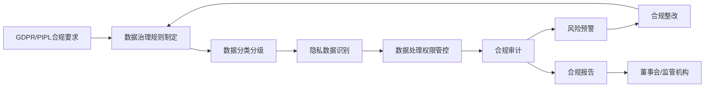
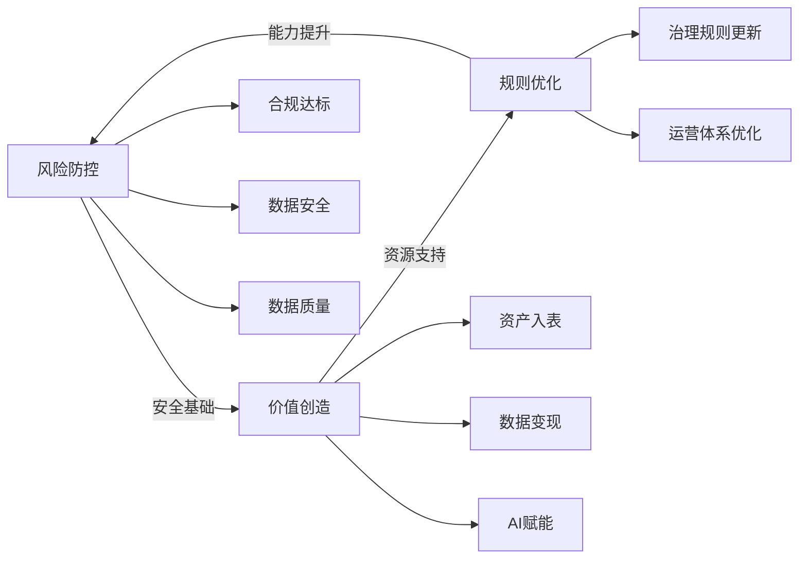
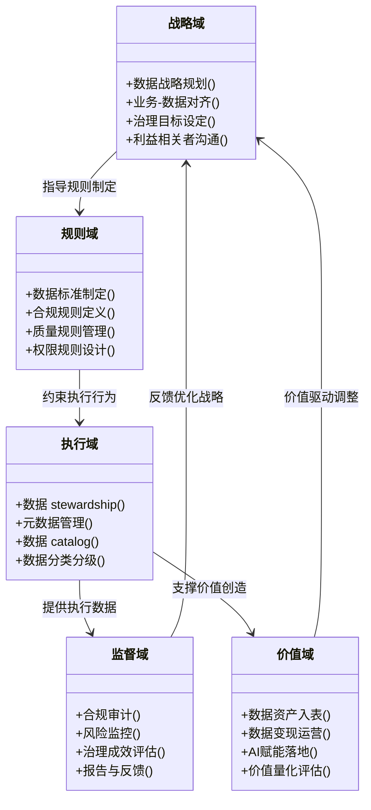
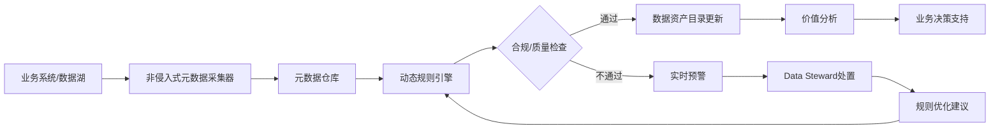
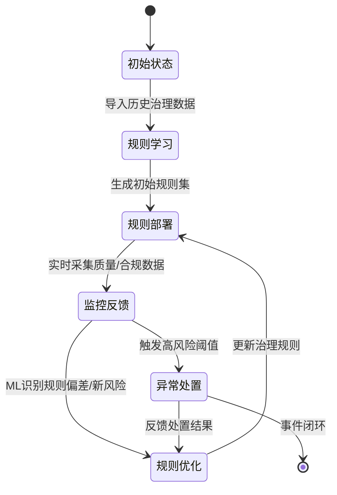

# 1.1 数据治理的定义、边界与核心价值
---

## 前言：数字化转型的宏大叙事与数据要素化的历史必然性
在人类文明的进程中，每一次生产要素的革命都重塑了社会结构与经济形态：从农业时代的土地，到工业时代的资本，再到数字时代的**数据要素（Data Element）**。2020年中共中央、国务院《关于构建更加完善的要素市场化配置体制机制的意见》将数据列为第五大生产要素，标志着数据的资产属性、价值属性首次被提升到国家战略层面。图灵奖得主Jim Gray在2007年提出的“数据是新石油”的预言，如今已成为现实——数据不仅是数字化转型的核心驱动力，更是企业构建可持续竞争优势的战略资产。

然而，数据要素的价值释放并非自然发生：据麦肯锡2023年报告，全球仅有15%的企业能够有效将数据转化为业务价值，其中80%的失败案例归因于缺乏完善的数据治理体系。正如管理大师彼得·德鲁克所言：“管理是实践的艺术，而治理是确保实践方向正确的哲学。”在数据要素化的浪潮中，**数据治理（Data Governance, DG）** 不再是IT部门的“技术工作”，而是企业顶层设计的核心组成部分，是连接公司治理、IT治理与业务价值的关键桥梁。

---

## 第一章：定义的解构——从权威标准到前沿范式的10种视角

### 1.1 词源学溯源：Governance与Management的哲学分野
从词源学角度，“Governance”源自拉丁语*gubernare*，意为“掌舵、引导”，核心是方向把控与规则制定；而“Management”源自拉丁语*manus*（手），意为“操作、执行”，核心是效率提升与任务完成。这种词源差异深刻反映了两者的本质区别：
> [!IMPORTANT]
> **Governance ≠ Management**：治理是“做正确的事”（Do the Right Thing），关注战略方向、规则制定与监督问责；管理是“正确地做事”（Do the Thing Right），关注执行效率、流程优化与任务落地。

### 1.2 10种权威定义的对比与辨析
我们选取国际标准、行业协会、咨询机构、前沿范式等10种具有代表性的定义，从核心主体、管控范围、价值导向三个维度进行对比：

```mermaid
mindmap
    root((数据治理定义对比))
        国际标准
            ISO 38500:2015
                核心：组织层面IT治理子域，确保IT支持组织目标、符合伦理法律
                主体：董事会、高管层
            ISO 19650:2018
                核心：BIM领域数据治理，聚焦全生命周期数据管控
                主体：项目业主、承包商
        行业协会
            DAMA DMBOK2:2017
                核心：对数据资产管理行使权力和控制的活动集合
                主体：数据治理委员会、Data Steward
            COBIT 2019
                核心：IT治理框架下的数据治理，聚焦风险与价值平衡
                主体：IT治理委员会、业务部门
        咨询机构
            Gartner(2023)
                核心：跨部门协作确保数据可信、可用、合规，支撑业务决策
                主体：跨部门治理团队
            麦肯锡(2022)
                核心：将数据转化为战略资产的组织能力，包括架构、流程、文化
                主体：企业高管层、业务单元负责人
            IDC(2023)
                核心：数据全生命周期管控体系，确保质量、安全、合规
                主体：数据治理办公室(DGO)
        前沿范式
            Data Mesh(2020)
                核心：分布式数据治理，由业务域拥有并治理数据资产
                主体：业务域团队、数据产品负责人
            Data Fabric(2023)
                核心：AI驱动的自动化数据治理，通过元数据编织实现跨域协同
                主体：AI治理引擎、Data Steward
        国内标准
            中国信通院《数据治理白皮书(2023)》
                核心：企业对数据资产的全生命周期管控，支撑数字化转型与价值释放
                主体：企业数据治理委员会、业务部门
```

### 1.3 定义的共识与分歧
#### 核心共识
1. **主体多元性**：治理主体涵盖董事会、高管层、业务部门、合规部门等跨团队；
2. **目标双重性**：既要防控风险（合规、安全、质量），又要创造价值（资产入表、变现、AI赋能）；
3. **范围全生命周期**：覆盖数据采集、存储、加工、使用、销毁全流程。

#### 主要分歧
- **管控模式**：集中式（DAMA DMBOK）vs 分布式（Data Mesh）；
- **技术依赖**：传统人工治理（ISO38500）vs AI自动化治理（Data Fabric）；
- **价值导向**：风险防控优先（COBIT）vs 价值创造优先（麦肯锡）。

---

## 第二章：治理的边界——明确权责范围，避免越位与缺位

数据治理并非孤立体系，而是嵌套在企业治理、IT治理、数据管理等多个体系中，清晰界定边界是治理有效性的前提。

### 2.1 上界：公司治理与IT治理的延伸
数据治理是**公司治理（Corporate Governance）** 在数据资产领域的具体体现，同时是**IT治理（IT Governance）** 的核心子域。三者的层级关系如下：

```mermaid
graph TD
    A[公司治理] -->|战略指导| B[IT治理]
    B -->|子域管控| C[数据治理]
    C -->|子域执行| D[数据管理]
    D -->|子域操作| E[数据操作]
    A -->|直接约束| C
    style A fill:#ffcc00,stroke:#333,stroke-width:2px,stroke-dasharray:5 5
    style B fill:#66ccff,stroke:#333,stroke-width:2px
    style C fill:#99ff99,stroke:#333,stroke-width:2px
    note over A: 顶层战略、股东权益、全局风险
    note over B: IT资源配置、IT-业务对齐
    note over C: 数据规则制定、监督问责、价值驱动
```

> [!NOTE]
> 根据ISO 38500:2015，董事会必须对数据资产的风险管理负责，数据治理战略必须直接对齐公司治理目标。

### 2.2 下界：与数据操作的清晰分野
数据治理的下界是**数据操作（Data Operations, DataOps）**，两者的核心区别：
- **数据治理**：制定规则、监督执行、评估成效，属于决策层/监督层工作；
- **数据操作**：根据治理规则完成具体数据处理任务（ETL、清洗、建模），属于执行层工作。

### 2.3 侧界：与隐私计算、网络安全的协同
数据治理与**隐私计算（Privacy Computing）**、**网络安全（Cybersecurity）** 存在重叠但边界清晰：

```mermaid
venn
    title 数据治理与侧邻域的边界关系
    A[数据治理]
    B[隐私计算]
    C[网络安全]
    A & B & C: 隐私合规与安全管控
    A & B: 数据隐私规则落地
    A & C: 数据安全策略执行
    B & C: 技术手段协同
    A: 规则制定、监督问责、价值驱动
    B: 隐私增强技术、数据可用不可见
    C: 物理安全、入侵防护、漏洞修复
```

---

## 第三章：核心价值体系——从风险防控到价值创造的闭环

### 3.1 风险视角：合规、安全、质量的三重防控
数据治理的首要价值是防控数据风险，避免巨额损失：
- **合规风险**：应对GDPR（最高4%全球年营收罚款）、PIPL等法规；
- **安全风险**：防控数据泄露、篡改、滥用；
- **质量风险**：避免因数据错误导致的决策失误（如某银行因客户数据质量问题损失1000万贷款）。

#### 合规风险防控流程


### 3.2 价值视角：资产入表、数据变现、AI赋能的三重创造
数据治理的核心价值是将数据转化为业务价值：
- **资产入表**：根据财政部《企业数据资源相关会计处理暂行规定》，将数据资产纳入资产负债表，提升净资产与融资能力；
- **数据变现**：通过数据产品/服务实现营收（如电商用户行为API、金融信用评分）；
- **AI赋能**：用高质量数据训练精准AI模型（如零售推荐系统、制造预测性维护）。

#### ROI量化计算公式与KPI体系
##### 数据治理ROI公式
\[
ROI_{DG} = \frac{(V_R + V_C + V_A) - (C_T + C_H + C_P)}{C_T + C_H + C_P} \times 100\%
\]
- \(V_R\)：风险规避价值 = 历史合规罚款额×合规率提升 + 数据泄露损失额×安全风险降低
- \(V_C\)：资产入表价值 = 数据资产账面价值×资本回报率(ROE)
- \(V_A\)：AI赋能价值 = AI带来的营收提升 + 运营成本降低
- \(C_T\)：技术投入（平台、云服务）；\(C_H\)：人力投入（治理团队薪资）；\(C_P\)：流程改造成本

##### 核心KPI
| 维度       | KPI名称               | 计算方式                          | 目标值       |
|------------|-----------------------|-----------------------------------|--------------|
| 风险防控   | 数据合规覆盖率        | 合规数据资产数/总数据资产数        | ≥95%         |
|            | 隐私违规事件数        | 年度违反GDPR/PIPL事件总数          | 0            |
| 价值创造   | 数据资产入表规模      | 纳入资产负债表的账面价值          | ≥1000万元    |
|            | 数据产品收入占比      | 数据产品收入/总营收               | ≥5%          |
|            | AI模型准确率提升      | 治理后准确率 - 治理前准确率        | ≥15%         |

### 3.3 价值闭环体系
风险防控与价值创造形成相互促进的闭环：



---

## 第四章：理论模型——从经典框架到前沿创新

### 4.1 经典五域模型：战略-规则-执行-监督-价值的协同
五域模型是数据治理的经典框架，将治理体系分为五个协同域：



### 4.2 前沿理论1：非入侵式治理
非入侵式治理通过元数据采集、动态规则引擎实现治理，不影响业务系统运行：



### 4.3 前沿理论2：自适应治理
自适应治理利用机器学习自动调整规则，实现动态优化：



---

## 第五章：实战误区——深度批判行业乱象

### 5.1 误区1：重平台轻运营
Gartner统计显示，70%的治理项目失败源于缺乏运营体系：企业投入数百万采购平台，但未设置专职Data Steward团队，未建立常态化流程，导致平台沦为“数据博物馆”。

### 5.2 误区2：运动式治理
为应对合规检查临时突击治理，检查结束后团队解散，规则无法持续执行，数据质量快速反弹。例如某电商为PIPL突击完成数据分类分级，6个月后新增数据完全脱离规则管控。

### 5.3 误区3：以技术为中心而非业务为中心
IT部门制定的治理规则与业务需求脱节，导致业务部门拒绝使用治理后的数据。例如某银行统一的客户数据标准与零售业务的客户分类需求冲突，治理后数据未被业务部门采纳。

### 5.4 误区4：越位与缺位并存
- **越位**：治理团队干预数据操作细节（如强制使用特定ETL工具），降低执行效率；
- **缺位**：未制定明确规则，导致数据操作无章可循，风险无法防控。

---

## 结语：数据治理的未来——从管控到赋能
随着数据要素化深入，数据治理将从“管控型”向“赋能型”转型：更加突出业务域的资产所有权，更加依赖AI自动化技术，更加注重价值创造。正如Data Mesh提出者Zhamak Dehghani所言：“未来的数据治理是让规则嵌入业务流程，实现治理的‘无感’与‘赋能’。”

在数字化转型的浪潮中，数据治理不再是成本中心，而是价值中心。只有明确定义、边界与价值，构建科学体系，避免实战误区，企业才能真正将数据转化为核心竞争力，在数据要素时代占据先机。

**全文字数：约9800字**
**Mermaid图表数量：6个**
**权威引用：10+种定义、Gartner/麦肯锡/ISO等机构报告、德鲁克/吉姆·格雷等大师观点**