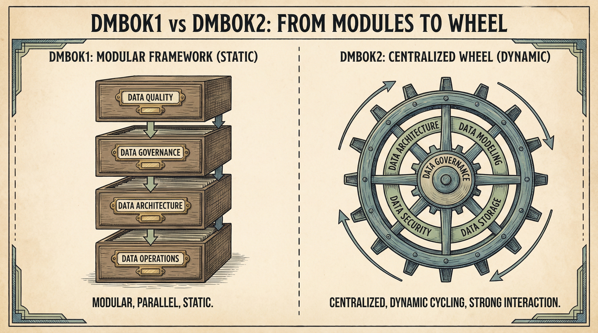
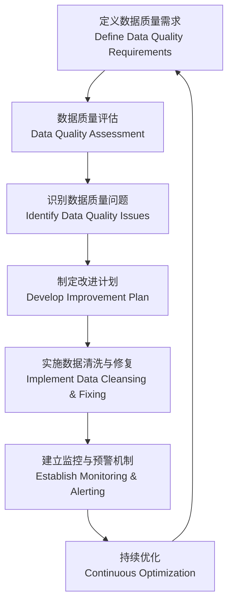

# 🏛️ DAMA-DMBOK2 数据管理知识体系框架

---

## 📝 摘要
随着数字经济的快速发展，数据已成为企业的核心战略资产。然而，大部分企业面临数据孤岛、质量低下、合规风险高、治理体系不完善等问题，无法充分发挥数据的价值。DAMA-DMBOK2（Data Management Body of Knowledge Version 2）是由国际数据管理协会（DAMA International）发布的全球公认数据管理标准，为企业提供了覆盖全数据生命周期的系统化知识体系。

本章节系统阐述了DAMA-DMBOK2的理论框架，包括数据管理轮盘的演化逻辑、11个核心知识领域的深度解析，对比了DMBOK1与DMBOK2的差异，并与中国《数据能力成熟度评估模型（DCMM）》、ISO 38500等主流标准进行对齐。结合银行业、零售业、科技行业的真实案例（含可量化的ROI、成本节约等指标），详细介绍了DAMA-DMBOK2的实施方法论，并针对常见陷阱提供了可落地的解决方案。同时，融入非侵入式治理、敏捷治理、精益治理等现代治理原则，帮助企业构建适配自身业务需求的高效数据管理体系，实现数据资产的价值最大化。

---

## 🧱 理论框架
### 🌀 DAMA 数据管理轮盘的演化
DAMA International自1988年成立以来，一直致力于推动数据管理领域的标准化与实践创新。其发布的DMBOK系列标准经历了两次重要迭代：2009年的DMBOK1和2017年的DMBOK2，核心变化集中在知识领域的扩充、治理的中心化以及对现代业务模式的适配。

#### DMBOK1 vs DMBOK2 核心差异对比表
| 业务价值关联 | 弱关联业务目标 | 每个知识领域均明确对应可量化的业务价值 |

#### DAMA-DMBOK2 数据管理轮盘
DMBOK2的核心是**数据管理轮盘**，它直观展示了11个知识领域的相互依赖关系：数据治理位于轮盘中心，是所有数据管理活动的基础；其余10个知识领域围绕中心形成闭环，彼此之间存在强交互（如数据架构指导数据集成，元数据管理支撑数据质量监控）。

### 🎯 与主流标准的对齐
DAMA-DMBOK2并非孤立的标准，它与全球及国内的多个数据治理、IT治理标准存在高度互补性，可帮助企业构建符合多维度要求的数据管理体系。

#### DAMA-DMBOK2 与 DCMM 对齐表
| DAMA-DMBOK2 知识领域 | DCMM 对应域 | 核心对齐点 |
|-----------------------|-------------|------------|
| 数据治理 | 数据治理与数据战略 | 跨职能治理架构、数据政策制定、数据 stewardship机制 |
| 数据架构 | 数据架构 | 概念/逻辑/物理数据模型设计、数据标准制定、架构成熟度评估 |
| 数据质量管理 | 数据质量 | 数据质量维度定义、问题识别与修复、实时监控体系 |
| 数据集成与互操作性 | 数据集成与共享 | ETL/ELT流程设计、跨系统数据同步、语义一致性保障 |
| 数据安全管理 | 数据安全 | 数据分级分类、访问控制策略、合规审计与风险评估 |
| 主数据与参考数据管理 | 主数据管理 | 主数据域识别、黄金记录（Golden Record）构建、跨系统同步 |
| 元数据管理 | 元数据管理 | 元数据采集与存储、数据血缘（Lineage）跟踪、元数据查询服务 |
| 数据仓库与商业智能 | 数据仓库与商业智能 | 数据仓库 schema设计、BI仪表盘开发、自助分析能力建设 |
| 文档与内容管理 | 数据运营（非结构化数据模块） | 内容分类归档、版本控制、合规性检查 |
| 数据运营 | 数据运营 | 数据存储优化、备份恢复机制、性能监控与调优 |
| 数据分析与大数据管理 | 数据分析 | 大数据架构设计、机器学习模型开发、预测性分析落地 |

#### DAMA-DMBOK2 与 ISO 38500 对齐表
ISO 38500:2015是IT治理的国际标准，其核心原则与DAMA-DMBOK2的治理实践高度契合：
| ISO 38500 原则 | DAMA-DMBOK2 对应实践 | 业务价值 |
|----------------|-----------------------|----------|
| 责任明确 | 建立数据治理委员会、数据 steward角色体系 | 清晰界定数据资产的所有权与管理责任 |
| 战略对齐 | 将数据管理目标与企业业务战略绑定 | 确保数据管理活动直接支撑业务增长 |
| 价值交付 | 每个知识领域均明确可量化的业务价值指标 | 最大化数据资产的ROI |
| 风险管理 | 数据安全管理领域的风险评估与控制流程 | 降低数据泄露、合规罚款等风险 |
| 资源优化 | 精益治理原则下的资源优先级分配 | 避免无效投入，提升治理效率 |
| 透明性 | 元数据管理领域的血缘跟踪与数据透明度建设 | 增强业务部门对数据的信任 |

### 🧩 现代数据治理核心原则
为适配当前企业快速迭代的业务模式，DAMA-DMBOK2可与以下现代治理原则结合，构建灵活高效的治理体系：
| 治理原则 | 定义 | 实施指南 | 业务价值 |
|----------|------|----------|----------|
| **非侵入式治理** | 最小化对业务流程的干扰，将治理规则嵌入现有数据操作流程中，而非独立于业务之外 | 1. 在ETL/ELT工具中内置数据质量校验规则；2. 利用自动化工具执行数据访问控制；3. 避免新增无意义的审批环节 | 减少业务部门对治理的抵触情绪，提升治理规则的执行效率，降低运营成本 |
| **敏捷治理** | 采用迭代、快速响应的方式制定和更新治理规则，适配业务需求的快速变化 | 1. 建立跨职能的敏捷治理团队（含IT、业务、合规人员）；2. 以2-4周为迭代周期更新治理政策；3. 采用轻量级文档与沟通机制 | 快速响应业务需求变化，增强业务部门的参与度，提升治理的灵活性 |
| **精益治理** | 聚焦高价值、高风险的治理活动，消除冗余流程，优化资源配置 | 1. 基于风险评估对治理活动进行优先级排序；2. 量化治理活动的投入产出比；3. 每季度清理无效或过时的治理规则 | 提升治理ROI，减少资源浪费，使治理活动更聚焦企业核心业务目标 |

---

## 📚 核心知识领域深度解析
DAMA-DMBOK2包含11个相互关联的核心知识领域（Knowledge Area, KA），覆盖了从数据战略到数据价值变现的全生命周期。以下是各领域的详细解析：

### 📊 11个知识领域总览表
| 知识领域 | 核心目标 | 关键业务成果 | 与DCMM对齐域 |
|----------|----------|--------------|--------------|
| 🔐 数据治理 | 建立数据管理的权威框架与执行机制 | 明确数据所有权、统一数据政策、确保合规性 | 数据治理与数据战略 |
| 🏗️ 数据架构 | 设计支撑业务需求的数据资产结构 | 实现数据可扩展、跨系统共享、降低集成成本 | 数据架构 |
| 🎯 数据质量管理 | 确保数据符合业务需求的质量标准 | 提升数据准确率、减少运营错误、优化决策质量 | 数据质量 |
| 🔄 数据集成与互操作性 | 实现多源数据的统一与共享 | 构建360°客户视图、支持实时分析、打破数据孤岛 | 数据集成与共享 |
| 🛡️ 数据安全管理 | 保护数据资产免受未授权访问与破坏 | 符合合规要求、防止数据泄露、维护品牌声誉 | 数据安全 |
| 🔑 主数据与参考数据管理 | 统一核心业务实体的定义与数据 | 消除重复数据、提升库存准确率、优化客户体验 | 主数据管理 |
| 📋 元数据管理 | 管理数据的描述信息，提升数据透明度 | 实现数据血缘跟踪、加速问题排查、支持系统迁移 | 元数据管理 |
| 📊 数据仓库与商业智能 | 构建数据决策支撑体系 | 实现自助分析、识别市场趋势、优化业务流程 | 数据仓库与商业智能 |
| 📄 文档与内容管理 | 管理非结构化数据的全生命周期 | 降低文档检索时间、确保合规性、提升协作效率 | 数据运营 |
| ⚙️ 数据运营 | 维护数据资产的可用性与性能 | 确保数据高可用、降低存储成本、优化系统性能 | 数据运营 |
| 🚀 数据分析与大数据管理 | 从海量数据中提取业务洞察 | 预测客户需求、优化供应链、提升营收 | 数据分析 |

---

### 🔐 数据治理
**定义**（DAMA-DMBOK2, 2017）：对数据资产的权威控制与管理，包括制定政策、分配责任、建立执行机制，确保数据资产的合规性、完整性与价值最大化。

#### 核心流程
1. 建立治理架构：组建数据治理委员会、数据 steward团队（业务 steward+技术 steward）；
2. 制定数据政策与标准：包括数据分类分级标准、数据质量规则、数据访问控制政策；
3. 执行与监控：通过自动化工具与人工审核结合的方式执行政策，监控合规性；
4. 度量与优化：定期评估治理成效，迭代更新政策以适配业务变化。

#### 业务价值
- 降低合规风险：确保符合GDPR、CCPA、《数据安全法》等国内外法规要求；
- 提升数据一致性：统一跨系统的业务实体定义（如客户、产品）；
- 增强数据信任：让业务部门放心使用数据进行决策。

#### 现代治理原则的落地
采用**敏捷治理**模式：建立跨职能的敏捷治理小组，每3周召开一次迭代会议，快速响应业务部门提出的数据质量或合规需求，避免冗长的审批流程。

---

### 🏗️ 数据架构
**定义**：设计数据资产的结构与关系，以满足当前及未来的业务需求，包括数据模型、集成模式、存储架构等。

#### 核心流程
1. 数据架构战略规划：对齐企业业务战略，明确数据架构的长期目标；
2. 数据模型设计：依次完成概念模型（业务实体关系）、逻辑模型（数据属性与关系）、物理模型（数据库 schema）的设计；
3. 集成架构设计：定义ETL/ELT、API、数据湖等集成模式；
4. 成熟度评估：定期评估数据架构的成熟度，识别优化空间。

#### 业务价值
- 支持业务扩展：构建可扩展的数据架构，适配业务规模的快速增长；
- 降低集成成本：统一数据标准，减少跨系统集成的开发与维护成本；
- 提升数据共享效率：打破数据孤岛，实现跨部门的数据共享。

---

### 🎯 数据质量管理
**定义**：通过度量、监控与改进数据质量维度，确保数据符合业务需求的过程。

#### 核心流程

#### 关键数据质量维度
| 维度 | 定义 | 业务影响 |
|------|------|----------|
| 准确性 | 数据与真实业务场景的一致程度 | 错误的数据会导致错误的决策（如基于错误客户信息的营销活动） |
| 完整性 | 数据是否包含所有必要的字段 | 缺失的字段会影响业务流程（如缺失客户联系方式无法完成订单通知） |
| 一致性 | 同一实体在不同系统中的数据是否一致 | 不一致的数据会导致运营混乱（如同一客户在CRM与ERP中的余额不同） |
| 及时性 | 数据是否在需要时可用 | 过时的数据会导致错失业务机会（如基于上周库存数据的补货决策） |
| 唯一性 | 数据是否存在重复记录 | 重复记录会增加运营成本（如向同一客户发送多次营销邮件） |

#### 业务价值
- 减少运营错误：如将客户数据准确率提升至98%，可减少30%的订单处理错误；
- 优化决策质量：基于高质量数据的决策，可提升营收5%-15%；
- 提升客户满意度：准确的客户数据可提供个性化的服务体验。

---

### 🔄 数据集成与互操作性
**定义**：将来自多个系统的数据源进行整合，实现数据的共享与互操作的过程。

#### 核心流程
1. 数据源分析：识别需要集成的数据源，评估其数据格式、质量与访问方式；
2. 集成模式选择：根据业务需求选择ETL（批量处理）、ELT（实时处理）、API（增量同步）等模式；
3. 数据转换与清洗：统一数据格式，修复数据质量问题；
4. 集成测试与监控：测试集成流程的稳定性，建立监控机制以确保数据同步的及时性与准确性。

#### 业务价值
- 构建360°客户视图：整合CRM、ERP、POS等系统的客户数据，全面了解客户行为；
- 支持实时分析：通过实时集成模式，为业务部门提供实时的销售、库存数据；
- 打破数据孤岛：消除跨部门的数据壁垒，提升协作效率。

---

### 🛡️ 数据安全管理
**定义**：保护数据资产免受未授权访问、修改、泄露或破坏的过程，确保数据的保密性、完整性与可用性。

#### 核心流程
1. 数据分级分类：根据数据的敏感程度与业务价值，将数据分为公开、内部、敏感、机密四个等级；
2. 访问控制：基于最小权限原则，为不同角色分配数据访问权限；
3. 合规审计：定期审计数据访问日志，确保符合法规要求；
4. 应急响应：制定数据泄露应急预案，快速响应安全事件。

#### 业务价值
- 避免合规罚款：如符合GDPR要求，可避免最高4%全球年营业额的罚款；
- 保护品牌声誉：防止数据泄露事件对企业品牌形象造成损害；
- 提升客户信任：向客户证明企业有能力保护其个人数据。

---

### 🔑 主数据与参考数据管理
**定义**：管理企业核心业务实体（如客户、产品、供应商）的统一视图，确保跨系统的数据一致性。

#### 核心流程
1. 主数据域识别：确定企业的核心主数据域（如客户、产品）；
2. 黄金记录构建：整合多个系统的主数据，创建唯一、准确的黄金记录；
3. 数据同步：将黄金记录同步到各个业务系统，确保数据一致性；
4. 参考数据管理：管理标准化的参考数据（如国家代码、产品分类）。

#### 业务价值
- 减少