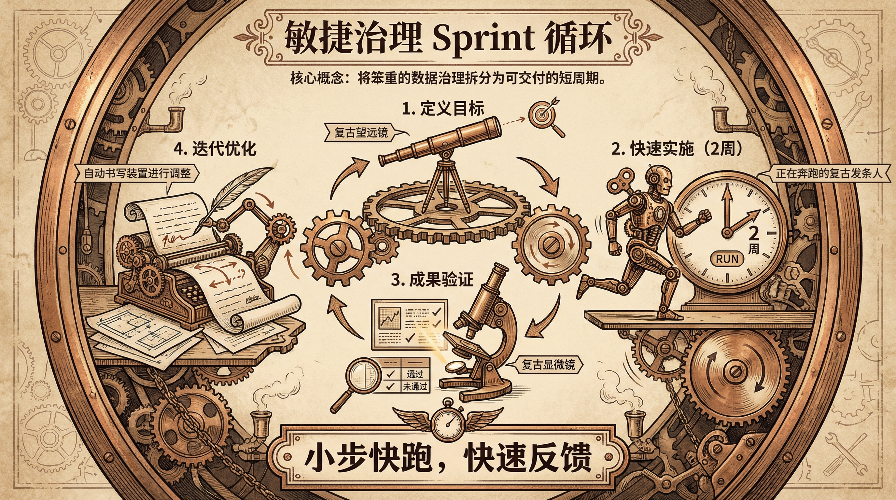
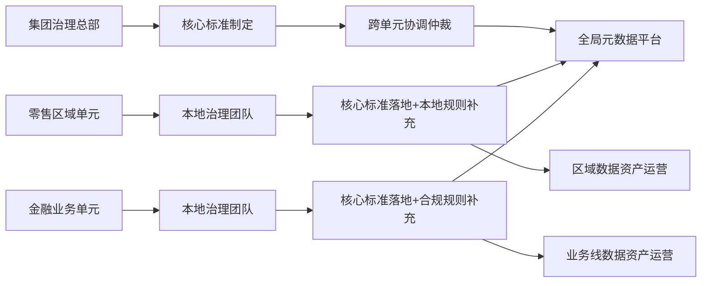

# 📊 数据治理的基本原则与方法论
## 📝 摘要
当前企业数字化转型进入深水区，传统“自上而下、重管控轻价值”的数据治理模式已无法适配业务创新需求，普遍面临治理成本高、落地阻力大、ROI难以量化等痛点。本文基于DAMA-DMBOK2框架与现代数据治理理论，深度拆解**非侵入式、敏捷、精益、联邦式**四大核心治理原则，提出“规划-试点-推广-优化”全生命周期实施路径与可量化ROI评估模型，对比分析三类主流治理模式的适配性，并结合金融、零售、制造三大行业的实战案例揭示最佳实践，最后梳理常见误区与规避策略。全文聚焦实战导向，通过具体数据与场景化案例为企业提供可落地的治理方案，平衡合规管控与业务创新，实现数据治理的价值最大化。

---

## 🏛️ 核心原则深度拆解
### 🚀 非侵入式治理（Non-Invasive）
#### 核心定义
基于DAMA-DMBOK2中“最小化业务影响”的治理理念，非侵入式治理是指在不修改业务系统代码、不中断业务流程、不占用核心业务资源的前提下，通过旁路采集、元数据自动发现、规则配置化等技术手段实现数据质量管控、合规审计、资产梳理等治理目标，本质是将治理逻辑与业务系统解耦。

#### 适用场景
| 场景类型                | 典型示例                                  |
|-------------------------|-------------------------------------------|
| 核心业务系统稳定运行期  | 金融机构的核心交易系统、制造业的生产执行系统（MES） |
|  legacy系统改造风险高    | 零售企业上线10年以上的ERP系统              |
| 业务系统迭代周期短      | 互联网电商的前端交易系统（每月迭代2-3次）  |

#### 实施要点
1. **技术选型**：采用CDC（变更数据捕获）工具（如Debezium、Flink CDC）实现旁路数据采集，避免直接连接业务数据库；使用元数据自动发现工具（如Collibra、Alation）梳理数据资产，无需业务团队手动录入。
2. **规则配置化**：通过低代码/无代码平台配置数据质量规则（如客户ID唯一性、交易金额合理性），规则变更无需业务系统发布。
3. **监控轻量化**：仅对高价值数据（如客户核心数据、交易数据）实施实时监控，低价值数据采用批量巡检模式，减少资源占用。
4. **数据隔离**：治理数据与业务数据物理隔离，治理操作不影响业务系统的正常运行。

### ⚡ 敏捷治理（Agile）
#### 核心定义
借鉴敏捷开发理念，将治理工作拆解为2-4周的Sprint迭代周期，快速响应业务需求，平衡治理合规与业务创新，对应DAMA-DMBOK2中“敏捷治理”的延伸升级。核心是“小步快跑、快速反馈、持续优化”，避免传统治理的长周期、高成本、低适配性问题。

#### 适用场景
| 场景类型                | 典型示例                                  |
|-------------------------|-------------------------------------------|
| 业务需求变化快的企业    | 电商平台、直播零售企业                    |
| 数字化转型初期的企业    | 传统制造企业数字化升级项目                |
| 创新型科技公司          | 人工智能、大数据创业公司                  |

#### 实施要点
4. **迭代优化**：每个Sprint结束后开展回顾会议，总结经验，迭代治理规则与流程，确保治理能力持续适配业务需求。

### 🛠️ 精益治理（Lean）
#### 核心定义
基于精益管理思想，消除治理过程中的无价值环节（如冗余审批、无效数据检查），聚焦高价值数据资产的治理，提升治理效率与ROI，对应DAMA-DMBOK2中“精益数据管理”的核心原则。核心是“只治理有价值的数据，只做有价值的治理动作”。

#### 适用场景
| 场景类型                | 典型示例                                  |
|-------------------------|-------------------------------------------|
| 数据资产规模庞大的企业  | 大型集团型企业（数据资产超10TB）          |
| 治理成本过高的企业      | 治理投入占IT总投入20%以上的企业            |
| 需优化治理ROI的企业    | 上市企业需向股东汇报治理价值              |

#### 实施要点
1. **数据价值分层**：采用“价值-风险”二维模型评估数据资产，将数据分为高价值高风险（如客户核心数据）、高价值低风险（如产品目录数据）、低价值高风险（如日志数据）、低价值低风险（如测试数据），仅对高价值高风险数据实施严格治理。
2. **流程精益化**：梳理治理流程，去除冗余环节（如将3级审批简化为1级审批，仅针对高风险数据），将治理流程效率提升30%以上。
3. **自动化替代**：用自动化工具替代人工操作（如自动生成数据质量报告、自动触发合规审计），人工操作占比降至20%以下。
4. **持续审计**：每季度开展治理流程审计，识别并消除无价值环节，确保治理效率持续提升。

### 🌐 联邦式治理
#### 核心定义
构建“总部定标准、业务单元执落地、跨单元协共享”的去中心化治理架构，既保证核心数据标准的一致性，又赋予业务单元治理自主权，对应DAMA-DMBOK2中“分布式治理”的升级。核心是“统一核心标准、分散执行落地、跨域协同共享”。

#### 适用场景
| 场景类型                | 典型示例                                  |
|-------------------------|-------------------------------------------|
| 集团型跨区域企业        | 全国性零售连锁集团、跨区域制造企业        |
| 业务线差异大的企业      | 金融集团（银行、证券、保险业务线）        |
| 多业态混合经营企业      | 互联网科技集团（电商、云服务、本地生活）  |

#### 实施要点
1. **核心标准统一**：总部层面制定不可突破的核心数据标准（如客户ID、产品编码的核心规则），允许业务单元在框架内制定细分规则（如区域特定的客户标签规则）。
2. **分布式执行**：每个业务单元设立本地治理团队，负责本单元的数据质量管控、资产梳理、合规审计等落地工作。
3. **跨域协调机制**：建立季度治理峰会、跨单元治理协调群等机制，解决跨业务线的数据冲突与共享需求。
4. **全局可视平台**：搭建全局元数据与数据血缘平台，实现跨业务线的数据资产可视、血缘追踪与共享。

---

## 🛤️ 实施方法论：全生命周期落地路径
### 🔄 实施路径：规划-试点-推广-优化
#### 各阶段核心动作
1. **规划阶段**：
   - 采用DAMA数据成熟度模型（DMM）评估企业当前数据治理水平，定位核心痛点（如数据质量、合规性、共享能力）。
   - 制定治理目标时必须绑定业务KPI（如客户数据重复率从18%降至3%，KYC流程效率提升80%）。
   - 组建跨部门治理委员会，由业务副总裁任主任，确保治理决策的权威性与业务贴合度。
2. **试点阶段**：
   - 筛选1-2个高价值痛点场景（如零售企业的会员数据治理、制造企业的设备数据治理），投入10-15%的治理资源。
   - 落地核心治理原则（如非侵入式采集、敏捷迭代），在2-3个月内完成MVP验证并实现初步ROI。
   - 固化试点阶段的治理规则与流程，形成可复制的模板。
3. **推广阶段**：
   - 将试点阶段的治理能力封装为平台化服务（如数据质量监控API、元数据查询服务），快速复制到其他区域/业务线。
   - 建立跨域数据共享机制，解决跨业务线的数据孤岛问题。
   - 投入60-70%的治理资源，在6-12个月内完成全企业覆盖。
4. **优化阶段**：
   - 搭建治理绩效监控平台，实时跟踪治理指标（如数据合规率、治理ROI）。
   - 每季度迭代治理规则与流程，响应业务需求变化。
   - 持续投入15-20%的治理资源，确保治理效果持续提升。

### 📈 ROI量化评估模型
#### 模型公式
$$
\text{ROI} = \frac{\text{总收益} - \text{总投入}}{\text{总投入}} \times 100\%
$$

其中：
##### 总收益（量化维度）
| 收益类型                | 计算方式                                  |
|-------------------------|-------------------------------------------|
| 业务增益收益            | 精准营销提升销售额 + 生产效率提升收益 + 风险管控收益 |
| 合规风险规避收益        | 避免监管罚款金额 + 声誉损失规避金额        |
| 运维成本降低收益        | 数据错误排查时间减少成本 + 数据整合成本降低 |

##### 总投入（量化维度）
| 投入类型                | 计算方式                                  |
|-------------------------|-------------------------------------------|
| 工具采购/部署成本       | 数据治理平台、元数据工具、CDC工具的一次性采购/订阅成本 |
| 人力成本                | 治理团队人员薪资 + 跨部门协作人员工时成本  |
| 培训成本                | 治理工具培训 + 治理理念培训费用            |
| 咨询成本                | 外部数据治理咨询服务费用                  |

#### 实战示例（某零售企业）
| 指标项                  | 治理前                | 治理后                | 量化收益/投入          |
|-------------------------|-----------------------|-----------------------|-----------------------|
| 会员复购率              | 21%                   | 33%                   | 业务增益：(33%-21%)×100万会员×200元客单价=2400万 |
| 库存数据准确率          | 82%                   | 96.8%                 | 缺货损失减少：8000万×40%=3200万 |
| 营销ROI                 | 1.8                   | 2.25                  | 营销成本节省：5000万×(1-1.8/2.25)=1000万 |
| 总收益                  | -                     | -                     | 2400+3200+1000=6600万 |
| 总投入                  | -                     | -                     | 工具500万+人力300万+培训100万+咨询100万=1000万 |
| ROI                     | -                     | -                     | (6600-1000)/1000×100%=560% |
| 投资回收期              | -                     | -                     | 约2.1个月             |

---

## ⚖️ 治理模式对比分析
| 对比维度          | 自上而下模式                | 自下而上模式                | 混合（联邦式）模式          |
|-------------------|-----------------------------|-----------------------------|-----------------------------|
| 治理主体          | 总部/IT部门主导             | 业务单元/一线团队主导       | 总部定标准+业务单元执落地   |
| 决策效率          | 高（集中决策，周期1-2周）  | 低（分散决策，周期4-6周）  | 中（核心标准集中，细分规则分散，周期2-3周） |
| 业务适应性        | 低（难响应个性化需求）      | 高（快速贴合业务痛点）      | 高（平衡标准与个性化）      |
| 数据标准一致性    | 高（统一规则）              | 低（易出现标准混乱）        | 高（核心标准统一，细分规则灵活） |
| 实施难度          | 中（需业务配合，阻力较大）  | 高（易形成数据孤岛）        | 中（需建立跨域协调机制）    |
| 适用企业类型      | 强监管行业（金融）、小型企业 | 创新型科技公司、创业公司    | 集团型企业、跨区域经营企业  |
| 核心优势          | 合规性高、标准统一          | 业务贴合度高、落地阻力小    | 兼顾标准统一与业务灵活性    |
| 核心劣势          | 业务抵触、创新受限制        | 数据孤岛、合规风险高        | 协调成本较高、治理能力要求高 |

---

## 💡 行业最佳实践
### 🏦 金融行业：某全国性股份制银行
#### 痛点
- 12个核心业务系统数据孤岛，客户核心数据重复率达18%，数据合规率仅72%
- 银保监会KYC流程需跨5个系统手动调取数据，平均耗时7天
- 年均因数据错误导致的合规罚款达2000万+

#### 方案
- 采用**联邦式治理+非侵入式数据质量管控**架构
- 总部制定统一客户ID标准，各业务单元在框架内补充细分规则
- 用Debezium CDC工具旁路采集各业务系统数据，不影响核心交易运行
- 搭建Collibra元数据平台实现跨系统数据血缘追踪，自动生成KYC合规报告

#### 成效
- 客户数据重复率降至2.3%，数据合规率提升至98.7%
- KYC流程耗时从7天缩短至1.2天，效率提升82.9%
- 年均合规罚款降至150万，减少92.5%
- 精准营销触达率提升35%，新增年营收1.2亿

### 🛒 零售行业：某连锁商超集团
#### 痛点
- 全国300+门店数据分散，会员数据一致性仅65%
- 营销活动依赖人工汇总数据，响应周期长达14天，营销ROI仅1.8
- 库存数据准确率仅82%，年缺货损失达8000万

#### 方案
- 采用**敏捷治理+精益治理**模式
- 试点阶段聚焦华东10家门店的会员与库存数据治理，2周迭代一次治理规则
- 精益梳理治理流程，去除3级审批环节，仅对高价值会员数据实施严格管控
- 搭建自动化数据质量监控平台，实时预警库存数据错误

#### 成效
- 会员数据一致性提升至97.5%，库存数据准确率提升至96.8%
- 营销活动响应周期从14天缩短至3天，营销ROI提升至2.25（增长25%）
- 年缺货损失降至4800万，减少40%
- 会员复购率从21%提升至33%，新增年营收2.5亿

### 🏭 制造行业：某汽车零部件制造商
#### 痛点
- 15条生产线数据分散在MES、SCADA等5个系统，数据整合耗时24小时
- 设备预测性维护依赖人工分析，非计划停机时间占比达12%
- 产品质量追溯需跨3个系统手动核对，周期长达3天

#### 方案
- 采用**非侵入式治理+精益治理**模式
- 用Flink CDC工具旁路采集生产线设备数据，不影响生产运行
- 精益评估数据价值，仅对设备核心运行数据、产品质量数据实施严格治理