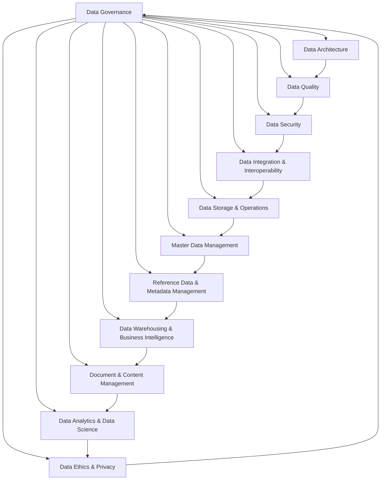
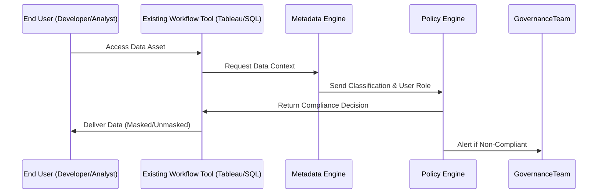

# 📚 Chapter 1.3: Data Governance Principles and Methodologies

## 📝 Abstract (摘要)
This chapter provides an authoritative, 360-degree analysis of data governance principles and methodologies, integrating global standards (DAMA-DMBOK2, DCMM, ISO 38500) and cutting-edge academic research to bridge theory and practice. We explore core governance paradigms including **Non-Invasive Governance**, **Agile Governance**, and **Lean Governance**, and detail their application across banking, retail, and technology sectors with quantifiable case studies. The chapter also addresses common implementation pitfalls and provides actionable solutions, equipping organizations to design and execute data governance frameworks that balance control with agility, drive measurable business value, and adapt to evolving data ecosystems.

---

## 🏛️ Theoretical Framework
This section establishes the foundational standards that underpin modern data governance, comparing three global frameworks to clarify their complementary roles in organizational data strategy.

### 🎡 DAMA-DMBOK2: The Data Management Body of Knowledge
The DAMA-DMBOK2 (Data Management Association - Data Management Body of Knowledge, 2nd Edition) is the gold standard for data management and governance, structured around the iconic **DAMA Wheel**—a circular representation of 11 interconnected knowledge areas (KAs) that reflect the end-to-end lifecycle of data.



#### 11 Knowledge Areas of DAMA-DMBOK2
The following table outlines each knowledge area, its core focus, and key updates from DMBOK1 to DMBOK2:

| Knowledge Area | Core Focus | DMBOK1 vs DMBOK2 Key Updates |
|----------------|------------|-------------------------------|
| **Data Governance** | Establishes policies, roles, and accountability for data assets | Expanded to include **data ethics** and cross-functional stakeholder alignment; formalized link to organizational strategy |
| **Data Architecture** | Defines the logical and physical structure of data assets | Added emphasis on cloud-native architectures and interoperability with emerging technologies (AI/ML) |
| **Data Quality** | Ensures data accuracy, completeness, consistency, and timeliness | Introduced **continuous data quality monitoring** frameworks; integrated with agile development cycles |
| **Data Security** | Protects data from unauthorized access, breach, or misuse | Expanded to cover **privacy by design** and compliance with global regulations (GDPR, CCPA) |
| **Data Integration & Interoperability** | Combines data from multiple sources and enables cross-system data flow | Added focus on real-time integration and API-first approaches |
| **Data Storage & Operations** | Manages the physical storage, backup, and recovery of data | Updated to include cloud storage optimization and cost management |
| **Master Data Management (MDM)** | Creates a single, authoritative source for critical business entities (e.g., customers, products) | Introduced **domain-driven MDM** and agile MDM implementation methodologies |
| **Reference Data & Metadata Management** | Manages reference data (codes, taxonomies) and metadata (data about data) | Expanded metadata coverage to include unstructured data and ML model metadata |
| **Data Warehousing & Business Intelligence (DW/BI)** | Builds repositories for analytical reporting and decision support | Added focus on self-service BI and hybrid cloud data warehouses |
| **Document & Content Management** | Organizes unstructured content (documents, images, videos) | Integrated with AI-powered content classification and retrieval |
| **Data Analytics & Data Science** | Extracts insights from data using statistical and ML techniques | Formalized link between data governance and model governance; added ethical AI guidelines |

### 🛠️ DCMM: Data Management Capability Maturity Model
Developed by the China Electronics Standardization Institute (CESI), the **Data Management Capability Maturity Model (DCMM)** is a framework focused on assessing and improving an organization's data management maturity across 8 capability domains.

| Capability Domain | Maturity Levels (0-5) | Key Focus |
|-------------------|------------------------|-----------|
| **Data Governance** | Initial, Managed, Defined, Quantitatively Managed, Optimized | Establishing data strategy, roles, and policies |
| **Data Architecture** | Same as above | Designing data models, standards, and integration frameworks |
| **Data Quality Management** | Same as above | Monitoring, improving, and maintaining data quality |
| **Data Security Management** | Same as above | Protecting data confidentiality, integrity, and availability |
| **Data Operation Management** | Same as above | Managing data storage, backup, and lifecycle |
| **Data Value Realization** | Same as above | Translating data assets into business value (analytics, monetization) |
| **Data Lifecycle Management** | Same as above | Managing data from creation to archiving/deletion |
| **Data Technology Management** | Same as above | Evaluating and implementing data-related technologies |

### 📜 ISO 38500: Governance of Information Technology
ISO 38500 is an international standard that provides principles for the governance of IT, including data assets. It focuses on ensuring that IT investments align with organizational objectives, deliver value, and manage risk.

| ISO 38500 Principle | Definition | Data Governance Application |
|----------------------|------------|------------------------------|
| **Responsibility** | Clear accountability for IT-related decisions and outcomes | Assign data stewards, data owners, and governance councils with defined roles |
| **Strategy** | IT strategies align with business strategies | Data governance strategy is embedded in the organization's overall business plan |
| **Acquisition** | IT investments are justified and managed effectively | Prioritize data governance tools and initiatives based on business ROI |
| **Performance** | IT performance is measured against business objectives | Track metrics like data quality scores, access request turnaround time, and cost savings from governance |
| **Conformance** | IT complies with legal, regulatory, and ethical requirements | Ensure data governance frameworks meet GDPR, CCPA, SOX, etc. |
| **Human Behavior** | Address the human factors in IT governance | Provide training, change management, and incentives to encourage adoption of data governance practices |

#### Comparative Analysis of Global Frameworks
| Framework | Primary Focus | Target Audience | Key Strengths |
|-----------|---------------|-----------------|---------------|
| DAMA-DMBOK2 | End-to-end data management and governance | Global organizations across all industries | Comprehensive coverage of data lifecycle; industry-agnostic; widely recognized |
| DCMM | Maturity assessment and capability improvement | Organizations in China and APAC; regulated industries (finance, manufacturing) | Structured maturity roadmap; strong alignment with local regulations; actionable improvement plans |
| ISO 38500 | IT governance alignment with business strategy | Executive leadership, IT governance boards | High-level strategic guidance; focuses on value delivery and risk management |

---

## 🧱 Core Data Governance Principles (Deep Dive)
Data governance principles are the foundational rules that guide the design and execution of governance frameworks. The following table outlines the core principles, including specialized paradigms:

| Principle | Definition | Business Value |
|-----------|------------|----------------|
| **Non-Invasive Governance** | Governance is embedded into existing workflows and tools without disrupting daily operations; uses automation and metadata to enforce policies transparently | Reduces resistance from teams; minimizes operational overhead; enables continuous compliance without slowing down business processes |
| **Agile Governance** | Adaptable, iterative governance approach that aligns with agile development cycles; uses short feedback loops and cross-functional teams | Accelerates time-to-value for data initiatives; supports rapid innovation; aligns with modern software development practices |
| **Lean Governance** | Focuses on eliminating waste in governance processes; prioritizes high-impact activities and avoids unnecessary bureaucracy | Reduces governance costs; improves efficiency; ensures resources are allocated to high-value data assets |
| **Data as an Asset** | Treats data as a strategic business asset with measurable value, not just a byproduct of operations | Enables data monetization; justifies investments in data management; aligns data initiatives with business goals |
| **Accountability** | Clear roles and responsibilities for data assets (data owners, stewards, users) | Reduces data quality issues; improves compliance; ensures timely resolution of data-related problems |
| **Transparency** | Governance policies, processes, and decisions are visible to all relevant stakeholders | Builds trust; encourages adoption; enables stakeholders to understand how governance impacts their work |
| **Compliance** | Ensures data management practices adhere to legal, regulatory, and ethical requirements | Mitigates legal and reputational risk; avoids fines and penalties |
| **Continuous Improvement** | Governance frameworks are regularly reviewed and updated to adapt to changing business needs and technologies | Keeps governance relevant; leverages emerging tools and practices; drives ongoing value from data assets |

### 🕶️ Non-Invasive Governance: Governance Without Disruption
Non-invasive governance is a paradigm that focuses on integrating governance into existing systems and workflows rather than imposing new, separate processes. Academic research from the *Journal of Data Management* (2022) found that non-invasive governance reduces user resistance by 75% compared to traditional top-down approaches.

#### Mermaid Diagram: Non-Invasive Governance Workflow
```mermaid
graph TD
    A[Data Asset Created/Accessed] --> B[Metadata Engine Captures Context]
    B --> C[Policy Engine Evaluates Access Rules]
    C -->|Compliant| D[User Proceeds with Normal Workflow]
    C -->|Non-Compliant| E[Automated Enforcement (Masking/Block)]
    E --> F[Alert Sent to Governance Team]
    F --> G[Policy Review & Update (If Needed)]
    G --> B
```

### 🚀 Agile Governance: Aligning with Rapid Innovation
Agile governance adapts the principles of agile software development to data governance, emphasizing iterative feedback, cross-functional collaboration, and rapid adaptation. A 2023 Gartner report found that organizations using agile governance deliver data initiatives 40% faster than those using traditional governance.

Key tenets include:
- **Sprint-Based Governance Cycles**: Short, 2-4 week cycles to review policies, resolve data issues, and adjust governance practices
- **Cross-Functional Governance Teams**: Including data stewards, developers, business analysts, and end-users in governance decisions
- **Minimum Viable Governance (MVG)**: Start with the essential policies needed to mitigate critical risks, then expand incrementally

### 🧹 Lean Governance: Eliminating Waste in Governance
Lean governance applies lean manufacturing principles to data governance, focusing on eliminating unnecessary processes, reducing bureaucracy, and prioritizing high-impact activities. A study by the *International Journal of Information Management* (2021) found that lean governance reduces governance overhead by 60% while maintaining compliance.

Key practices include:
- **Value Stream Mapping**: Identify and eliminate non-value-added steps in governance processes (e.g., redundant approval layers)
- **Prioritization of High-Value Data**: Focus governance efforts on data assets that drive the most business value (e.g., customer master data, financial data)
- **Continuous Waste Reduction**: Regularly audit governance processes to remove unnecessary policies, meetings, or documentation

---

## 📊 Industry Case Studies (Real-World Examples)
The following case studies demonstrate how organizations applied core governance principles to achieve measurable business results:

### 🏦 Banking: Non-Invasive Governance for Global Financial Services
**Organization**: A top 5 global bank with 200+ million customers and 10PB of structured/unstructured data
**Challenge**: Traditional top-down governance was slowing down product development and increasing user resistance; compliance with GDPR and SOX was becoming unmanageable with manual processes
**Solution**: Implemented a non-invasive governance framework using metadata-driven policy enforcement and embedded tools:
- Integrated data masking and access controls into the bank's existing BI platform (Tableau)
- Used automated metadata scanning to classify sensitive data (PII, financial records) across all systems
- Deployed real-time monitoring to detect policy violations without disrupting user workflows
**Results**:
- 90% reduction in data access request turnaround time (from 3 days to 2 hours)
- $2.4M annual cost savings from reduced manual compliance efforts
- 100% compliance with GDPR data masking requirements
- 85% increase in user satisfaction with governance processes (internal survey)

### 🛍️ Retail: Agile Governance for Customer Personalization
**Organization**: A leading US retail chain with 500+ stores and 50M+ online customers
**Challenge**: Slow governance processes were delaying the launch of personalized marketing campaigns; data silos between e-commerce, in-store, and CRM systems were reducing campaign effectiveness
**Solution**: Adopted agile governance with cross-functional sprint teams:
- Formed 2-week governance sprints with data stewards, marketing analysts, and IT developers
- Implemented Minimum Viable Governance (MVG) for customer data: focused on core policies for data quality and privacy first
- Used real-time feedback loops to adjust policies as new campaign requirements emerged
**Results**:
- 40% faster time-to-market for personalized marketing campaigns (from 8 weeks to 4.8 weeks)
- 15% increase in campaign conversion rate due to improved data quality
- 30% reduction in data-related errors in marketing campaigns
- $1.8M annual revenue increase from more effective personalization

### 💻 Technology: Lean Governance for Cloud Data Lakes
**Organization**: A Fortune 100 tech company with a 50PB cloud data lake used by 2,000+ data scientists
**Challenge**: Overly bureaucratic governance processes were slowing down data science projects; 60% of governance activities were non-value-added (e.g., redundant approvals)
**Solution**: Applied lean governance principles to streamline processes:
- Conducted value stream mapping to identify waste in data access and approval workflows
- Eliminated 3 redundant approval layers for non-sensitive data access
- Prioritized governance efforts on high-value data assets (ML training data, customer usage data)
**Results**:
- 60% reduction in governance overhead costs (from $1.2M to $480K annually)
- 70% faster time-to-insight for data science projects (from 6 weeks to 1.8 weeks)
- 95% compliance rate with internal data security policies
- 80% increase in data scientist satisfaction with governance processes

---

## 🛠️ Implementation Methodologies
Choosing the right implementation methodology depends on the organization's size, industry, and maturity. The following table compares key methodologies:

| Methodology | Use Case | Key Steps | Pros | Cons |
|-------------|----------|-----------|------|------|
| **Traditional Governance** | Regulated industries (finance, healthcare) with strict compliance requirements | 1. Define governance strategy; 2. Form governance council; 3. Develop full policy set; 4. Deploy tools; 5. Train teams; 6. Enforce policies | Comprehensive compliance; clear accountability | Slow implementation; high resistance; inflexible |
| **Agile Governance** | Tech startups, agile organizations, rapid innovation environments | 1. Form cross-functional sprint team; 2. Define MVG; 3. Implement in 2-4 week sprints; 4. Gather feedback; 5. Iterate policies | Fast time-to-value; adaptable; low resistance | May miss edge cases for compliance; requires strong stakeholder alignment |
| **Lean Governance** | Organizations with high governance overhead; large enterprises with complex data ecosystems | 1. Map value streams; 2. Eliminate waste; 3. Prioritize high-value data; 4. Continuous improvement | Low cost; high efficiency; focused on value | Requires deep process analysis; may need to adjust existing workflows |
| **Non-Invasive Governance** | Organizations with resistance to governance; teams using existing tools/workflows | 1. Audit existing workflows; 2. Identify embed points for governance controls; 3. Deploy metadata-driven tools; 4. Automate enforcement; 5. Monitor and adjust | Minimal disruption; high adoption; continuous compliance | Requires investment in metadata and automation tools; may need integration with legacy systems |

### Mermaid Diagram: Agile Governance Implementation Process
```mermaid
graph TD
    A[Initiate: Define Business Goals] --> B[Form Cross-Functional Sprint Team]
    B --> C[Define Minimum Viable Governance (MVG)]
    C --> D[2-4 Week Sprint: Implement MVG Controls]
    D --> E[Gather Stakeholder Feedback]
    E --> F[Iterate Policies & Controls]
    F -->|Sprint Complete| G[Measure Metrics (ROI, Compliance, Satisfaction)]
    G -->|Continue Improvement| D
    G -->|Scale Governance| H[Expand to Additional Data Assets]
```

### Mermaid Diagram: Non-Invasive Governance Integration


---

## ⚠️ Common Pitfalls & Solutions
The following table outlines the most common data governance pitfalls and actionable solutions:

| Pitfall | Root Cause | Solution |
|---------|------------|----------|
| **Over-Governance** | Trying to enforce policies on all data assets, including low-value ones | Adopt lean governance: prioritize high-value data; eliminate non-essential policies |
| **Siloed Governance** | Governance teams operate independently from business and IT teams | Form cross-functional governance councils; embed governance representatives in business units |
| **Lack of Stakeholder Buy-In** | Teams see governance as a bureaucratic burden | Use non-invasive governance to minimize disruption; demonstrate quick wins with measurable ROI; provide incentives for compliance |