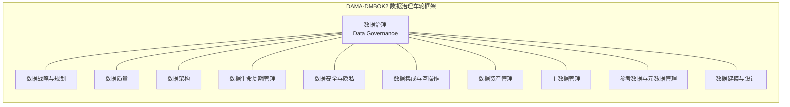

> **摘要**：本章以DAMA-DMBOK2、DCMM、ISO 38500等权威标准为理论基石，全面剖析数据治理的底层逻辑与落地路径。重点围绕**非侵入式治理**、**敏捷治理**、**精益治理**三大核心原则展开深度解读，结合结构化表格明确各原则的定义、价值与实施要点；通过Step-by-Step实施方法论与模式对比表格，为企业提供可操作的落地指南；辅以银行业、零售业、科技行业的量化案例，揭示常见治理陷阱及解决方案，助力企业平衡合规要求与业务效率，实现数据资产的价值最大化。

---

## 🏛️ 理论框架
数据治理的理论体系源于全球权威组织的实践总结，主流标准覆盖了从顶层治理到落地执行的全维度要求，为企业提供了可参考的治理框架。

### 3.1 权威标准对齐
当前全球数据治理领域的三大核心标准各有侧重，企业可根据自身需求选择适配的体系：

| 标准名称       | 发布组织               | 核心定位                     | 适用场景                     |
|----------------|------------------------|------------------------------|------------------------------|
| DAMA-DMBOK2    | 国际数据管理协会（DAMA）| 全知识域覆盖的数据管理体系    | 全球企业数据治理的理论参考   |
| DCMM           | 中国工信部              | 能力成熟度分级的评估与提升模型 | 国内企业数据治理的合规与能力建设 |
| ISO 38500      | 国际标准化组织（ISO）   | 顶层IT治理下的数据治理框架    | 跨国企业或需要符合国际合规要求的组织 |

### 3.2 DAMA治理框架可视化
DAMA-DMBOK2以"数据治理车轮"为核心，将数据治理作为中心引擎，驱动10个数据管理知识域协同运作：

> 注：DAMA框架强调数据治理的"引擎"作用，通过制定政策、明确责任、建立流程，确保所有数据管理活动对齐业务战略。

---

## 🎯 核心原则
数据治理的核心是平衡**合规要求**与**业务价值**，避免陷入"为治理而治理"的误区。以下三大原则是数字化转型背景下的核心指导思想：

### 3.3 三大核心治理原则
#### 🛡️ 非侵入式治理（Non-Invasive Governance）
| 维度         | 具体内容                                                                 |
|--------------|--------------------------------------------------------------------------|
| 定义         | 以**不干扰业务系统原有流程、不增加业务人员额外负担**为前提，通过旁路采集、元数据驱动、规则引擎外挂等技术手段实现数据治理目标的治理模式。 |
| 核心价值     | 1. 降低业务部门对治理的抵触情绪，提升治理落地的接受度；2. 避免对业务系统的稳定性造成影响；3. 缩短治理项目的实施周期，快速产生价值。 |
| 实施要点     | 1. 采用元数据自动采集工具，无需业务系统改造；2. 数据质量规则通过旁路引擎执行，不嵌入业务流程；3. 数据资产目录采用轻量化接入方式（如API、日志采集）；4. 治理规则配置可视化，无需代码开发。 |

#### ⚡ 敏捷治理（Agile Governance）
| 维度         | 具体内容                                                                 |
|--------------|--------------------------------------------------------------------------|
| 定义         | 借鉴敏捷开发理念，以**快速响应业务需求、小步快跑迭代优化**为核心，将治理目标拆解为可快速验证的小任务，通过跨职能团队协作实现治理落地的模式。 |
| 核心价值     | 1. 快速响应业务变化，让治理与业务需求同频；2. 通过MVP（最小可行产品）验证治理价值，降低项目风险；3. 提升治理团队的协作效率与创新能力。 |
| 实施要点     | 1. 组建跨职能治理团队（业务、技术、合规人员各占1/3）；2. 将治理目标拆解为2-4周可完成的迭代任务；3. 每次迭代后进行价值复盘，调整治理方向；4. 采用敏捷看板工具跟踪治理任务进度。 |

#### 🚀 精益治理（Lean Governance）
| 维度         | 具体内容                                                                 |
|--------------|--------------------------------------------------------------------------|
| 定义         | 借鉴精益生产理念，以**消除治理过程中的冗余环节、聚焦高价值场景**为核心，通过价值流映射识别浪费，持续优化治理流程的模式。 |
| 核心价值     | 1. 提升治理投入的ROI（投资回报率），避免无效治理；2. 简化治理流程，降低治理成本；3. 聚焦核心业务场景，实现数据价值的快速释放。 |
| 实施要点     | 1. 通过价值流映射识别治理过程中的冗余环节（如重复审批、无效数据采集）；2. 优先选择业务价值高、治理难度低的场景落地（如客户主数据治理）；3. 建立治理效果量化评估体系，持续消除浪费；4. 采用精益工具（如5S、Kaizen）优化治理流程。 |

---

## 🛠️ 实施方法论
数据治理是一个持续迭代的过程，而非一次性项目，以下是可落地的六步实施法：

### 3.4 分阶段实施步骤
#### 📝 第一步：治理现状评估
- 采用**DCMM成熟度模型**或**DAMA能力评估框架**，对企业的数据治理现状进行全面诊断；
- 重点评估：数据战略对齐度、数据质量水平、数据资产盘点覆盖率、数据安全合规性等维度；
- 输出《数据治理现状评估报告》，明确治理的痛点与优先级。

#### 🎯 第二步：治理目标对齐业务战略
- 组织跨部门研讨会，明确数据治理的核心目标（如提升客户数据质量、满足GDPR合规要求、支持精准营销等）；
- 将治理目标拆解为可量化的指标（如数据质量合格率从60%提升到95%、数据资产盘点覆盖率从30%提升到100%）；
- 输出《数据治理战略规划书》，获得高层领导的审批与支持。

#### 🎛️ 第三步：治理模式选择
根据企业的业务特点、信息化水平、治理目标，选择合适的治理模式，具体对比见下表：

| 对比维度       | 传统治理模式               | 敏捷治理模式               | 非侵入式治理模式           |
|----------------|----------------------------|----------------------------|----------------------------|
| 治理理念       | 自上而下，合规优先         | 快速迭代，业务价值优先     | 最小侵入，效率优先         |
| 实施周期       | 6-12个月                   | 2-4周迭代，持续优化        | 1-2个月快速落地，持续扩展  |
| 业务侵入性     | 高（需要改造业务系统）     | 中（需要业务人员参与迭代） | 低（无需改造业务系统）     |
| 适用场景       | 大型企业的合规性治理（如银行业） | 互联网企业、创新型企业的业务驱动型治理 | 信息化成熟度高、业务系统复杂的企业 |
| ROI周期        | 长（6-12个月才能看到价值） | 短（1-2个月即可看到价值）  | 极短（2-4周即可看到价值）  |
| 团队结构       | 层级分明，分工明确         | 跨职能小团队，扁平化管理   | 技术主导，业务轻参与       |
| 工具要求       | 重型治理平台（如MDM、DQP） | 轻量化敏捷治理工具（如看板、低代码平台） | 元数据采集工具、旁路规则引擎 |

#### 👥 第四步：组建跨职能治理团队
- **数据治理委员会**：由企业高层领导组成，负责制定治理政策、审批治理预算、解决跨部门冲突；
- **数据 steward（数据管家）**：由业务部门骨干担任，负责数据规则的制定、数据质量的监控、业务需求的反馈；
- **技术实施团队**：负责治理工具的选型、部署与维护，实现治理规则的技术落地；
- **合规审计团队**：负责监督治理政策的执行，确保符合法律法规要求。

#### 🚀 第五步：核心场景落地
- 选择1-2个高价值的核心场景（如客户主数据治理、财务数据质量监控）进行MVP验证；
- 按照敏捷迭代的方式，快速实现治理目标，并展示治理价值（如客户数据重复率从20%降低到5%，精准营销转化率提升10%）；
- 逐步推广到其他场景，实现治理的全面覆盖。

#### 🔄 第六步：迭代优化与持续改进
- 建立治理效果的量化评估体系，定期（如每季度）评估治理的ROI；
- 收集业务部门的反馈，持续优化治理规则与流程；
- 随着企业业务的发展，调整治理目标与模式，实现数据治理的持续迭代。

---

## 📊 行业案例
以下是三个不同行业的数据治理实践案例，均采用了上述核心原则与方法论，实现了显著的业务价值：

### 3.5 银行业：某国有大行的非侵入式数据质量治理
- **背景**：该行拥有200+业务系统，数据质量问题频发（如客户身份证号重复、账户信息不一致），传统治理模式需要改造业务系统，周期长、风险高；
- **实施方式**：采用**非侵入式治理**模式，通过元数据自动采集工具获取全行系统的元数据，搭建旁路数据质量监控平台，实时监控数据质量规则；
- **成果**：1. 节省业务系统改造成本**200万元**；2. 数据质量问题的响应时间从72小时缩短到4小时；3. 客户数据重复率从18%降低到3%；4. 满足了银保监会的数据合规要求。

### 3.6 零售业：某连锁超市的敏捷数据标签治理
- **背景**：该超市拥有1000+门店，需要快速调整客户分群策略，支持精准营销，但传统数据标签体系迭代周期长达3个月，无法满足业务需求；
- **实施方式**：采用**敏捷治理**模式，组建跨职能团队（市场、IT、数据），每2周迭代一次数据标签体系，通过MVP验证标签的有效性；
- **成果**：1. 数据标签体系的迭代周期从3个月缩短到2周；2. 客户分群效率提升**40%**；3. 精准营销的转化率从8%提升到23%；4. 销售额同比增长12%。

### 3.7 科技行业：某互联网公司的精益数据治理
- **背景**：该公司数据治理流程冗余，存在大量无效的审批环节，数据开发效率低下，每年浪费大量的人力成本；
- **实施方式**：采用**精益治理**模式，通过价值流映射识别出30%的冗余流程，消除无效审批，聚焦高价值的数据场景（如用户行为数据治理）；
- **成果**：1. 消除了30%的冗余数据治理流程；2. 数据开发效率提升**25%**；3. 每年节省运维成本**120万元**；4. 用户行为数据的分析效率提升30%。

---

## ⚠️ 常见陷阱与解决方案
数据治理落地过程中，容易陷入以下陷阱，以下是对应的解决方案：

| 常见陷阱                     | 产生原因                                                                 | 应对方案                                                                 |
|------------------------------|--------------------------------------------------------------------------|--------------------------------------------------------------------------|
| 治理过度，影响业务效率       | 为了满足合规要求，制定过于严格的治理规则，增加业务人员的额外负担           | 采用**精益+非侵入式治理**模式，聚焦高价值场景，简化治理规则，避免无效管控 |
| 治理与业务脱节，沦为纸面工作 | 治理团队与业务部门缺乏沟通，治理目标未对齐业务需求                         | 组建跨职能治理团队，让业务人员参与治理目标的制定，定期展示治理的业务价值   |
| 缺乏高层支持，推进困难       | 高层对数据治理的价值认知不足，未给予足够的资源与权限支持                   | 制作**治理ROI测算报告**，通过量化数据展示治理带来的业务价值，获得高层支持 |
| 工具选型错误，导致成本浪费   | 盲目选择重型治理平台，未考虑企业的实际需求与信息化水平                     | 先进行POC验证，选择轻量化、可扩展的治理工具，逐步升级功能                 |
| 只重技术，忽略组织与流程     | 治理团队过度依赖技术工具，未建立完善的组织架构与流程体系                   | 明确数据 steward的职责，建立治理政策与流程，技术工具作为支撑手段           |

---

## 🎬 结论
数据治理不是一个一次性的项目，而是一个**持续迭代、价值驱动**的过程。在数字化转型的背景下，企业应摒弃传统的"为治理而治理"的理念，采用**非侵入式、敏捷、精益**三大核心原则，结合自身的业务特点选择合适的治理模式，通过分阶段的实施方法论，快速实现治理的落地与价值释放。

同时，企业应注重组织架构的建设，让业务部门深度参与治理过程，避免陷入治理陷阱，最终实现数据资产的价值最大化，为企业的数字化转型提供坚实的支撑。