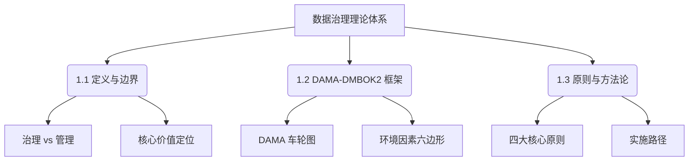

# 📘 01. 数据治理核心概念与理论框架 (Core Concepts & Framework)

## 🏙️ 1. 业界背景与发展综述 (Industry Context)

### 1.1 从“数据库管理”到“数据治理”的范式转移
在过去的三十年中，企业对数据的认知经历了从“副产物”到“核心资产”的深刻转变。

*   **1.0 时代 (1990s - 2005)**: 数据是 IT 系统的附属品。重点在于**数据库管理 (DBA)**，确保 Oracle/SQL Server 不宕机，数据不丢失。
*   **2.0 时代 (2005 - 2015)**: 随着数据仓库 (DW) 和 BI 的兴起，企业开始关注数据的**一致性**。重点在于**元数据管理**和简单的**数据质量 (DQ)** 清洗，试图解决“报表打架”的问题。
*   **3.0 时代 (2015 - 2023)**: 移动互联网和数字化转型爆发。数据成为生产要素。**数据治理 (Data Governance)** 正式走向舞台中央，涵盖了安全、合规、标准、质量全生命周期。企业设立 CDO (首席数据官) 职位。
*   **4.0 时代 (2023 - 未来)**: AI 大模型驱动。治理的边界拓展到**非结构化数据**和**语料治理**。

### 1.2 当前痛点
尽管概念火热，但据 Gartner 统计，超过 60% 的数据治理项目未能达到预期目标。核心痛点包括：
*   **重技术轻管理**: 买了一堆昂贵的治理平台，但没有建立配套的认责制度。
*   **与业务脱节**: 治理变成了 IT 部门的自嗨，业务部门觉得“增加了录入负担”而消极抵抗。
*   **ROI 难以量化**: 老板问“花 500 万做治理，在这个季度能带来多少利润？”，很难回答。

---

## 🎯 2. 本章课题描述 (Chapter Objectives)

本章作为全课程的基石，旨在为读者构建一个坚实、清晰的理论认知框架。我们将剥离市面上令人眼花缭乱的概念包装，直击数据治理的本质。

**核心课题**:
1.  **定义厘清**: 什么是治理？什么是管理？两者有何区别？(Governance vs Management)
2.  **框架对齐**: 深入解读全球通用的 **DAMA-DMBOK2** 知识体系，理解“车轮图”的内在逻辑。
3.  **价值锚定**: 如何从战略高度阐述数据治理的核心价值（风险控制 vs 价值创造）。
4.  **方法论**: 掌握“道法术器”四层治理逻辑。

---

## 🏗️ 3. 整体知识框架 (Overall Framework)

本章内容逻辑结构如下：

### 🧩 3.1 核心板块详解

| 章节 | 核心内容 | 关键知识点 |
| :--- | :--- | :--- |
| [**1.1 定义与边界**](./1.1-%E6%95%B0%E6%8D%AE%E6%B2%BB%E7%90%86%E7%9A%84%E5%AE%9A%E4%B9%89%E3%80%81%E8%BE%B9%E7%95%8C%E4%B8%8E%E6%A0%B8%E5%BF%83%E4%BB%B7%E5%80%BC.md) | 厘清概念，划定范围 | **决策权 (Decision Rights)**、**责权对等**、**资产负债表论** |
| [**1.2 DAMA 体系**](./1.2-dama-dmbok2-%E6%95%B0%E6%8D%AE%E7%AE%A1%E7%90%86%E7%9F%A5%E8%AF%86%E4%BD%93%E7%B3%BB%E6%A1%86%E6%9E%B6.md) | 全球标准解读 | **DAMA Wheel**、**11 个知识领域**、**环境因素** |
| [**1.3 方法论**](./1.3-%E6%95%B0%E6%8D%AE%E6%B2%BB%E7%90%86%E7%9A%84%E5%9F%BA%E6%9C%AC%E5%8E%9F%E5%88%99%E4%B8%8E%E6%96%B9%E6%B3%95%E8%AE%BA.md) | 落地实施指南 | **业务导向**、**急用先行**、**PDCA 循环** |

---

## 🧭 4. 目录导航 (Section Navigation)

以下是本章包含的详细内容模块：

*   [1.1-数据治理的定义、边界与核心价值](./1.1-%E6%95%B0%E6%8D%AE%E6%B2%BB%E7%90%86%E7%9A%84%E5%AE%9A%E4%B9%89%E3%80%81%E8%BE%B9%E7%95%8C%E4%B8%8E%E6%A0%B8%E5%BF%83%E4%BB%B7%E5%80%BC.md)
    *   _Note: 重点理解“治理是关于决策权的分配，管理是关于决策的执行”。_
*   [1.2-dama-dmbok2-数据管理知识体系框架](./1.2-dama-dmbok2-%E6%95%B0%E6%8D%AE%E7%AE%A1%E7%90%86%E7%9F%A5%E8%AF%86%E4%BD%93%E7%B3%BB%E6%A1%86%E6%9E%B6.md)
    *   _Note: 本节包含高清 DAMA 车轮图解析，是数据治理从业者的必修课。_
*   [1.3-数据治理的基本原则与方法论](./1.3-%E6%95%B0%E6%8D%AE%E6%B2%BB%E7%90%86%E7%9A%84%E5%9F%BA%E6%9C%AC%E5%8E%9F%E5%88%99%E4%B8%8E%E6%96%B9%E6%B3%95%E8%AE%BA.md)
    *   _Note: 探讨如何避免“大而全”的治理陷阱，主张“敏捷治理”。_

---

## ❓ 5. 常见问题 (FAQ)

### Q1: 数据治理项目通常也是“一把手”工程，具体在企业中如何体现？
**A:** 
*   **理论**: 治理需要跨部门协调（协调 IT、业务、法务），只有高层才有此权力。
*   **场景**: 在某大型商业银行，CEO 亲自担任“数据治理委员会”主席。如果不这样，业务部门（信贷部、吸储部）根本不会配合 IT 部门修改数据录入规范。
*   **结论**: 没有“尚方宝剑”，治理寸步难行。

### Q2: 如何区分“业务数据”和“元数据”？
**A:**
*   **场景**: 淘宝购物。
*   **业务数据**: "订单号: 1001, 金额: 50.00"。实际交易。
*   **元数据**: "订单表 (Order_Table) 包含字段 OrderId (Int)"。描述交易的数据。

---

## 📚 6. 参考文档 (References)

> [!NOTE]
> 本列表收录了该领域的核心文献。您可以点击链接购买书籍或查看原文。

| 标题 (Title) | 作者 (Author) | 日期 (Date) | | 简介 (Summary) |
| :--- | :--- | :--- | :--- | :--- |
| DAMA-DMBOK2 | DAMA International | 2017 | | 行业圣经，核心参考架构。 |
| Non-Invasive Data Governance | Robert Seiner | 2014 | | 非入侵式治理，强调利用已有流程。 |
| Designing Data Governance | Khatri & Brown | 2010 | | 学术界定义的 5 大治理决策域。 |
| The DGI Framework | DGI | 2004 | | 早期的经典治理框架。 |
| 华为数据之道 | 华为数据管理部 | 2020 | | 国内企业数字化转型必读实战案例。 |
| ISO/IEC 38500 | ISO | 2015 | | IT 治理国际标准。 |
| Gartner Data Governance Survey | Gartner | 2023 | | 年度行业治理现状统计。 |
| What's Your Data Strategy? | HBR | 2017 | | 哈佛商业评论关于数据战略的论述。 |
| Data Governance Maturity Model | IBM | 2007 | | 成熟度评估模型。 |
| Data Stewardship | David Plotkin | 2013 | | 数据管家实操指南。 |

---

## 📝 7. 章节测验 (Quiz)

### 7.1 第一部分：判断题 (True/False)
1. **[判断]** 数据治理的核心目标是限制业务人员访问数据，以确保安全。
    * ( ) 对
    * ( ) 错

2. **[判断]** “非入侵式治理”意味着不需要任何人对数据质量负责。
    * ( ) 对
    * ( ) 错

3. **[判断]** 技术债如果早期不处理，后期处理成本会指数级上升。
    * ( ) 对
    * ( ) 错

4. **[判断]** 数据管理包含数据治理。
    * ( ) 对
    * ( ) 错

### 7.2 第二部分：选择题 (Multiple Choice)
5. **[单选]** 因反洗钱被罚款，属于治理在哪个维度的价值？
    * A. 增收
    * B. 降本
    * C. 避险
    * D. 增效

6. **[单选]** 谁最适合担任公司级委员会主席？
    * A. 实习生
    * B. IT经理
    * C. DBA
    * D. CEO

7. **[单选]** 描述“数据的定义”的数据是？
    * A. 主数据
    * B. 交易数据
    * C. 元数据
    * D. 参考数据

8. **[多选]** 核心原则包括？
    * A. 责权对等
    * B. 透明性
    * C. 审计性
    * D. 随意性

9. **[单选]** RACI的A代表？
    * A. Action
    * B. Accountable
    * C. Agile
    * D. Audit

---

### 7.3 答案与解析 (Answers & Analysis)

1. **错**。解析：核心目标是平衡安全与价值。过度限制会导致数据失去价值。
2. **错**。解析：非入侵式治理是指正式化现有的责任，而不是没有责任。
3. **对**。解析：这是软件工程和数据工程的共识。
4. **错**。解析：治理指导管理（DAMA观点），或者二者并行。
5. **C**。解析：合规免罚属于风险控制。
6. **D**。解析：涉及跨部门权力协调，必须由高层挂帅。
7. **C**。解析：元数据是“关于数据的数据”。
8. **ABC**。解析：随意性显然错误。
9. **B**。解析：Responsible (执行), Accountable (负责), Consulted, Informed。
