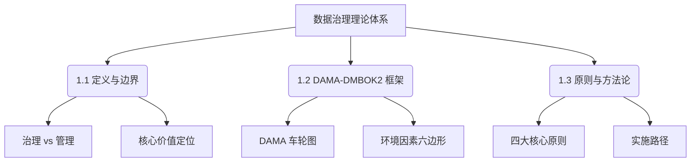

# 📘 01. 数据治理核心概念与理论框架 (Core Concepts & Framework)

## 🏙️ 1. 业界背景与发展综述 (Industry Context)

### 1.1 从“数据库管理”到“数据治理”的范式转移
在过去的三十年中，企业对数据的认知经历了从“副产物”到“核心资产”的深刻转变。

*   **1.0 时代 (1990s - 2005)**: 数据是 IT 系统的附属品。重点在于**数据库管理 (DBA)**，确保 Oracle/SQL Server 不宕机，数据不丢失。
*   **2.0 时代 (2005 - 2015)**: 随着数据仓库 (DW) 和 BI 的兴起，企业开始关注数据的**一致性**。重点在于**元数据管理**和简单的**数据质量 (DQ)** 清洗，试图解决“报表打架”的问题。
*   **3.0 时代 (2015 - 2023)**: 移动互联网和数字化转型爆发。数据成为生产要素。**数据治理 (Data Governance)** 正式走向舞台中央，涵盖了安全、合规、标准、质量全生命周期。企业设立 CDO (首席数据官) 职位。
*   **4.0 时代 (2023 - 未来)**: AI 大模型驱动。治理的边界拓展到**非结构化数据**和**语料治理**。

### 1.2 当前痛点
尽管概念火热，但据 Gartner 统计，超过 60% 的数据治理项目未能达到预期目标。核心痛点包括：
*   **重技术轻管理**: 买了一堆昂贵的治理平台，但没有建立配套的认责制度。
*   **与业务脱节**: 治理变成了 IT 部门的自嗨，业务部门觉得“增加了录入负担”而消极抵抗。
*   **ROI 难以量化**: 老板问“花 500 万做治理，在这个季度能带来多少利润？”，很难回答。

---

## 🎯 2. 本章课题描述 (Chapter Objectives)

本章作为全课程的基石，旨在为读者构建一个坚实、清晰的理论认知框架。我们将剥离市面上令人眼花缭乱的概念包装，直击数据治理的本质。

**核心课题**:
1.  **定义厘清**: 什么是治理？什么是管理？两者有何区别？(Governance vs Management)
2.  **框架对齐**: 深入解读全球通用的 **DAMA-DMBOK2** 知识体系，理解“车轮图”的内在逻辑。
3.  **价值锚定**: 如何从战略高度阐述数据治理的核心价值（风险控制 vs 价值创造）。
4.  **方法论**: 掌握“道法术器”四层治理逻辑。

---

## 🏗️ 3. 整体知识框架 (Overall Framework)

本章内容逻辑结构如下：

### 🧩 3.1 核心板块详解

| 章节 | 核心内容 | 关键知识点 |
| :--- | :--- | :--- |
| [**1.1 定义与边界**](./1.1-%E6%95%B0%E6%8D%AE%E6%B2%BB%E7%90%86%E7%9A%84%E5%AE%9A%E4%B9%89%E3%80%81%E8%BE%B9%E7%95%8C%E4%B8%8E%E6%A0%B8%E5%BF%83%E4%BB%B7%E5%80%BC.md) | 厘清概念，划定范围 | **决策权 (Decision Rights)**、**责权对等**、**资产负债表论** |
| [**1.2 DAMA 体系**](./1.2-dama-dmbok2-%E6%95%B0%E6%8D%AE%E7%AE%A1%E7%90%86%E7%9F%A5%E8%AF%86%E4%BD%93%E7%B3%BB%E6%A1%86%E6%9E%B6.md) | 全球标准解读 | **DAMA Wheel**、**11 个知识领域**、**环境因素** |
| [**1.3 方法论**](./1.3-%E6%95%B0%E6%8D%AE%E6%B2%BB%E7%90%86%E7%9A%84%E5%9F%BA%E6%9C%AC%E5%8E%9F%E5%88%99%E4%B8%8E%E6%96%B9%E6%B3%95%E8%AE%BA.md) | 落地实施指南 | **业务导向**、**急用先行**、**PDCA 循环** |

---

## 🧭 4. 目录导航 (Section Navigation)

以下是本章包含的详细内容模块：

*   [1.1-数据治理的定义、边界与核心价值](./1.1-%E6%95%B0%E6%8D%AE%E6%B2%BB%E7%90%86%E7%9A%84%E5%AE%9A%E4%B9%89%E3%80%81%E8%BE%B9%E7%95%8C%E4%B8%8E%E6%A0%B8%E5%BF%83%E4%BB%B7%E5%80%BC.md)
    *   _Note: 重点理解“治理是关于决策权的分配，管理是关于决策的执行”。_
*   [1.2-dama-dmbok2-数据管理知识体系框架](./1.2-dama-dmbok2-%E6%95%B0%E6%8D%AE%E7%AE%A1%E7%90%86%E7%9F%A5%E8%AF%86%E4%BD%93%E7%B3%BB%E6%A1%86%E6%9E%B6.md)
    *   _Note: 本节包含高清 DAMA 车轮图解析，是数据治理从业者的必修课。_
*   [1.3-数据治理的基本原则与方法论](./1.3-%E6%95%B0%E6%8D%AE%E6%B2%BB%E7%90%86%E7%9A%84%E5%9F%BA%E6%9C%AC%E5%8E%9F%E5%88%99%E4%B8%8E%E6%96%B9%E6%B3%95%E8%AE%BA.md)
    *   _Note: 探讨如何避免“大而全”的治理陷阱，主张“敏捷治理”。_

---

## 📚 5. 扩展阅读与参考文献 (References)

> [!NOTE]
> 理论学习是基础，但切忌教条主义。DAMA 只是指南针，不是地图。

1.  **DAMA International**. _DAMA-DMBOK: Data Management Body of Knowledge (2nd Edition)_. Technics Publications, 2017.
    *   *评注*: 行业圣经，虽然略显晦涩，但覆盖面最全。
2.  **Gartner**. _Gartner's Data and Analytics Governance Survey_.
    *   *评注*: 提供每年的行业趋势数据，适合用来写立项报告 PPT。
3.  **Data Governance Institute (DGI)**. _The DGI Framework_.
    *   *评注*: 相比 DAMA，DGI 的框架更侧重于组织和流程设计。
