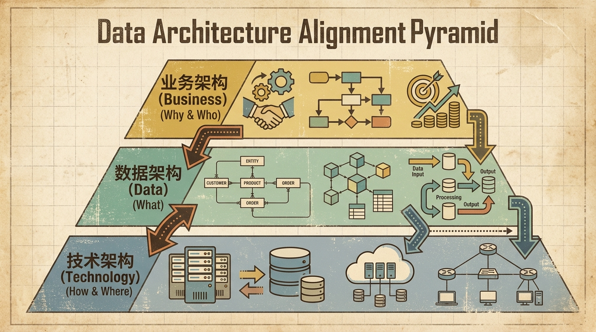
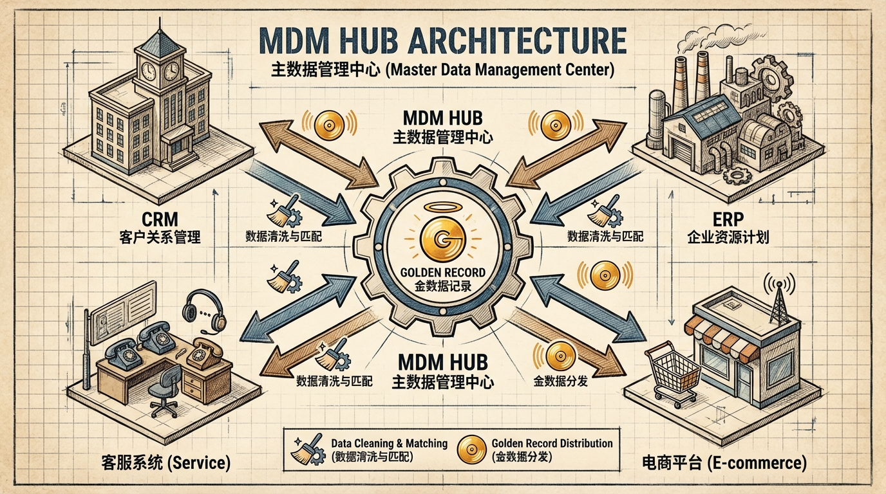
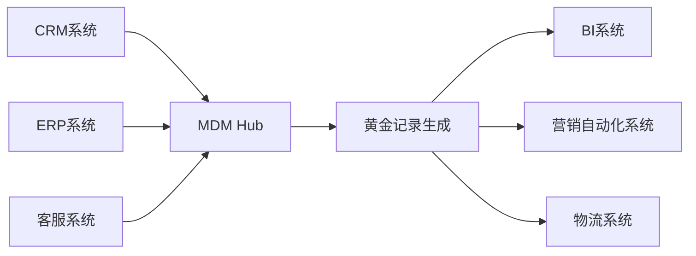
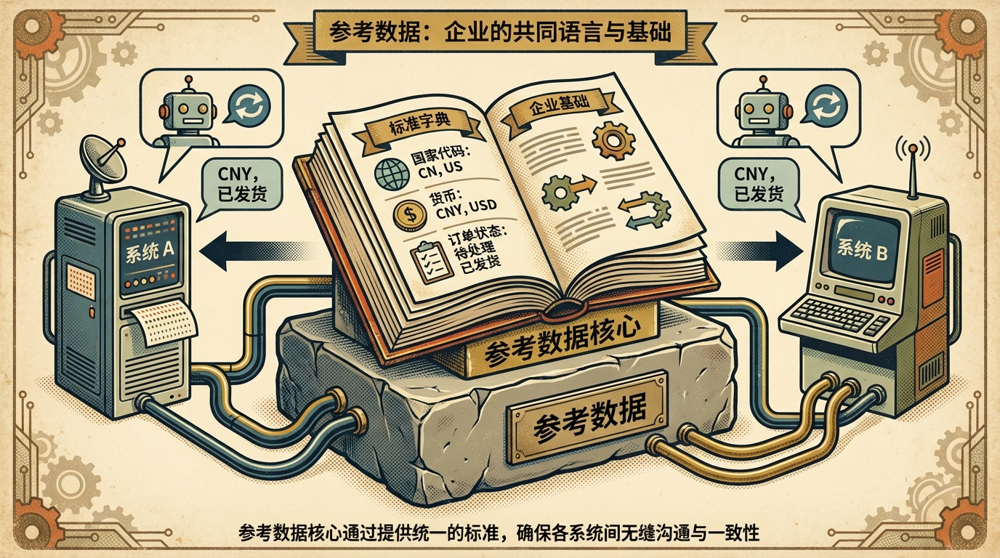

# 2.1 数据架构管理

> **摘要**: 数据架构是数据治理的骨架，是连接企业业务战略、数据资产与技术实现的核心纽带。本节深入探讨“业务-数据-技术”三层架构的对齐逻辑，拆解其协同统一的底层原理，并重点剖析主数据 (MDM) 和参考数据 (Reference Data) 这两类核心数据资产的架构设计要点、常见痛点与行业最佳实践。

---

## 2.1.1 架构对齐逻辑 (Architectural Alignment)

数据架构并非独立存在的技术产物，而是企业数字化转型中“承上启下”的关键枢纽：向上承接业务战略的落地需求，向下指导技术栈的选型与实现。其核心目标是消除业务与技术之间的“语言鸿沟”，确保数据资产的价值能够精准匹配业务场景。

### 1. 三层架构的协同统一

#### **业务架构 (Business Architecture)**: **(Why & Who)**
业务架构是数据架构的源头，定义了企业的核心价值创造路径，涵盖价值链模型、业务能力地图、端到端业务流程三大核心内容，由企业战略规划部、业务运营部门共同主导。
- **内容与对齐点**: 数据架构必须建立“数据-业务”的强关联，每一类数据资产都需要对应明确的业务场景与价值。例如，零售企业的“客户地址”数据，直接映射到“订单履约-物流配送”“客户回访-售后上门”两大核心业务流程，若该数据缺失或错误，将直接导致配送延误、客户满意度下降。
- **无效数据的判定标准**: 若一个数据对象无法关联到任何业务流程或价值场景，即成为“暗数据（Dark Data）”——据Gartner统计，企业平均有60%以上的存储数据属于暗数据，不仅占用存储资源，还可能带来合规风险。例如，某快消企业曾花费数百万存储客户的社交平台浏览轨迹，但未对应任何营销或运营场景，最终清理后节省了40%的云存储成本。

#### **数据架构 (Data Architecture)**: **(What)**
数据架构是业务需求的数字化翻译器，核心产出包括**概念模型、逻辑模型、物理模型**三级数据模型，以及数据流图（DFD）、数据分布热力图等。
- **核心职责拆解**:
  - 业务名词标准化：将“上帝客户”“VVIP用户”等业务口语，翻译为标准化的数据实体“高价值客户（High-Value Customer）”，并定义其属性（年消费金额、月复购频率等）。
  - 实体关系建模：通过ER图（实体关系图）明确“客户-订单-商品”之间的关联，例如一个客户可拥有多个订单，一个订单可包含多个商品，为后续数据查询与分析提供逻辑基础。
  - 数据流转规划：设计从业务系统（源端）到ETL/ELT工具，再到数据仓库、数据集市的完整路径，确保数据在流转过程中保持一致性与可追溯性。例如，制造企业的生产数据从PLC设备采集后，通过Kafka实时同步到数据湖，再经Spark清洗后加载到数据仓库的生产分析集市，供生产效率分析使用。

#### **技术架构 (Technology Architecture)**: **(How & Where)**
技术架构是数据架构的实现载体，涵盖数据库、大数据平台、云基础设施等技术组件的选型与部署。
- **对齐核心逻辑**: 数据架构的非功能性需求（数据量、实时性、一致性、安全性）直接决定技术选型。例如：
  - 若数据架构要求“订单数据支撑秒级查询且强一致性”，则需选用分布式关系型数据库（如TiDB）或MySQL分库分表架构，而非面向批量分析的Hive（延迟可达小时级）；
  - 若需支撑PB级的用户行为数据存储与分析，则需选用云原生数据湖（如AWS S3+Athena）或Hadoop集群，兼顾存储成本与分析灵活性。

### 2. 架构设计原则

#### **唯一信源（Single Source of Truth, SSOT）**
SSOT是确保数据一致性的核心原则，即企业内的每一类核心数据（如客户年度销售额、产品库存总量）只能有一个官方认定的权威来源。某国有银行曾面临“数据打架”问题：零售部门报表显示季度客户销售额为50亿，对公部门报表显示为55亿，管理层无法判断真实业绩。通过搭建企业级数据仓库，将所有业务系统的销售数据统一汇聚到数仓作为SSOT后，数据一致性提升至99.9%，彻底解决了跨部门数据矛盾。

#### **松耦合（Loose Coupling）**
松耦合要求生产交易系统（OLTP）与分析决策系统（OLAP）物理分离，避免分析查询对核心业务造成影响。某电商企业在2020年大促期间，因报表系统直接读取交易库数据，导致订单下单接口响应延迟从100ms飙升至2s，订单转化率下降15%。后续采用CDC（变更数据捕获）技术，实时将交易数据同步到独立的数据仓库，实现物理分离后，交易系统响应速度恢复正常，同时分析报表的查询效率提升了300%。

---

## 2.1.2 关键架构设计：主数据与参考数据

在企业的数万张数据表里，主数据与参考数据是数据资产的“核心骨架”，直接决定了数据的一致性、可用性与业务价值。

### 1. 主数据管理 (Master Data Management - MDM)

主数据是描述企业核心业务实体的数据，Gartner将其定义为“跨越业务部门共享的、高价值的、相对静态的数据资产”，最典型的四大类为**人（客户/员工）、事（产品/服务）、地（区域/网点）、物（设备/资产）**。
- **核心特征**:
  - 高共享性：几乎所有业务系统都依赖主数据，例如CRM、ERP、客服系统都需要调用客户主数据，电商平台、供应链系统都需要调用产品主数据；
  - 相对静态：与交易数据（如订单、支付记录）的高频更新不同，主数据的更新频率通常低于1%/月，例如客户姓名、产品型号的变更频率极低。
- **常见架构痛点：多头管理导致数据冗余与冲突**
某快消企业在实施MDM前，CRM、电商平台、ERP三个系统的客户数据重复率达35%，且同一客户的联系地址、会员等级等信息存在冲突，导致精准营销时同一客户收到多份不同的优惠券，客户投诉率上升20%，转化率下降12%。
- **核心设计要点**:
  - **全局唯一ID（One ID）**: 为每一个核心实体生成全局唯一的UUID（通用唯一识别码），避免跨系统的ID冲突。与自增ID不同，UUID不依赖于特定数据库，可在多系统间无缝流转，确保实体的唯一标识；
  - **黄金记录（Golden Record）**: 当多源数据发生冲突时，通过预设的“信任规则”生成权威融合记录。例如，优先取最近30天内有交易行为的系统的客户地址，或取业务权重更高的系统（如ERP的财务地址比CRM的联系地址更可信）；
  - **集中式Hub架构**: 采用“MDM Hub”作为核心节点，上游对接各业务系统的数据源，经过清洗、匹配、合并生成黄金记录后，再通过API、消息队列（Kafka）分发给下游所有系统，避免下游系统之间直接同步导致的不一致。其架构逻辑可通过以下Mermaid图描述：

### 2. 参考数据 (Reference Data)

参考数据是用于对其他数据进行分类、标签化的标准化数据集合，俗称“码表”“字典表”，是确保数据一致性的底层基石。
- **核心示例**: 国家代码（CN/US）、币种（CNY/USD）、订单状态（Pending/Shipped/Delivered）、产品分类（电子/家电/服装）等；
- **重要性**: 参考数据的不一致会导致数据整合灾难。某制造企业曾因车间系统用“01”代表合格品，质检系统用“Pass”代表合格品，生产报表统计合格率时，两类数据无法匹配，导致合格率统计误差达10%，影响了生产决策的准确性；
- **标准化管理流程**:
  - **统一管控**: 禁止开发人员将参考数据硬编码（Hardcode）在代码中，必须统一存储在参考数据管理系统（RDM）中。某互联网企业曾因开发人员将订单状态硬写在代码里，当业务新增“退款中”状态时，需要修改5个系统的代码，耗时一周；改用RDM后，只需在系统中新增状态，所有下游系统自动同步，当天即可完成；
  - **版本控制**: 参考数据并非一成不变（如行政区划变更、行业标准更新），需维护生效时间与失效时间。例如，2024年成都设立新的行政区，RDM中需记录旧代码的失效时间为2024年1月1日，新代码的生效时间同步，确保历史数据查询的准确性；
  - **映射管理**: 维护企业标准码与老旧系统、外部系统的码值映射关系。例如，企业收购某子公司后，对方的性别码为“1/2”，而企业标准为“M/F”，RDM中维护映射规则，在数据集成时自动转换，无需修改旧系统的代码。