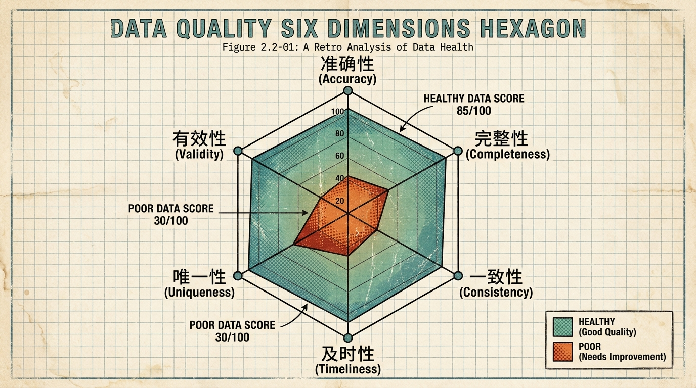
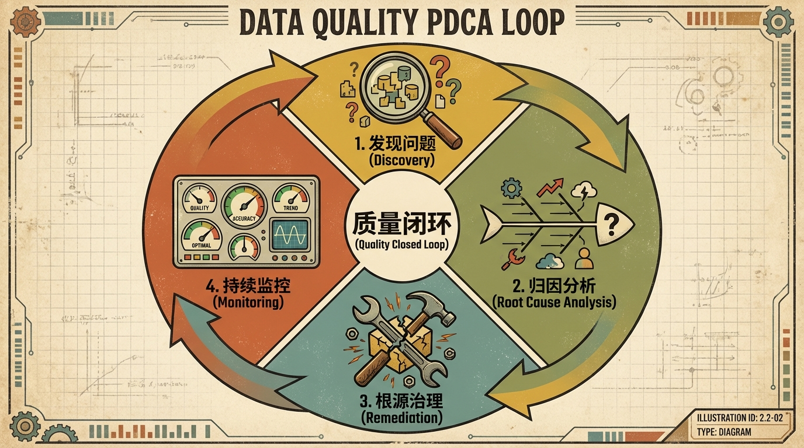

# 2.2 数据质量管理

> **摘要**: 质量是数据治理的生命线，直接决定业务决策的可信度、客户体验的优劣及合规风险的高低——金融行业数据误差可能引发风控误判导致坏账，电商平台数据不完整会降低推荐转化率，而不合规的脏数据还可能触犯《数据安全法》《个人信息保护法》等监管要求。本节基于业界通用的“六大维度”建立量化可落地的质量评估标准，并提出“归因-治理-闭环”的系统性解决方案，通过自动化工具、责任体系与流程机制的结合，建立长效的质量管控机制，为企业数据资产的价值释放筑牢基础。

---

## 2.2.1 质量评估维度 (Data Quality Dimensions)

要治理数据质量，首先需清晰定义“好数据”的量化标准。业界经过数十年实践沉淀，形成了覆盖数据全生命周期的六大核心评估维度，各维度既相互独立又协同支撑，共同构成数据质量的评价体系。

### 1. 准确性 (Accuracy)
*   **定义**: 数据与现实世界实体或权威基准的吻合程度，是数据质量的核心维度，直接反映数据的真实性。
*   **业务影响**: 错误的客户收入数据会导致银行信用评级偏差，错误的库存数据会引发零售企业缺货或积压风险。
*   **示例**: 某员工真实年龄30岁，系统记录为300岁；某客户在央行征信系统的还款状态为“正常”，但企业内部CRM系统标记为“逾期”。
*   **评估方法**: 通常采用“权威源比对法”和“业务规则校验法”结合：权威源优先选择企业主数据管理（MDM）平台、外部合规数据源（如央行征信、政务公开数据）；业务规则校验通过逻辑判断排除不可能值（如年龄≤150、收入≥0）。自动化评估可借助Great Expectations的`expect_column_values_to_match_other_table`实现跨源比对，或用`expect_column_values_to_be_between`实现规则校验。
*   **行业案例**: 某全国性商业银行曾因客户职业信息准确率不足98.8%，导致个人信用贷款审批通过率偏差1.2%，坏账率上升0.3个百分点。通过搭建自动化权威源比对系统，每日同步央行征信数据校验，将准确率提升至99.7%以上，坏账率回落至基准水平。

### 2. 完整性 (Completeness)
*   **定义**: 预期采集或存储的数据是否完整存在，分为字段级完整性（必填字段是否非空）和数据集级完整性（预期记录数是否达标）。
*   **业务影响**: 缺失客户手机号会导致电商营销触达失败，缺失交易流水记录会导致财务报表失真。
*   **示例**: 客户信息表中“手机号”必填字段空值率达10%；每日应抽取100万条交易流水，ETL抽取后仅90万条，且增量数据波动超过15%。
*   **评估指标**: 字段空值率、必填字段覆盖率、记录数波动率、数据集增量完整性率。
*   **行业案例**: 某零售企业在2023年“黑五”大促期间，因源数据库性能瓶颈，ETL抽取交易数据时记录数缺失15%，导致实时库存报表失真，引发3个核心品类缺货。后续通过增加并行抽取节点、设置预校验阈值（记录数波动超过5%即触发告警），将数据集完整性稳定在99.99%。

### 3. 一致性 (Consistency)
*   **定义**: 同一数据实体在不同系统、不同数据集或不同时间点的格式、语义是否统一，分为语法一致性（如日期格式统一为YYYY-MM-DD）和语义一致性（如“客户ID”在CRM、ERP、数仓中均指唯一客户标识）。
*   **业务影响**: 跨系统部门ID定义不一致会导致人力成本核算偏差，跨渠道订单状态语义冲突会导致客服响应失误。
*   **示例**: A表“部门ID”为字符串格式“DEP001”，B表“部门ID”为数字格式“1”；ERP系统中“生产订单完成”指财务结算完成，MES系统中指工序执行完成，导致生产调度报表偏差20%。
*   **评估方法**: 借助数据血缘工具（如Collibra、Apache Atlas）追踪数据流转链路，通过跨表关联校验（如`expect_column_values_to_be_in_set`检查A表部门ID是否存在于B表）实现语法一致性校验；语义一致性需通过统一数据字典和术语表（Taxonomy）保障。
*   **行业案例**: 某大型制造企业通过主数据管理平台统一了全集团120+系统的“生产订单状态”术语定义，同步更新跨系统数据映射规则，生产调度报表的一致性准确率从80%提升至100%，生产计划调整效率提升30%。

### 4. 及时性 (Timeliness)
*   **定义**: 数据从产生到通过质量校验、可被业务使用的时间间隔，需匹配不同业务场景的SLA要求。
*   **业务影响**: 实时风控场景数据延迟超过1秒会导致欺诈交易漏判，T+1报表延迟会影响管理层次日决策效率。
*   **示例**: 约定T+1的销售报表次日6点前产出，但实际次日9点才完成；实时推荐系统的用户行为数据延迟5分钟，导致推荐转化率下降3%。
*   **评估指标**: SLA达成率、数据就绪时间（DRT）、数据延迟时长（Lag）。实时场景可通过Kafka流处理的监控指标追踪数据传输延迟。
*   **行业案例**: 某头部电商平台的实时推荐系统曾因用户行为数据延迟5分钟，个性化商品推荐的点击率下降3%，订单转化率下降2.5%。通过优化Kafka分区策略、增加实时数据质量校验节点，将数据延迟控制在200毫秒以内，推荐转化率回升至基准水平以上。

### 5. 唯一性 (Uniqueness)
*   **定义**: 同一业务实体在数据集中仅存在一条唯一记录，无重复或冗余，需通过实体识别（Entity Resolution）实现跨记录匹配。
*   **业务影响**: 重复的客户记录会导致营销资源浪费（同一客户收到多份相同推送），重复的供应商记录会导致采购付款重复。
*   **示例**: 同一客户用手机号138XXXX1234和139XXXX4567分别注册，系统生成两条独立的客户ID记录。
*   **评估方法**: 字段级唯一性通过`expect_column_values_to_be_unique`校验主键；实体级唯一性需借助Tamr等实体识别工具，通过机器学习算法（余弦相似度、实体链接）匹配相似记录。
*   **行业案例**: 某全国性保险公司通过实体识别工具扫描客户数据库，发现8%的重复客户记录，合并冗余数据后，精准营销的响应率提升12%，营销成本降低9%。

### 6. 有效性 (Validity)
*   **定义**: 数据符合预定义的格式、类型、值域或业务规则，分为格式有效性（如邮箱含@）和业务规则有效性（如信用卡有效期>当前日期）。
*   **业务影响**: 无效的手机号会导致营销触达失败，无效的发票号会导致企业税务合规风险。
*   **示例**: 邮箱字段记录为“test.example.com”（无@）；信用卡有效期记录为“2023-01”（早于当前日期2024-05）。
*   **评估方法**: 格式有效性通过正则表达式校验（如Great Expectations的`expect_column_values_to_match_regex`）；值域有效性通过枚举值校验或动态规则校验（如随时间更新的有效期规则）。
*   **行业案例**: 某第三方支付公司在用户绑卡流程中新增实时有效性校验，包括信用卡有效期、卡号格式、CVV码规则，将无效绑卡请求率从1.5%降至0.1%，用户绑卡成功率提升2.3%。

---

## 2.2.2 归因与闭环 (Root Cause Analysis & Closed Loop)

数据质量监控发现问题只是起点，只有通过系统的归因分析、根源治理与持续监控，形成完整的PDCA循环，才能实现数据质量的长效管控。以下是“发现-归因-治理-监控”的全闭环落地路径：

### 1. 发现问题 (Discovery)
*   **核心手段**: 搭建全链路数据质量监控体系，覆盖源系统、ETL/ELT、数据服务全流程，借助专业工具（如Great Expectations、Apache Griffin、Talend Data Quality）实现自动化监控。
*   **实施策略**:
    *   **分层探针埋点**: 在源系统的录入节点、ETL的抽取/转换/加载节点、数据服务的输出节点分别部署质量探针，实时采集质量指标。
    *   **阈值化告警机制**: 针对各维度指标设置业务可接受的阈值（如空值率>1%触发一级告警，>5%触发紧急告警），通过邮件、企业微信、Jira工单等多渠道推送至数据责任人（Data Owner、数据 steward）。
*   **行业案例**: 某互联网企业用Apache Griffin搭建全链路监控体系，在ETL转换阶段发现60%的质量问题来自逻辑Bug，通过前置校验节点提前拦截脏数据，下游报表的脏数据率从2.1%降至0.2%。

### 2. 归因分析 (Root Cause Analysis)
找到质量问题的根本原因是实现有效治理的关键，通常采用“5Why分析法”“鱼骨图法”定位根源，常见问题分为三类：
*   **Input Error (录入错误)**: 前端系统缺乏必填校验、业务人员录入不规范、批量导入数据未做预校验（如某企业HR批量导入员工数据时，误将年龄列复制为入职年份列）。
*   **Process Error (处理错误)**: ETL/ELT代码逻辑Bug、数据转换时字符集乱码、数据血缘断裂导致的映射错误（如某数仓将“商品ID”与“类别ID”映射错误，导致销售品类统计偏差）。
*   **System Error (系统错误)**: 源数据库宕机、网络丢包、存储介质故障导致数据丢失（如某零售企业黑五期间源数据库性能过载，导致10%的交易数据未写入）。
*   **行业案例**: 某银行发现客户年龄数据错误率达1.5%，通过5Why分析定位根源：→年龄错误→录入无限制→前端系统未设置校验规则→需求阶段未明确业务规则→跨部门需求评审缺失。最终通过建立跨部门需求评审机制，从根源解决了90%的年龄错误问题。

### 3. 根源治理 (Remediation)
治理需坚持“治标与治本结合”，短期解决下游业务痛点，长期消除问题根源：
*   **治标 (Data Cleansing)**: 针对已产生的脏数据，在数仓层通过SQL脚本或专业清洗工具（AWS Glue DataBrew）批量清洗，如将空值替换为“Unknown”、修正格式错误数据。该方式仅解决下游问题，无法从源头避免脏数据产生。
*   **治本 (Root Cause Fix)**:
    *   源端系统改造：增加必填校验、格式校验、值域校验（如前端录入年龄限制为18-120岁）。
    *   数据流程优化：修复ETL/ELT Bug、完善数据映射规则、增加数据血缘监控。
    *   人员能力建设：培训业务人员规范录入数据，明确数据质量责任。
*   **行业案例**: 某零售企业针对客户地址空值率达10%的问题，先用第三方地址补全工具清洗下游数仓数据（治标，解决报表展示问题），再推动CRM系统增加地址必填校验和格式校验（治本），同时培训门店录入人员，3个月后地址空值率降至0.5%。

### 4. 持续监控 (Monitoring)
*   **质量仪表盘 (DQ Scorecard)**: 搭建可视化数据质量仪表盘，展示各业务域的DQ综合得分（加权六大维度：准确性30%、完整性25%、一致性20%、及时性15%、唯一性5%、有效性5%）、核心指标趋势、风险告警。
*   **质量通报与考核**: 每月发布数据质量报告，设立红黑榜，将数据质量评分纳入业务部门KPI（占比5%-10%），倒逼业务部门重视数据质量。
*   **闭环自动化**: 实现质量监控工具与工单系统（如Jira）的集成，每一个质量问题自动生成工单，只有当根源修复、监控指标连续3个周期达标后，工单才能自动关闭。

> **闭环思维**: 每一个质量问题对应一个Jira工单，明确责任人、修复期限、验证标准。只有当问题根源被彻底修复，且连续3次监控周期内指标恢复正常时，工单方可关闭，确保质量问题“发现-修复-验证”全流程可追溯、无遗漏。