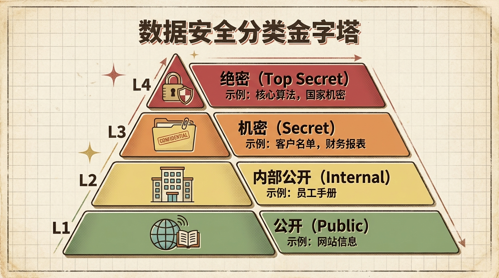
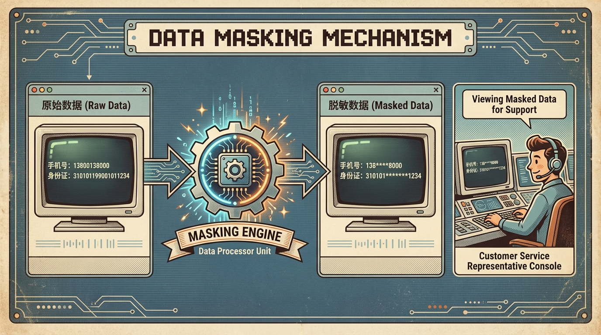
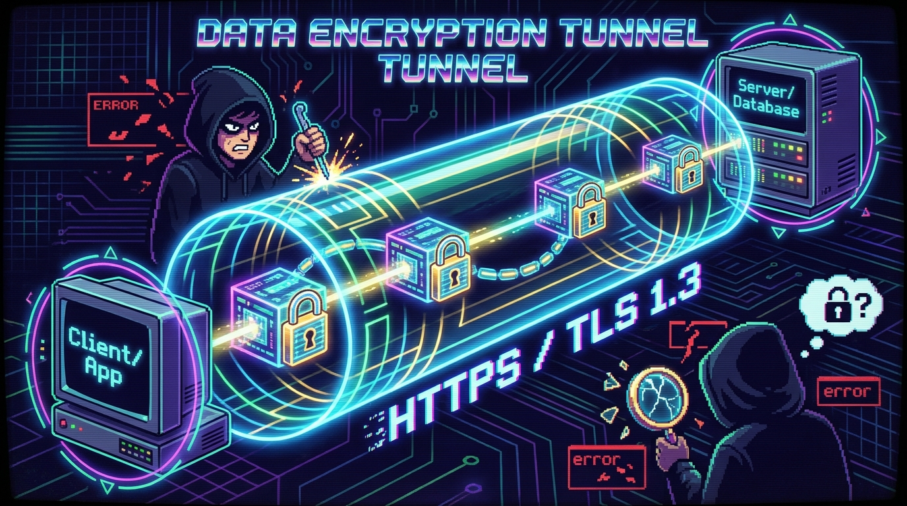

# 2.3 数据安全与合规管理

> **摘要**: 安全与合规是数据治理的底线。本节从技术和法规两个维度展开，详解 IAM、脱敏、加密等核心技术，并深度解读 GDPR 及中国《数据安全法》对企业的合规要求。

---

## 2.3.1 安全技术体系 (Data Security Technology)

数据安全不是靠“口号”，而是靠“全链路技术防线”，需覆盖数据采集、存储、传输、使用、销毁的全生命周期，通过技术手段将安全策略固化为不可逾越的执行规则。

### 1. 数据分级分类 (Data Classification & Grading)

一切安全管理的前提是：**知道什么数据重要**。数据分级分类是数据安全管理的“第一道关口”，只有精准识别数据的敏感程度和业务属性，才能实现差异化防护，避免过度防护浪费资源或防护不足引发风险，这也是《数据安全法》对核心数据保护的强制性要求。

*   **分级**: 按敏感程度从高到低划分，不同级别对应不同的安全管控力度：
        *   **L4 (绝密)**: 直接影响国家安全或企业生存的核心数据，如军工企业的核设施控制代码、互联网头部企业的核心推荐算法、上市公司未披露的并购预案等。某头部电商曾因核心推荐算法泄露，导致竞争对手精准复刻其流量分发逻辑，市场份额在3个月内下降8%。
        *   **L3 (机密)**: 影响企业核心竞争力的数据，如高净值客户名单、未发布的年度营收预测、新产品研发蓝图等。某快消企业因内部员工泄露L3级经销商折扣体系数据，导致渠道利润亏损超千万元。
        *   **L2 (内部公开)**: 仅对企业内部员工开放的数据，如内部OA通讯录、员工培训手册、部门季度工作总结等，需限制对外传播。
        *   **L1 (公开)**: 可对外发布的非敏感数据，如企业官网的产品介绍、社会责任报告、公开招聘信息等。
*   **分类**: 按业务属性划分，便于按场景定制安全策略，例如：用户个人信息（含敏感字段）、交易流水数据、系统运维日志数据、财务核算数据等。企业通常会成立跨业务、安全、IT部门的分级分类工作组，制定统一标准后，通过自动化数据发现工具扫描识别敏感字段（如身份证号、银行卡号），批量标记分级分类标签。

### 2. 访问控制 (IAM - Identity and Access Management)

访问控制是数据安全的“守门人”，核心是确保“合适的人在合适的场景下访问合适的数据”。

*   **原则**: **最小权限原则 (Least Privilege)**，即仅为用户授予完成工作所需的最小权限集，避免过度授权引发风险，这也是NIST（美国国家标准与技术研究院）IAM框架的核心要求。
*   **机制**:
        *   **RBAC (Role-Based Access Control)**: 基于角色的授权，将权限绑定到岗位角色而非个人，简化权限管理。例如某制造业企业为“车间主任”角色分配设备监控数据查看权限，而非给每个车间主任单独授权，当岗位变动时，只需调整角色权限即可批量更新。
        *   **ABAC (Attribute-Based Access Control)**: 基于多维度属性的细粒度授权，通过用户属性（岗位、地域）、环境属性（时间、终端）、数据属性（分级、分类）的组合判断授权。例如某保险公司的理赔人员，仅在工作日9:00-18:00，且处理辖区内案件时，才能访问对应客户的医疗费用明细数据，有效防止权限滥用。
        *   **账号生命周期管理**: 实现账号从创建到回收的全自动化管控，通过HR系统与IAM系统的API打通，员工入职时自动创建账号并分配基础角色，离职时1小时内回收所有系统权限并冻结账号。某科技公司曾因离职员工账号未及时回收，导致核心代码泄露，上线自动化生命周期管理系统后，此类风险彻底清零。

### 3. 数据脱敏 (Data Masking)

数据脱敏是在不破坏数据业务逻辑的前提下，对敏感数据进行变形处理，确保非授权人员无法获取真实敏感信息。

*   **静态脱敏 (Static Data Masking - SDM)**:
        *   **场景**: 生产数据导出至测试、开发、数据分析等非生产环境时使用。
        *   **方法**: 通过正则替换、虚拟数据生成等不可逆方式修改敏感字段，例如将客户手机号替换为138xxxx0000格式的虚拟号，将身份证号中间10位替换为星号。
        *   **特点**: 不可逆、非生产环境无真实敏感数据，安全级别高。例如某零售企业在给测试团队提供交易数据时，通过静态脱敏工具批量处理，确保测试人员无法接触真实客户信息，每年避免了至少3起潜在的测试数据泄露事件。

*   **动态脱敏 (Dynamic Data Masking - DDM)**:
        *   **场景**: 在线业务场景中，客服、运维等人员访问生产数据时使用。
        *   **方法**: 根据用户权限在数据展示层实时屏蔽敏感字段，数据库存储的原始数据保持不变。例如某银行客服查询客户信息时，系统自动隐藏身份证号中间10位、银行卡号中间8位，仅展示首尾四位。
        *   **特点**: 无需修改原始数据，不影响业务流程，适合高并发在线场景。

### 4. 加密技术 (Encryption)

加密技术是数据安全的“最后一道防线”，确保数据即使被窃取，也无法被解密使用。

*   **传输加密**: 采用HTTPS协议基于TLS 1.3版本，相比TLS 1.2握手时间缩短50%以上，关闭了所有不安全的加密套件，有效抵御中间人攻击。某电商平台在登录、交易等核心环节强制使用HTTPS/TLS 1.3，全年未发生传输过程中的数据泄露事件。
*   **存储加密**: 采用TDE（透明数据加密）对数据库磁盘文件进行加密，使用AES-256加密算法，即使磁盘被盗或备份文件泄露，也无法读取明文数据，且对应用层完全透明，无需修改业务代码。某云厂商为金融客户提供的数据库服务默认开启TDE加密，满足《金融数据安全 数据生命周期安全规范》要求。
*   **同态加密 (Homomorphic Encryption)**: 隐私计算领域的前沿技术，允许在密文状态下直接进行加、减、乘等运算，运算结果解密后与明文运算一致，实现“数据可用不可见”。例如某医疗AI公司联合多家三甲医院，采用同态加密让各医院的病历数据在密文状态下训练诊断模型，既保护了患者隐私，又实现了跨机构数据价值共享。

---

## 2.3.2 合规体系搭建 (Compliance Framework)

全球范围内，数据合规监管已进入“强监管”时代，毕马威2023年全球数据合规报告显示，全球企业因合规违规导致的平均损失超过1200万美元，合规已成为企业生存发展的必备能力。

### 1. 核心法规解读

*   **GDPR (欧盟通用数据保护条例)**:
        *   **特点**: 史上最严隐私法规，具有长臂管辖权，只要处理欧盟居民个人数据，无论企业位于何地均需遵守。
        *   **核心权利**: 被遗忘权（用户可要求企业删除其个人数据）、数据可携带权（用户可要求导出数据并转移至其他服务商）。
        *   **罚款**: 最高为企业全球年营收的4%或2000万欧元，以较高者为准。2023年，亚马逊因未明确告知用户数据使用目的，被欧盟数据保护委员会罚款7.46亿欧元。

*   **中国《数据安全法》**:
        *   **核心**: 我国数据领域基础性法律，确立了“数据分类分级保护制度”，要求企业对核心数据、重要数据实施重点保护。
        *   **关注点**: 国家安全、公共利益与企业核心利益的平衡。2022年，某网约车平台因未对用户行踪轨迹（重要数据）进行分级保护，被网信办罚款8000万元。

*   **中国《个人信息保护法》 (PIPL)**:
        *   **核心**: 我国个人信息保护专门法律，坚持“告知-同意 (Notice & Consent)”原则，处理个人信息必须提前明确告知用户并获得有效同意。
        *   **敏感个人信息**: 生物识别、医疗健康、金融账户、行踪轨迹等数据，处理需取得用户**单独同意**。2023年，某短视频APP因强制要求用户授权通讯录权限才能使用核心功能，违反告知-同意原则，被监管部门责令整改并罚款300万元。

### 2. 企业合规落地框架

*   **隐私政策 (Privacy Policy)**: 企业告知用户数据处理规则的法定文件，需使用通俗语言，清晰列出采集数据种类、使用目的、存储期限、对外共享情况等，不得隐藏在多级菜单中。某电商APP曾因隐私政策长达20页且充斥法律术语，被监管部门责令整改，整改后简化为3页通俗文本，明确标注核心信息。
*   **数据跨境评估**: 根据《数据出境安全评估办法》，企业向境外传输重要数据或大量个人信息前，必须向网信部门申报安全评估，获批后方可传输。某跨国企业将中国用户交易数据传输至新加坡总部前，通过3个月的评估流程获得批准，确保合规。
*   **PIA (隐私影响评估)**: 在新业务、新系统上线前，评估其对用户隐私的影响，识别风险并提出整改措施。某社交平台上线人脸识别登录功能前，通过PIA评估识别到强制授权风险，调整为用户可选开启，并增加人脸数据加密存储措施。
*   **审计留痕**: 所有敏感数据的访问、操作必须留存不可篡改的审计日志，明确“谁在什么时间做了什么操作”，金融行业需保存日志5年以上。某银行采用区块链存储审计日志，确保日志无法被删除或篡改，发生异常时可快速追溯责任。

> **合规红线**: **严禁大数据杀熟**；严禁未经授权向第三方出售用户数据。