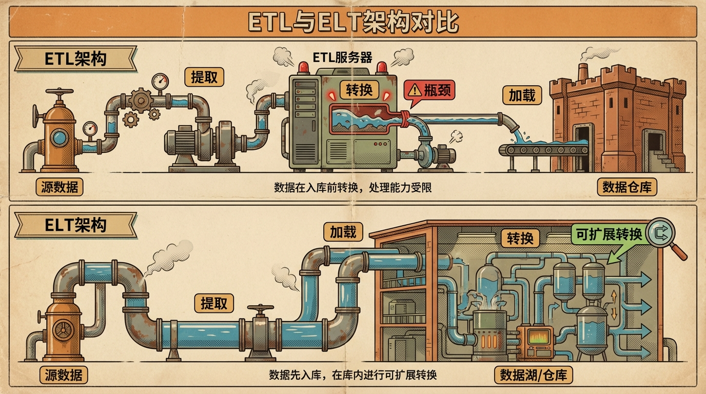
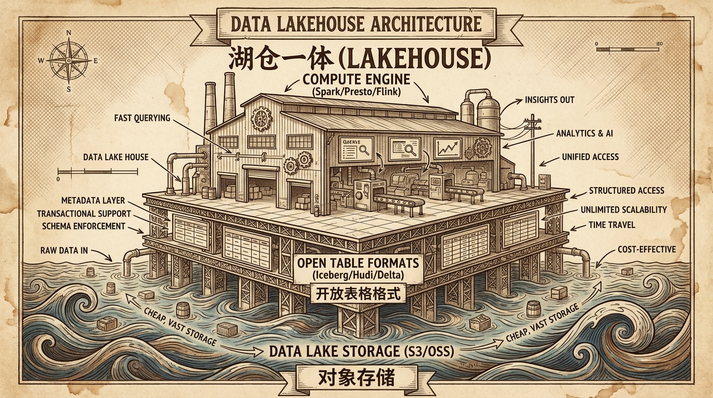
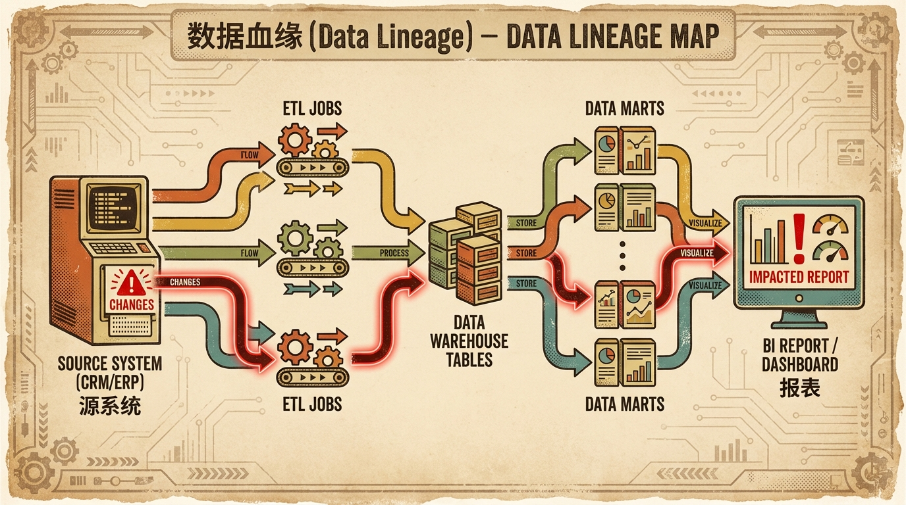

# 2.4 其他关键知识领域

> **摘要**: 除了架构、质量和安全，数据集成与元数据管理也是数据治理的重要支柱。本节从技术原理、适用场景、行业实践维度解析ETL/ELT选型逻辑与演进趋势，深入拆解湖仓一体架构的价值与实现路径，同时揭示元数据管理的分类体系及数据血缘在数据可信性构建、合规审计中的核心作用。

---

## 2.4.1 数据集成与存储 (Data Integration & Storage)

### 1. 数据集成模式：ETL vs. ELT

*   **ETL (Extract-Transform-Load)**:
        *   **流程**: 抽取（从业务系统、日志文件等数据源获取原始数据）-> **清洗/转换**（在独立ETL服务器上完成字段校验、重复值剔除、编码映射、数据标准化等操作）-> 加载到结构化数据仓库。
        *   **技术背景与适用场景**: 诞生于上世纪90年代传统数据仓库（如Teradata、Oracle Exadata）主导的时期，当时存储与计算资源成本极高（按TB级存储计费），企业需通过前置转换最小化存储占用。典型适用于以结构化数据为主、对数据一致性要求极高的传统金融、能源行业数仓场景。例如某国有银行2015年前的核心数仓系统，采用Informatica ETL工具每日夜间抽取核心业务系统、信贷系统数据，在专用小型机ETL服务器上完成转换后加载到Teradata数仓，支撑监管报表生成。
        *   **缺点**: 当转换逻辑涉及多数据源关联、复杂计算时，单节点ETL服务器易成为性能瓶颈，全量ETL任务耗时可能从数小时延长至十余小时；由于转换后直接加载清洗后的数据，原始数据无法保留，难以满足回溯分析、合规审计等需求。

*   **ELT (Extract-Load-Transform)**:
        *   **流程**: 抽取（与ETL一致，获取多源原始数据）-> **加载**（将全量原始数据直接写入数据湖或云数仓的存储层）-> **转换**（利用数仓/数据湖的分布式集群算力，通过SQL、Spark等框架完成转换逻辑）。
        *   **技术背景与适用场景**: 伴随云原生大数据平台（Snowflake、Databricks、阿里云MaxCompute）的普及兴起，核心依托“算力下推（Push-down Optimization）”机制——将转换逻辑下沉至存储层的MPP并行计算集群执行。适用于PB级海量数据、多格式数据（结构化+非结构化）混合的现代企业，尤其适合电商、互联网等需要快速响应业务创新的行业。
        *   **优势**: 利用集群并行计算能力，转换效率较传统ETL提升5-10倍；完整保留原始数据（Raw Data），支持业务部门进行用户行为回溯、异常数据排查等创新分析；转换逻辑灵活可迭代，无需修改ETL服务器配置。
        *   **趋势与案例**: **ELT已成为数据集成的主流模式**。国内某头部电商2020年将数据集成架构从ETL切换为ELT后，全量数据加载时间从8小时压缩至1.5小时，同时保留了所有原始交易日志与用户行为数据，支撑了“用户路径全链路分析”等场景，直接推动用户复购率提升3%。

### 2. 存储架构：从数仓到湖仓一体

*   **数据仓库 (Data Warehouse)**:
        *   **数据类型**: 仅支持结构化数据（关系型数据库表、CSV文件等），需严格遵循预定义的星型/雪花模型Schema。
        *   **核心特点**: 采用**Schema-on-Write（写时模式）**，写入数据时强制校验Schema一致性，确保数据质量与查询性能。
        *   **优势**: 数据一致性高，复杂查询响应速度快，适用于企业级决策报表、监管合规报表等场景。
        *   **局限**: 扩展成本线性增长，非结构化数据处理能力缺失，无法支撑实时分析、AI训练等现代数据需求。例如某制造企业2018年将数仓存储从10TB扩容至50TB时，硬件与软件成本增加了6倍。

*   **数据湖 (Data Lake)**:
        *   **数据类型**: 支持结构化、半结构化（JSON、Parquet）、非结构化（图片、视频、日志）等所有数据格式。
        *   **核心特点**: 采用**Schema-on-Read（读时模式）**，写入时不校验Schema，仅存储原始数据，读取时再解析数据结构。
        *   **优势**: 存储成本仅为传统数仓的1/10，灵活性强，可容纳任意类型的数据。
        *   **局限**: 缺乏统一元数据管理与数据质量校验，易演变为“数据沼泽”——某互联网公司2019年搭建的Hadoop数据湖，1年内存入PB级数据，但业务部门寻找可用数据平均耗时超过3天，数据利用率不足10%。

*   **湖仓一体 (Data Lakehouse)**:
        *   **核心理念**: 融合数据湖的廉价存储能力与数据仓库的高效管理能力，解决两者的各自短板。
        *   **技术支撑**: 基于对象存储（AWS S3、阿里云OSS）构建，通过**开放表格格式（Open Table Formats）**如Delta Lake、Apache Iceberg、Apache Hudi实现数据湖的结构化管理。这些格式在对象存储之上增加了元数据管理层，支持ACID事务、Time Travel（时间旅行）、数据版本管理等核心能力。
        *   **适用场景与案例**: 适用于需要同时支撑实时分析、批量报表、AI训练的企业。例如Netflix采用Apache Iceberg构建湖仓一体架构，整合了原有的数据湖与数仓，既保留了原始数据的低成本存储，又实现了数仓级的查询性能，支撑全球2亿+用户的实时推荐算法训练与业务报表分析，数据处理延迟从小时级降至分钟级。

---

## 2.4.2 元数据管理 (Metadata Management)

元数据是“数据的地图”，根据Gartner定义，它是“描述数据的数据，包括数据的结构、内容、上下文、来源和使用方式”，是实现数据可理解、可信任、可追溯的核心基础设施。

### 1. 元数据的分类

*   **技术元数据 (Technical Metadata)**:
        *   **服务对象**: IT技术团队、数据工程师。
        *   **核心内容**: 涵盖数据库版本、表的存储引擎、字段类型与约束、索引配置、ETL任务的依赖关系、SQL查询的执行计划等技术细节。
        *   **获取方式**: 通过自动化扫描工具（Apache Atlas、Collibra Data Intelligence Cloud）从数据库、ETL工具、数仓平台中实时抓取，无需人工录入。例如某保险公司用Apache Atlas每日自动扫描核心业务库与Snowflake数仓，同步技术元数据到治理平台，确保IT团队实时掌握数据结构的变更。

*   **业务元数据 (Business Metadata)**:
        *   **服务对象**: 业务部门、数据分析师、管理人员。
        *   **核心内容**: 是业务语言与技术数据之间的“翻译器”，包括业务术语表（Business Glossary）、指标计算公式、数据所有者职责、数据安全等级、数据使用场景等。例如某零售企业的业务元数据平台中，“GMV”被明确定义为“当日所有已支付订单的总金额，包含运费但排除退款金额”，并关联到数据所有者（电商业务部数据分析师）、上游数据源（订单支付系统）和下游报表（每日销售报表），彻底解决了跨部门报表数据口径冲突的问题。
        *   **获取方式**: 部分通过业务部门人工录入，部分通过指标平台、BI工具同步自动化生成。

*   **操作元数据 (Operational Metadata)**:
        *   **核心内容**: 数据在生命周期中的运行时信息，包括数据访问热度、表的更新时间、数据处理任务的运行时长与成功率、表的存储大小等。
        *   **核心价值**: 支撑数据生命周期管理与成本优化。例如某云服务商根据操作元数据中的访问热度，将超过90天未被访问的冷数据迁移到对象存储的归档层，存储成本降低了40%；同时通过监控表的更新时间，清理了6个月未更新的“僵尸表”，释放了30%的数仓存储空间。

### 2. 核心应用：数据血缘 (Data Lineage)

*   **定义**: 数据血缘是展示数据从源系统产生、经过集成转换、最终流向报表/AI模型的全链路依赖关系图，直观呈现数据“从哪里来，到哪里去，经过了哪些加工”。
*   **实现方式**: 分为静态血缘与动态血缘：静态血缘通过解析ETL脚本、SQL语句、BI报告的数据源配置获取，反映数据的静态依赖关系；动态血缘通过捕获数据处理的运行时日志（如Spark作业日志、Snowflake查询日志）获取，反映数据的实际流转路径。
*   **关键场景与案例**:
        *   **影响分析**: 当源系统字段变更时，通过血缘图可快速识别下游受影响的报表、指标与业务系统。例如某银行核心业务系统的“客户等级”字段调整后，通过血缘图10分钟内就梳理出了涉及的12份监管报表与5个BI仪表盘，提前完成了报表逻辑的调整。
        *   **问题溯源**: 当报表数据出现偏差时，通过血缘图可快速定位问题根源。某快消企业某次“月度区域销售报表”出现数据错误，通过血缘图仅用25分钟就定位到上游经销商库存系统的“退货数量”字段被错误修改，而之前人工排查需要2-3天。
        *   **合规审计**: 满足GDPR、《数据安全法》等合规要求，快速证明敏感数据的流向与处理合规性。某跨境电商通过数据血缘平台，在GDPR审计中仅用1天就导出了用户个人数据的全链路流转报告，顺利通过审计，避免了最高4%全球营业额的罚款。

> **治理箴言**: 元数据管理系统必须自动化。靠手工维护的字典三天就会过时。例如某企业曾尝试用Excel手工维护元数据字典，3个月后字典中80%的内容与实际数据结构不符，最终引入自动扫描工具后，元数据准确率提升至98%以上。