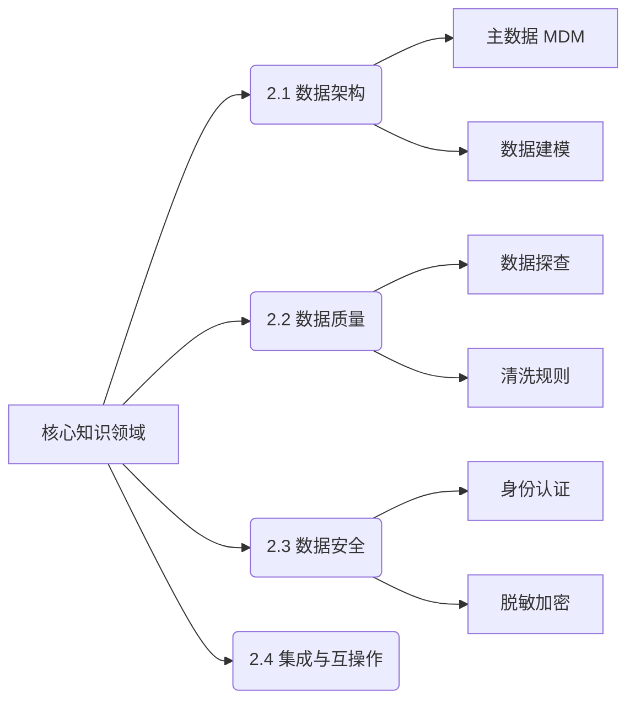

# 📘 02. 数据治理核心知识领域详解 (Key Knowledge Areas)

## 🏙️ 1. 业界背景与领域细分

数据治理并非铁板一块，而是由多个相互依赖的专业领域组成的复杂机器。在 DAMA 定义的 11 个领域中，并非所有领域权重都一样。对于大多数企业而言，存在所谓的“四大金刚”：

1.  **数据架构 (Data Architecture)**: 类似城市的规划图，决定了数据流动的骨架。
2.  **数据质量 (Data Quality)**: 类似城市的水质监测，确保流淌（流动）的是净水而非污水。
3.  **数据安全 (Data Security)**: 类似城市的防御系统，防止数据泄露或被非法访问。
4.  **元数据 (Metadata)**: 类似城市的地图和索引，没有它，谁也找不到数据在哪里。

### 趋势分析
*   **传统视角**: 侧重于“数据建模”和“数据库设计”。
*   **现代视角**: 侧重于 **DataOps (数据开发运营一体化)** 和 **Data Fabric (数据编织)**。架构更加灵活（Schema-on-Read），质量管控更加自动化。

---

## 🎯 2. 本章课题描述 (Chapter Objectives)

本章不追求对 DMBOK 的面面俱到，而是挑选企业实施中**最痛、最难、最关键**的四个领域进行深度剖析。

**核心课题**:
1.  **架构治理**: 如何打破“数据孤岛”？如何设计 Master Data Management (MDM) 主数据系统？
2.  **质量攻坚**: 建立“六性”评估标准（完整性、准确性等），并构建闭环改进机制。
3.  **安全合规**: 在 GDPR/PIPL 严监管环境下，如何做好数据分级分类与隐私保护。
4.  **元数据驱动**: 如何利用 Data Lineage (血缘分析) 自动化追踪数据链路。

---

## 🏗️ 3. 整体知识框架 (Overall Framework)

本章的知识拓扑结构如下：

### 3.1 关键领域对照表

| 领域 | 核心产出物 (Deliverables) | 典型工具 (Tools) | 常见挑战 |
| :--- | :--- | :--- | :--- |
| **数据架构** | 企业数据模型 (EDM)、数据流图 | PowerDesigner, ER/Studio | 业务变更快，模型跟不上 |
| **数据质量** | 质量检核报告 (DQC Report) | Informatica DQ, Apache Griffin | 发现问题容易，根因解决难 |
| **数据安全** | 分级分类清单、脱敏策略 | Ranger, Kerberos | 业务便利性与安全的平衡 |

---

## 🧭 4. 目录导航 (Section Navigation)

*   [2.1-数据架构管理](./2.1-%E6%95%B0%E6%8D%AE%E6%9E%B6%E6%9E%84%E7%AE%A1%E7%90%86.md)
    *   _Note: 重点掌握纵向的“业务-逻辑-物理”三层架构，以及横向的中台化架构设计。_
*   [2.2-数据质量管理](./2.2-%E6%95%B0%E6%8D%AE%E8%B4%A8%E9%87%8F%E7%AE%A1%E7%90%86.md)
    *   _Note: 所谓“垃圾进垃圾出 (GIGO)”，本节提供了一套完整的“清洗-监控-评估”实战方案。_
*   [2.3-数据安全与合规管理](./2.3-%E6%95%B0%E6%8D%AE%E5%AE%89%E5%85%A8%E4%B8%8E%E5%90%88%E8%A7%84%E7%AE%A1%E7%90%86.md)
    *   _Note: 涉及 GDPR、CCPA 及中国《数据安全法》的合规落地策略。_
*   [2.4-其他关键知识领域](./2.4-%E5%85%B6%E4%BB%96%E5%85%B3%E9%94%AE%E7%9F%A5%E8%AF%86%E9%A2%86%E5%9F%9F.md)
    *   _Note: 涵盖数据集成 (ETL/ELT)、文件与内容管理等补充领域。_

---

## 📚 5. 扩展阅读与参考文献 (References)

> [!WARNING]
> 技术只是手段，业务才是目的。不要为了搞架构而搞架构。

1.  **Inmon, W.H.**. _Building the Data Warehouse_. (数仓之父经典)
2.  **Kimball, Ralph**. _The Data Warehouse Toolkit_. (维度建模经典)
3.  **ISO/IEC 25012**. _Data Quality Model_. (国际数据质量标准)
