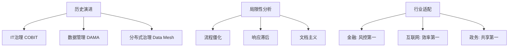

# 03. 数据治理理论的演进与应用边界 (Evolution & Boundaries)

## 1. 业界背景与理论迭代

数据治理理论并非静止的，它随着 IT 架构的演进而不断进化。理解这段历史，有助于我们看清未来的方向，避免刻舟求剑。

### 演进路线图
*   **阶段一：IT 治理 (IT Governance)**
    *   *背景*: COBIT 框架时代。
    *   *特征*: 关注 IT 资产（服务器、网络、软件）的合规性与投资回报。数据只是 IT 资产的一部分。
*   **阶段二：数据管理 (Data Management)**
    *   *背景*: DAMA DMBOK 1.0 发布。
    *   *特征*: 开始独立关注数据生命周期。试图通过标准化的流程（如数据建模规范）来控制数据混乱。
*   **阶段三：数据治理 (Data Governance)**
    *   *背景*: 大数据时代，Hadoop 兴起。
    *   *特征*: "治理"与"管理"分离。治理层（决策、定责）在上，管理层（执行、操作）在下。强调**组织架构**和**文化**的作用。
*   **阶段四：敏捷治理与自适应治理 (Adaptive Governance)**
    *   *背景*: Data Mesh 理伦、AI 时代。
    *   *特征*: 承认中心化管控的瓶颈。提倡**联邦式治理**，谁生产数据，谁治理数据。由“强制管控”转向“服务赋能”。

---

## 2. 本章课题描述 (Chapter Objectives)

本章旨在打破对 DAMA 等经典理论的迷信，用辩证的眼光审视现有框架的适用性与局限性。

**核心课题**:
1.  **历史观**: 梳理从 IT 治理到 AI 治理的脉络。
2.  **批判性思维**: DAMA 框架（特别是车轮图）在互联网高并发、快速迭代场景下的**水土不服**（重流程、轻敏捷）。
3.  **行业适配**: 分析金融（强监管）vs 互联网（弱监管、强业务）在治理策略上的本质差异。

---

## 3. 整体知识框架 (Overall Framework)

### 3.1 理论对比分析

| 维度 | 经典 DAMA 治理 | 现代 Data Mesh 治理 |
| :--- | :--- | :--- |
| **核心逻辑** | 中心化管控 (Centralized Command) | 去中心化联邦 (Federated) |
| **数据所有权** | 归属于数据团队/IT | 归属于领域业务团队 (Domain Owner) |
| **成功标准** | 标准一致性、合规性 | 数据产品的复用率、用户满意度 |
| **典型瓶颈** | 数据团队成为响应瓶颈 | 跨域数据标准对齐困难 |

---

## 4. 目录导航 (Section Navigation)

*   [3.1-数据治理理论的发展脉络](./3.1-%E6%95%B0%E6%8D%AE%E6%B2%BB%E7%90%86%E7%90%86%E8%AE%BA%E7%9A%84%E5%8F%91%E5%B1%95%E8%84%89%E7%BB%9C.md)
    *   _Note: 回顾历史是为了更好地面对未来。了解为什么会有“治理”这个概念。_
*   [3.2-行业适配性分析](./3.2-%E8%A1%8C%E4%B8%9A%E9%80%82%E9%85%8D%E6%80%A7%E5%88%86%E6%9E%90.md)
    *   _Note: 银行怎么做？淘宝怎么做？政府怎么做？不同的土壤长出不同的树。_
*   [3.3-dama框架的局限性](./3.3-dama%E6%A1%86%E6%9E%B6%E7%9A%84%E5%B1%80%E9%99%90%E6%80%A7.md)
    *   _Note: 犀利指出“照搬 DAMA 必死”的原因。_

---

## 5. 扩展阅读与参考文献 (References)

> [!NOTE]
> 任何理论模型都是对现实的简化（Reduction），必然存在失真。

1.  **Zhamak Dehghani**. _Data Mesh: Delivering Data-Driven Value at Scale_. (Data Mesh 理论奠基之作)
2.  **ISACA**. _COBIT 2019 Framework_. (IT 治理标准)
3.  **Thomas C. Redman**. _Data Quality: The Field Guide_. (批判性视角看数据质量)
