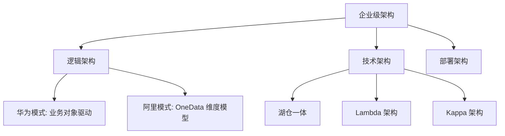

# 📘 04. 企业数据治理核心架构设计与落地 (Architecture & Implementation)

## 🏙️ 1. 业界背景与架构范式

企业数据架构（Enterprise Data Architecture）是连接业务战略与技术实现的桥梁。如果没有稳固的架构，任何治理动作都是“修修补补”。

### 两大主流流派
在中国 IT 界，存在两个显赫的架构流派，深刻影响了所有企业的数据建设：

1.  **华为流派 (传统企业数字化)**:
    *   **特点**: **逻辑严密，流程先行**。强调“业务对象”的梳理，强调 ISC (集成供应链)、IPD (集成产品开发) 等业务流程与数据的绑定。
    *   **适用**: 制造业、大型央企、流程型企业。
2.  **阿里流派 (互联网中台化)**:
    *   **特点**: **OneData，大宽表**。强调“公共层”建设，强调快速响应前端多变的业务。**维度建模 (Dimensional Modeling)** 的极致应用。
    *   **适用**: 电商、零售、C 端高并发业务。

---

## 🎯 2. 本章课题描述 (Chapter Objectives)

本章旨在讲透“怎么搭架子”。架构设计不是画几张 PPT，而是要解决实际的数据流转效率和复用性问题。

**核心课题**:
1.  **顶层设计**: 学习 TOGAF 等企业架构方法论在数据域的应用。
2.  **实战范式**: 深入对比华为与阿里的架构图，理解其背后的业务逻辑差异。
3.  **落地难点**: 为什么 80% 的“数据中台”项目都失败了？复盘架构落地中的“人际政治”与“技术债”。

---

## 🏗️ 3. 整体知识框架 (Overall Framework)

### 3.1 架构分层标准 (Layered Architecture)

一个标准的数据架构通常包含以下层次：

| 层次 | 名称 | 职责 | 阿里术语 | 华为术语 |
| :--- | :--- | :--- | :--- | :--- |
| **L0** | 源系统层 (Source) | 贴源存储，不做处理 | ODS | 贴源层 |
| **L1** | 标准数据层 (Standard) | 清洗、标准化、原子指标 | DWD | 基础数据层 |
| **L2** | 公共汇总层 (Summary) | 跨域复用，轻度汇总 | DWS | 汇总层 |
| **L3** | 应用集市层 (App) | 面向具体报表/大屏 | ADS | 应用层 |

---

## 🧭 4. 目录导航 (Section Navigation)

*   [4.1-数据架构设计的核心逻辑与实践范式](4.1-data_architecture_core_logic.md)
    *   _Note: 架构即政治。数据架构的本质是组织内部信息权力的重构。_
*   [4.2-数据架构落地的难点与方案](4.2-data_architecture_challenges.md)
    *   _Note: 解析“烟囱式”建设的顽疾，以及如何通过“数据地图”实现资产可视化。_
*   [4.3-华为和阿里的数据架构差异、理论溯源与适用场景](4.3-huawei_alibaba_data_architecture.md)
    *   _Note: 深度横评。不想被厂商忽悠，就得看懂这篇。_

---

## ❓ 5. 常见问题 (FAQ)
### Q1: 湖仓一体（Lakehouse）解决了什么？
**A:** 解决了 Data Lake 查得慢且不支持事务（ACID），以及 Data Warehouse 存非结构化数据贵的问题。
### Q2: 为什么烟囱式架构要不得？
**A:** 导致数据孤岛。营销部一套用户表，客服部一套用户表，无法打通计算“全生命周期价值”。

---

## 📚 6. 参考文档 (References)

> [!NOTE]
> 本列表收录了该领域的核心文献。您可以点击链接购买书籍或查看原文。

| 标题 (Title) | 作者 (Author) | 日期 (Date) | 链接 (Link) | 简介 (Summary) |
| :--- | :--- | :--- | :--- | :--- |
| Lakehouse: A New Generation | Databricks | 2021 | [CIDR](https://cidrdb.org/cidr2021/papers/cidr2021_paper17.pdf) | 湖仓一体论文。 |
| Lambda Architecture | Nathan Marz | 2011 | [Blog](http://nathanmarz.com/blog/how-to-beat-the-cap-theorem-master-slave-and-the-scale-up.html) | 批流分离架构。 |
| Kappa Architecture | Jay Kreps | 2014 | [O'Reilly](https://www.oreilly.com/radar/questioning-the-lambda-architecture/) | 流批一体。 |
| Alibaba Big Data | Alibaba | 2017 | [Amazon](https://www.amazon.com/Big-Data-Alibaba-Computing-Practice/dp/9811355831) | OneData 体系。 |
| TOGAF 9.2 | The Open Group | 2018 | [OpenGroup](https://www.opengroup.org/togaf) | 企业架构标准。 |
| Designing Data-Intensive Applications | Kleppmann | 2017 | [Amazon](https://www.amazon.com/Designing-Data-Intensive-Applications-Reliable-Maintainable/dp/1449373321) | DDIA 神书。 |
| Data Fabric vs Mesh | Gartner | 2022 | [Gartner](https://www.gartner.com/) | 架构对比。 |
| Modern Data Warehouse | Microsoft | 2023 | [Azure](https://learn.microsoft.com/en-us/azure/architecture/solution-ideas/articles/modern-data-warehouse) | 云数仓架构。 |
| Huawei Data Way | Huawei | 2020 | [JD](https://item.jd.com/12965389.html) | 华为架构实践。 |
| Zachman Framework | John Zachman | 1987 | [Zachman](https://www.zachman.com/) | 企业架构始祖。 |

## 📝 7. 章节测验 (Quiz)

### 7.1 第一部分：判断题 (True/False)
1. **[判断]** ODS 是贴源层，数据结构通常与源码一致。
    * ( ) 对
    * ( ) 错

2. **[判断]** Lambda 架构需要维护两套代码（批和流）。
    * ( ) 对
    * ( ) 错

3. **[判断]** Data Fabric 侧重于利用元数据进行虚拟化集成。
    * ( ) 对
    * ( ) 错

4. **[判断]** 烟囱式架构有利于数据复用。
    * ( ) 对
    * ( ) 错

### 7.2 第二部分：选择题 (Multiple Choice)
5. **[单选]** 哪个适合做实时推荐？
    * A. 只有离线层
    * B. 只有 Excel
    * C. Kappa 架构
    * D. 所谓 T+1

6. **[单选]** 阿里 OneData 核心目的是？
    * A. 统一指标口径
    * B. 增加服务器
    * C. 使用 Oracle
    * D. 备份数据

7. **[单选]** 湖仓一体优势？
    * A. 只支持 SQL
    * B. 结合了湖的低成本和仓的 ACID
    * C. 完全免费
    * D. 不需要存储

8. **[多选]** 架构分层意义？
    * A. 复用
    * B. 解耦
    * C. 清晰
    * D. 混淆

9. **[单选]** DWD 层通常是指？
    * A. 原始层
    * B. 明细层 (Detail)
    * C. 汇总层
    * D. 报表层

---

### 7.3 答案与解析 (Answers & Analysis)

1. **对**。解析：Operational Data Store 镜像源系统。
2. **对**。解析：这是 Lambda 的主要缺点。
3. **对**。解析：Fabric 强调逻辑连接而非物理搬运。
4. **错**。解析：烟囱式导致孤岛，无法复用。
5. **C**。解析：Kappa 全流式处理。
6. **A**。解析：OneModel, OneID, OneService。
7. **B**。解析：Transaction support on low cost storage。
8. **ABC**。解析：D 是反义词。
9. **B**。解析：Data Warehouse Detail。
