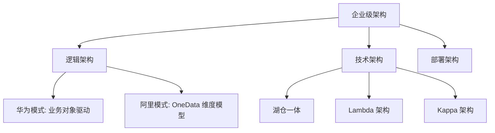

# 04. 企业数据治理核心架构设计与落地 (Architecture & Implementation)

## 1. 业界背景与架构范式

企业数据架构（Enterprise Data Architecture）是连接业务战略与技术实现的桥梁。如果没有稳固的架构，任何治理动作都是“修修补补”。

### 两大主流流派
在中国 IT 界，存在两个显赫的架构流派，深刻影响了所有企业的数据建设：

1.  **华为流派 (传统企业数字化)**:
    *   **特点**: **逻辑严密，流程先行**。强调“业务对象”的梳理，强调 ISC (集成供应链)、IPD (集成产品开发) 等业务流程与数据的绑定。
    *   **适用**: 制造业、大型央企、流程型企业。
2.  **阿里流派 (互联网中台化)**:
    *   **特点**: **OneData，大宽表**。强调“公共层”建设，强调快速响应前端多变的业务。**维度建模 (Dimensional Modeling)** 的极致应用。
    *   **适用**: 电商、零售、C 端高并发业务。

---

## 2. 本章课题描述 (Chapter Objectives)

本章旨在讲透“怎么搭架子”。架构设计不是画几张 PPT，而是要解决实际的数据流转效率和复用性问题。

**核心课题**:
1.  **顶层设计**: 学习 TOGAF 等企业架构方法论在数据域的应用。
2.  **实战范式**: 深入对比华为与阿里的架构图，理解其背后的业务逻辑差异。
3.  **落地难点**: 为什么 80% 的“数据中台”项目都失败了？复盘架构落地中的“人际政治”与“技术债”。

---

## 3. 整体知识框架 (Overall Framework)

### 3.1 架构分层标准 (Layered Architecture)

一个标准的数据架构通常包含以下层次：

| 层次 | 名称 | 职责 | 阿里术语 | 华为术语 |
| :--- | :--- | :--- | :--- | :--- |
| **L0** | 源系统层 (Source) | 贴源存储，不做处理 | ODS | 贴源层 |
| **L1** | 标准数据层 (Standard) | 清洗、标准化、原子指标 | DWD | 基础数据层 |
| **L2** | 公共汇总层 (Summary) | 跨域复用，轻度汇总 | DWS | 汇总层 |
| **L3** | 应用集市层 (App) | 面向具体报表/大屏 | ADS | 应用层 |

---

## 4. 目录导航 (Section Navigation)

*   [4.1-数据架构设计的核心逻辑与实践范式](./4.1-%E6%95%B0%E6%8D%AE%E6%9E%B6%E6%9E%84%E8%AE%BE%E8%AE%A1%E7%9A%84%E6%A0%B8%E5%BF%83%E9%80%BB%E8%BE%91%E4%B8%8E%E5%AE%9E%E8%B7%B5%E8%8C%83%E5%BC%8F.md)
    *   _Note: 架构即政治。数据架构的本质是组织内部信息权力的重构。_
*   [4.2-数据架构落地的难点与方案](./4.2-%E6%95%B0%E6%8D%AE%E6%9E%B6%E6%9E%84%E8%90%BD%E5%9C%B0%E7%9A%84%E9%9A%BE%E7%82%B9%E4%B8%8E%E6%96%B9%E6%A1%88.md)
    *   _Note: 解析“烟囱式”建设的顽疾，以及如何通过“数据地图”实现资产可视化。_
*   [4.3-华为和阿里的数据架构差异、理论溯源与适用场景](./4.3-%E5%8D%8E%E4%B8%BA%E5%92%8C%E9%98%BF%E9%87%8C%E7%9A%84%E6%95%B0%E6%8D%AE%E6%9E%B6%E6%9E%84%E5%B7%AE%E5%BC%82%E3%80%81%E7%90%86%E8%AE%BA%E6%BA%AF%E6%BA%90%E4%B8%8E%E9%80%82%E7%94%A8%E5%9C%BA%E6%99%AF.md)
    *   _Note: 深度横评。不想被厂商忽悠，就得看懂这篇。_

---

## 5. 扩展阅读与参考文献 (References)

> [!NOTE]
> 只有适合自己企业的架构，才是最好的架构。切忌盲目照搬大厂。

1.  **阿里巴巴数据技术及产品部**. _大数据之路：阿里巴巴大数据实践_. 电子工业出版社.
    *   *评注*: 互联网数据中台的扛鼎之作，必读。
2.  **华为公司数据管理部**. _华为数据之道_. 机械工业出版社.
    *   *评注*: 传统企业数字化转型的教科书，非常严谨。
3.  **The Open Group**. _TOGAF Version 9.2_.
