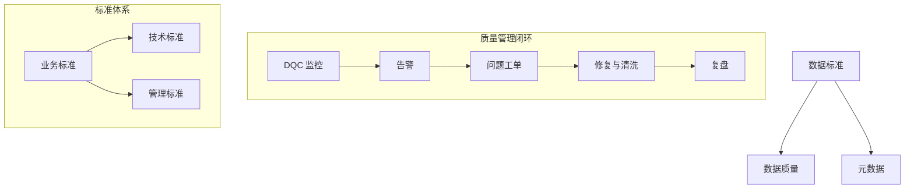

# 📘 05. 数据质量与数据标准治理体系实践 (Quality & Standards)

## 🏙️ 1. 业界背景与实战挑战

数据质量 (Data Quality, DQ) 是数据治理这棵大树的“果实”。如果治理了半天，报表还是错的，模型还是偏的，那么所有的投入都是浪费。

### 现状：冰山之下
在大多数企业中，显性的数据质量问题（如报表挂了）只是冰山一角。隐性的问题更为致命：
*   **不一致**: 财务系统说销售额是 1 亿，CRM 系统说是 1.2 亿。
*   **不可用**: 历史数据缺失，导致 AI 模型训练样本不足。
*   **不及时**: T+1 的数据支撑不了秒级响应的营销活动。

---

## 🎯 2. 本章课题描述 (Chapter Objectives)

本章聚焦于“怎么管好数据质量”和“怎么定好数据标准”这两个孪生话题。

**核心课题**:
1.  **量化评估**: 如何用“六大维度”给数据体检？(Completeness, Accuracy, Consistency, etc.)
2.  **闭环管理**: 介绍华为的“发现-归因-整改-复盘”质量管理闭环。
3.  **标准落地**: 为什么“文档型”标准没有用？如何将标准嵌入到开发流程中（Code Check）。

---

## 🏗️ 3. 整体知识框架 (Overall Framework)

### 3.1 核心评价指标 (The 6 Dimensions)

DAMA 定义了数据质量的六个核心维度，我们必须熟记于心：

| 维度 | 英文 | 含义 | 例子 |
| :--- | :--- | :--- | :--- |
| **完整性** | Completeness | 该有的有没有？ | 客户手机号字段空值率 < 0.1% |
| **准确性** | Accuracy | 对不对？ | 存款余额不能为负数 |
| **一致性** | Consistency | 矛盾不矛盾？ | 两个表里的用户性别必须一致 |
| **及时性** | Timeliness | 赶不赶趟？ | 实时大屏延迟 < 5s |
| **唯一性** | Uniqueness | 重不重复？ | 每个用户只有一个 UserID |
| **有效性** | Validity | 符不符合格式？ | 只有 'M' 或 'F'，没有 'X' |

---

## 🧭 4. 目录导航 (Section Navigation)

*   [5.1-数据质量管理全流程管控](./5.1-%E6%95%B0%E6%8D%AE%E8%B4%A8%E9%87%8F%E7%AE%A1%E7%90%86%E5%85%A8%E6%B5%81%E7%A8%8B%E7%AE%A1%E6%8E%A7.md)
    *   _Note: 详解华为“数据质量五维体系”与大规模 ETL 场景下的熔断机制。_
*   [5.2-数据标准体系的构建、推广与迭代](./5.2-%E6%95%B0%E6%8D%AE%E6%A0%87%E5%87%86%E4%BD%93%E7%B3%BB%E7%9A%84%E6%9E%84%E5%BB%BA%E3%80%81%E6%8E%A8%E5%B9%BF%E4%B8%8E%E8%BF%AD%E4%BB%A3.md)
    *   _Note: 解决“标准与业务两张皮”的顽疾，探讨“刚性标准”与“弹性标准”的平衡。_

---

## 📚 5. 扩展阅读与参考文献 (References)

> [!NOTE]
> 质量不是测出来的，是设计出来的 (Quality is designed in, not tested in)。

1.  **Mahanti, Rupa**. _Data Quality: Dimensions, Measurement, Strategy, Management, and Governance_. ASQ Quality Press.
2.  **Larry English**. _Improving Data Warehouse and Business Information Quality_. (TIQM 理论)
3.  **ISO 8000**. _Data Quality Standard_.
