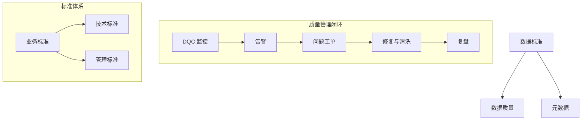

# 📘 05. 数据质量与数据标准治理体系实践 (Quality & Standards)

## 🏙️ 1. 业界背景与实战挑战

数据质量 (Data Quality, DQ) 是数据治理这棵大树的“果实”。如果治理了半天，报表还是错的，模型还是偏的，那么所有的投入都是浪费。

### 现状：冰山之下
在大多数企业中，显性的数据质量问题（如报表挂了）只是冰山一角。隐性的问题更为致命：
*   **不一致**: 财务系统说销售额是 1 亿，CRM 系统说是 1.2 亿。
*   **不可用**: 历史数据缺失，导致 AI 模型训练样本不足。
*   **不及时**: T+1 的数据支撑不了秒级响应的营销活动。

---

## 🎯 2. 本章课题描述 (Chapter Objectives)

本章聚焦于“怎么管好数据质量”和“怎么定好数据标准”这两个孪生话题。

**核心课题**:
1.  **量化评估**: 如何用“六大维度”给数据体检？(Completeness, Accuracy, Consistency, etc.)
2.  **闭环管理**: 介绍华为的“发现-归因-整改-复盘”质量管理闭环。
3.  **标准落地**: 为什么“文档型”标准没有用？如何将标准嵌入到开发流程中（Code Check）。

---

## 🏗️ 3. 整体知识框架 (Overall Framework)

### 3.1 核心评价指标 (The 6 Dimensions)

DAMA 定义了数据质量的六个核心维度，我们必须熟记于心：

| 维度 | 英文 | 含义 | 例子 |
| :--- | :--- | :--- | :--- |
| **完整性** | Completeness | 该有的有没有？ | 客户手机号字段空值率 < 0.1% |
| **准确性** | Accuracy | 对不对？ | 存款余额不能为负数 |
| **一致性** | Consistency | 矛盾不矛盾？ | 两个表里的用户性别必须一致 |
| **及时性** | Timeliness | 赶不赶趟？ | 实时大屏延迟 < 5s |
| **唯一性** | Uniqueness | 重不重复？ | 每个用户只有一个 UserID |
| **有效性** | Validity | 符不符合格式？ | 只有 'M' 或 'F'，没有 'X' |

---

## 🧭 4. 目录导航 (Section Navigation)

*   [5.1-数据质量管理全流程管控](./5.1-%E6%95%B0%E6%8D%AE%E8%B4%A8%E9%87%8F%E7%AE%A1%E7%90%86%E5%85%A8%E6%B5%81%E7%A8%8B%E7%AE%A1%E6%8E%A7.md)
    *   _Note: 详解华为“数据质量五维体系”与大规模 ETL 场景下的熔断机制。_
*   [5.2-数据标准体系的构建、推广与迭代](./5.2-%E6%95%B0%E6%8D%AE%E6%A0%87%E5%87%86%E4%BD%93%E7%B3%BB%E7%9A%84%E6%9E%84%E5%BB%BA%E3%80%81%E6%8E%A8%E5%B9%BF%E4%B8%8E%E8%BF%AD%E4%BB%A3.md)
    *   _Note: 解决“标准与业务两张皮”的顽疾，探讨“刚性标准”与“弹性标准”的平衡。_

---

## ❓ 5. 常见问题 (FAQ)
### Q1: 什么叫“数据落标”？
**A:** 定了标准（比如日期格式 YYYY-MM-DD）没用，要通过代码检查（DQC）或录入端校验，强制拦截不符合标准的数据，这叫落标。
### Q2: 质量评估中“唯一性”很难吗？
**A:** 很难。比如“张三”和“Zhang San”是不是一个人？需要复杂的 Entity Resolution（实体解析）算法来识别。

---

## 📚 6. 参考文档 (References)

> [!NOTE]
> 本列表收录了该领域的核心文献。您可以点击链接购买书籍或查看原文。

| 标题 (Title) | 作者 (Author) | 日期 (Date) | 链接 (Link) | 简介 (Summary) |
| :--- | :--- | :--- | :--- | :--- |
| Data Quality Field Guide | Thomas Redman | 2016 | [Amazon](https://www.amazon.com/Data-Quality-Field-Guide-Getting/dp/012809673X) | 质量实战。 |
| ISO 8000 Data Quality | ISO | 2011 | [ISO](https://www.iso.org/standard/50798.html) | 国际标准。 |
| TIQM | Larry English | 1999 | [Amazon](https://www.amazon.com/Improving-Data-Warehouse-Business-Information/dp/0471253839) | 全面信息质量管理。 |
| Measuring Data Quality | Sebastian-Coleman | 2013 | [Amazon](https://www.amazon.com/Measuring-Data-Quality-Ongoing-Improvement/dp/0124157836) | 度量指标。 |
| Data Standards Management | DAMA | 2017 | [DAMA](https://www.dama.org/) | DMBOK 章节。 |
| Entity Resolution | Talburt | 2011 | [Amazon](https://www.amazon.com/Entity-Resolution-Information-Quality-Talburt/dp/0123819725) | 实体解析算法。 |
| Data Quality Assessment | Pipino et al. | 2002 | [ACM](https://dl.acm.org/doi/10.1145/512999.513008) | 评估方法论。 |
| Rule-Based DQ | Informatica | 2022 | [Informatica](https://www.informatica.com/) | 规则引擎。 |
| Cost of Poor Data Quality | Gartner | 2018 | [Gartner](https://www.gartner.com/) | 劣质数据成本。 |
| Six Sigma for Data | Motorola | 2000 | [iSixSigma](https://www.isixsigma.com/) | 六西格玛数据版。 |

## 📝 7. 章节测验 (Quiz)

### 7.1 第一部分：判断题 (True/False)
1. **[判断]** 质量是检测出来的，不是设计出来的。
    * ( ) 对
    * ( ) 错

2. **[判断]** 落标比定标技术上更难。
    * ( ) 对
    * ( ) 错

3. **[判断]** 只要买了质量工具，质量自然就好。
    * ( ) 对
    * ( ) 错

4. **[判断]** 业务部门必须参与标准制定。
    * ( ) 对
    * ( ) 错

### 7.2 第二部分：选择题 (Multiple Choice)
5. **[单选]** 手机号位数不够属于？
    * A. 一致性
    * B. 及时性
    * C. 有效性 (Validity)
    * D. 唯一性

6. **[单选]** 必填项为空属于？
    * A. 完整性
    * B. 准确性
    * C. 唯一性
    * D. 及时性

7. **[单选]** 解决质量问题性价比最高的环节？
    * A. 源头 (录入端)
    * B. ODS
    * C. DW
    * D. 报表端

8. **[多选]** 质量改进循环 PDCA 指？
    * A. Plan
    * B. Do
    * C. Check
    * D. Act

9. **[单选]** 谁最懂业务字段的含义？
    * A. DBA
    * B. 业务人员
    * C. 网络管理员
    * D. 硬件采购员

---

### 7.3 答案与解析 (Answers & Analysis)

1. **错**。解析：质量是设计出来的，源头控制最重要。
2. **对**。解析：定标是写文档，落标要改系统。
3. **错**。解析：工具只是辅助，关键是制度和人。
4. **对**。解析：业务含义只有业务懂。
5. **C**。解析：格式/Pattern 错误属于有效性。
6. **A**。解析：缺失值。
7. **A**。解析：1-10-100 法则，源头纠错成本最低。
8. **ABCD**。解析：戴明环。
9. **B**。解析：领域知识。
