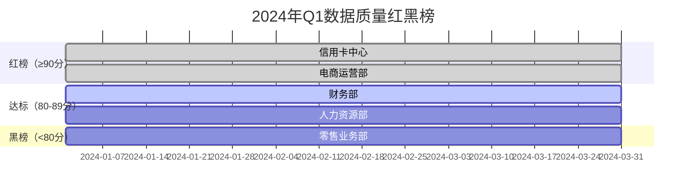

# 6.3 数据文化建设与全员意识培养

> **摘要**: 数据治理的最高境界是“文化自觉”——即员工无需外部约束，就能自发以数据为决策依据、以合规为行为准则。Gartner调研显示，80%的数据治理项目失败源于文化阻力，因此构建从高层到基层的分层渗透型数据文化，是突破治理瓶颈、实现数据资产价值释放的核心路径。本节探讨如何通过战略宣贯、能力赋能、执行落地的分层路径，结合实战化载体，让“讲数据、用数据、护数据”成为企业DNA。

---

## 6.3.1 文化建设路径：从被动到主动

数据文化是一种“软制度”，无法通过行政命令直接落地，必须遵循“认知-认同-践行-自觉”的分层渗透逻辑，推动员工从“被动执行治理要求”转向“主动维护数据价值”。

### 1. 高层：战略宣贯 (Strategic Alignment)
*   **动作**: 需将数据治理与企业核心战略深度绑定，避免空泛表态。例如国内某头部零售集团CEO在年度战略发布会上，将“数据驱动千人千面的客户运营”列为三大核心战略之一，同步展示“2023年数据质量黑榜”——其中某区域分公司因客户地址数据缺失率达35%，导致精准营销触达率下降28%，直接关联到该区域年度业绩完成率仅为72%；此外，将“核心数据资产完整性、准确率”纳入高管KPI，占考核权重的12%。
*   **目的**: 释放“数据治理是战略级任务”的明确信号，建立高管数据问责制，让管理层深刻认知：数据质量直接影响战略落地，数据治理绝非“IT部门的事”，而是所有业务线的核心责任。

### 2. 中层：能力赋能 (Empowerment)
*   **动作**: 针对业务中层设计“价值导向”的赋能活动，而非纯技能培训。例如某快消企业举办“区域销售数据驱动增长大赛”，要求各区域经理基于POS销售数据、库存数据制定铺货优化方案；其中某三线城市区域经理通过分析数据发现，新品在下沉市场的动销率是一线城市的3.2倍，调整铺货策略后该区域新品销售额提升22%，团队季度绩效排名从第8跃升至第2。同时配套开设“数据驱动业绩拆解” workshops，教授中层如何用数据拆解业务指标、定位业绩瓶颈。
*   **目的**: 让业务中层亲身感知数据的业务价值，从“数据治理的被动配合者”转变为“主动推动者”——当管理层发现数据能直接提升团队业绩时，会自发推动部门内部的数据规范执行。

### 3. 基层：执行落地 (Execution)
*   **动作**: 将数据要求嵌入日常工作的“最小单元”，形成行为惯性。例如某制造企业在一线操作工的岗位SOP中明确：设备运行数据录入必须精确到分钟，缺失数据需标注“无记录”而非空值；入职培训设置“数据安全红线”闭卷考试，满分100分需达到90分方可上岗；每月评选“数据录入明星”，给予500元现金奖励，连续3个月达标可获得“数据合规标兵”证书，纳入年度评优加分项。
*   **目的**: 让数据规范成为基层员工的“肌肉记忆”，从根源上减少数据录入错误、违规操作等问题。IDC数据显示，70%的数据质量问题源于基层操作不规范，因此基层执行落地是数据文化的“最后一公里”。

---

## 6.3.2 落地载体：实战手段

数据文化的落地需依托具象化、可感知的实战载体，避免“喊口号”式的宣传。

### 1. 案例推广 (Success Stories)
*   **讲故事**: 构建“场景化、可复制”的案例库，按“业绩增长、成本节约、风险防控”三类标签分类，每个案例包含“业务背景、数据问题、治理动作、量化成果、可复制经验”五要素。例如某国有银行的案例：背景是零售业务部客户投诉中，因 billing数据错误导致的纠纷占比18%；问题是一线客服录入客户套餐信息时错误率达12%；治理动作是优化录入校验规则+3天定制化培训；成果是投诉率下降12个百分点，年节约投诉处理成本320万元；可复制经验是“在录入系统中增加字段校验+岗位绑定的实操考核”。案例通过内部OA首页每周推送、部门周会强制分享的方式传播。
*   **效应**: 用“业务语言”讲数据故事，让不同部门的员工都能找到共鸣——销售部门关注业绩增长，财务部门关注成本节约，风控部门关注风险防控，从而形成“数据能解决我的问题”的认知，主动参与治理。

### 2. 数据素养培训 (Data Literacy)
*   **课程体系**: 构建分层分类的培训体系，覆盖全员：
        *   **通用类**: 新员工入职必学《数据合规红线与操作规范》，老员工每年复训《数据质量常见问题排查指南》；
        *   **专业类**: 针对业务骨干开设《SQL入门与业务数据查询》《Tableau可视化实战》，针对资深业务/IT岗开设《数据架构设计与资产盘活》；
        *   **定制类**: 为销售部门定制《数据驱动客户分层运营》，为财务部门定制《业财融合数据建模》。
*   **认证机制**: 建立“数据素养等级认证体系”，分为三级：L1（数据合规认证）为全员必考，通过后方可开通核心业务系统权限；L2（数据分析师认证）面向业务骨干，通过后可申请BI系统高级分析权限；L3（数据治理专家认证）面向IT及资深业务岗，负责部门内部数据问题的咨询与整改。认证有效期1年，每年需通过复评延续权限。

### 3. 可视化红黑榜
*   打造“公开、透明、动态”的数据质量红黑榜，通过企业展厅电子屏、内部BI系统首页、每周全员邮件同步推送。红黑榜采用可视化展示（如以下Mermaid热力图），针对不同部门定制核心指标：销售部门看“客户数据完整性”，财务部门看“凭证数据准确率”，IT部门看“系统数据安全性”。

*   **配套机制**: 红榜部门颁发“数据治理先锋奖”，给予10万元团队激励；黑榜部门需在7日内提交整改方案，由数据治理委员会跟踪整改进度，连续2次登黑榜的部门负责人需在高管会上做检讨。
*   **利用人性**: 通过公开排名触发部门间的良性竞争，借助“荣辱感”推动中层主动抓数据治理——某股份制银行的实践显示，红黑榜推行后，部门数据质量平均得分从68分提升至89分。

> **终极目标**: 达到麻省理工斯隆管理学院定义的“数据文化自觉”状态——员工在做任何决策前，都会下意识地追问：“支撑这个结论的数据源在哪里？数据的准确率、完整性如何？”而非仅凭经验说“我觉得...”，此时数据思维已真正融入企业的行为逻辑与DNA。