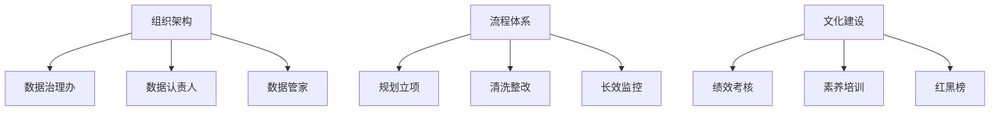

# 📘 06. 数据治理组织、流程与文化建设 (Organization & Culture)

## 🏙️ 1. 业界背景与组织困境

数据治理是“一把手工程”，这句口号喊了很多年，但落地的只有少数。原因在于治理触动了部门的核心利益（数据的所有权）。

### 常见组织形态
1.  **IT 主导型**: 数据部门归属 CTO。优点是技术强，缺点是叫不动业务部门，治理变成“洗数据”。
2.  **业务主导型**: 数据部门归属 CFO 或 COO。优点是贴近业务，缺点是缺乏技术抓手，难以自动化。
3.  **独立数据部**: 平行于 IT 和业务。最理想，但需要极高的政治地位。

---

## 🎯 2. 本章课题描述 (Chapter Objectives)

本章探讨“人”的问题。没有组织保障，再好的技术平台也是摆设。

**核心课题**:
1.  **角色定义**: 什么是 Data Owner? Data Steward? Data Custodian? 他们的责权利是什么？
2.  **流程嵌入**: 如何把治理动作“埋”进业务流程里？（例如：不填好主数据，就不允许下采购单）。
3.  **文化建设**: 如何通过绩效考核 (KPI) 和培训，改变员工随手填数据的坏习惯。

---

## 🏗️ 3. 整体知识框架 (Overall Framework)

### 3.1 核心角色职责矩阵 (RACI)

| 任务 | 业务部门 (Data Owner) | IT 部门 (Data Custodian) | 治理办 (DGO) |
| :--- | :--- | :--- | :--- |
| **定义标准** | R (负责) | C (咨询) | A (批准) |
| **数据录入** | R (负责) | I (知情) | I (知情) |
| **代码开发** | I (知情) | R (负责) | C (咨询) |
| **质量监控** | I (知情) | C (咨询) | R (负责) |

---

## 🧭 4. 目录导航 (Section Navigation)

*   [6.1-数据治理组织架构与责任体系搭建](./6.1-%E6%95%B0%E6%8D%AE%E6%B2%BB%E7%90%86%E7%BB%84%E7%BB%87%E6%9E%B6%E6%9E%84%E4%B8%8E%E8%B4%A3%E4%BB%BB%E4%BD%93%E7%B3%BB%E6%90%AD%E5%BB%BA.md)
    *   _Note: 详解华为“铁三角”协同机制。_
*   [6.2-数据治理全流程优化与业务融合](./6.2-%E6%95%B0%E6%8D%AE%E6%B2%BB%E7%90%86%E5%85%A8%E6%B5%81%E7%A8%8B%E4%BC%98%E5%8C%96%E4%B8%8E%E4%B8%9A%E5%8A%A1%E8%9E%8D%E5%90%88.md)
    *   _Note: 治理不能是“事后诸葛亮”，必须是“事前控制”。_
*   [6.3-数据文化建设与全员意识培养](./6.3-%E6%95%B0%E6%8D%AE%E6%96%87%E5%8C%96%E5%BB%BA%E8%AE%BE%E4%B8%8E%E5%85%A8%E5%91%98%E6%84%8F%E8%AF%86%E5%9F%B9%E5%85%BB.md)
    *   _Note: 红黑榜是最低成本却最有效的管理工具。_

---

## ❓ 5. 常见问题 (FAQ)
### Q1: 怎么让业务人员愿意配合治理？
**A:** 
1. **利诱**: 帮他洗数据，让他的报表更准，业绩更好看。
2. **威逼**: 红黑榜通报，把数据质量纳入 KPI。
3. **赋能**: 教他用自助 BI 工具，提高工作效率。
### Q2: Data Owner 一般是谁？
**A:** 通常是产生数据的业务部门负责人（如销售总监对客户数据负责）。IT 只是 Data Custodian（保管员）。

---

## 📚 6. 参考文档 (References)

> [!NOTE]
> 本列表收录了该领域的核心文献。您可以点击链接购买书籍或查看原文。

| 标题 (Title) | 作者 (Author) | 日期 (Date) | | 简介 (Summary) |
| :--- | :--- | :--- | :--- | :--- |
| Leading Change | John Kotter | 1996 | | 变革管理经典。 |
| Data Stewardship | David Plotkin | 2013 | | 管家职责。 |
| Culture Eats Strategy for Breakfast | Peter Drucker | N/A | | 名言：文化至上。 |
| Organizing for Data Governance | Boris Otto | 2011 | | 治理组织形态。 |
| Chief Data Officer Agenda | Gartner | 2020 | | CDO 职责。 |
| Data Literacy | Qlik | 2021 | | 数据素养。 |
| Non-Invasive Data Governance | Seiner | 2014 | | 角色定义。 |
| RACI Matrix | PMI | 2017 | | 职责矩阵工具。 |
| Constructing a Data Culture | McKinsey | 2018 | | 建设数据文化。 |
| Governing the Commons | Elinor Ostrom | 1990 | | 公共事务治理（诺奖）。 |

---

## 📝 7. 章节测验 (Quiz)

### 7.1 第一部分：判断题 (True/False)
1. **[判断]** IT 部门天然拥有数据的所有权。
    * ( ) 对
    * ( ) 错

2. **[判断]** 治理是一把手工程，文化很重要。
    * ( ) 对
    * ( ) 错

3. **[判断]** 绩效考核不应该包含数据质量，太伤感情。
    * ( ) 对
    * ( ) 错

4. **[判断]** 培训是浪费时间，直接扣钱最管用。
    * ( ) 对
    * ( ) 错

### 7.2 第二部分：选择题 (Multiple Choice)
5. **[单选]** Data Owner 通常是？
    * A. 程序员
    * B. 业务负责人
    * C. 运维人员
    * D. 采购员

6. **[单选]** Data Custodian (保管员) 是？
    * A. 业务员
    * B. CEO
    * C. IT 人员
    * D. 客服

7. **[单选]** 治理办公室 (DGO) 主要作用？
    * A. 协调与监督
    * B. 写代码
    * C. 销售产品
    * D. 修电脑

8. **[多选]** 变革管理的手段？
    * A. 沟通
    * B. 培训
    * C. 激励
    * D. 只有惩罚

9. **[单选]** 谁有权最终批准数据标准的修改？
    * A. 治理委员会/Owner
    * B. 实习生
    * C. 第三方顾问
    * D. 用户

---

### 7.3 答案与解析 (Answers & Analysis)

1. **错**。解析：业务拥有，IT 保管。
2. **对**。解析：Top-down 支持 + Bottom-up 文化。
3. **错**。解析：没考核就没有执行力。
4. **错**。解析：培训提升意识，是治本。
5. **B**。解析：业务对数据定义负责。
6. **C**。解析：IT 负责技术维护。
7. **A**。解析：PMO 角色。
8. **ABC**。解析：AD 是反面。
9. **A**。解析：决策权在 Owner。
