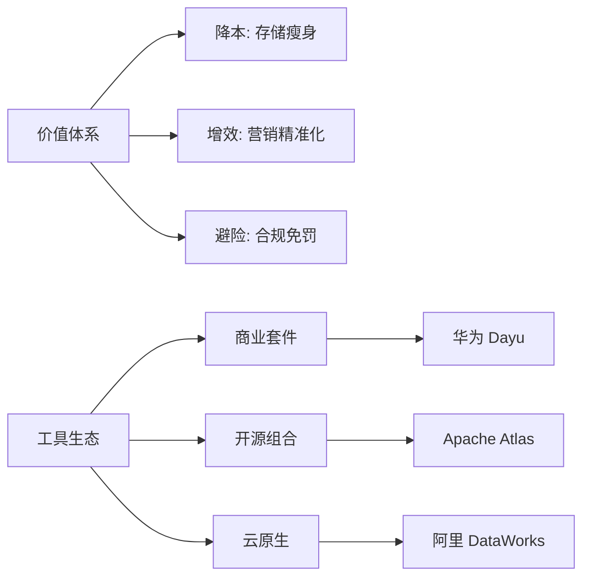

# 📘 07. 数据治理价值变现与工具生态适配 (Value & Tools)

## 🏙️ 1. 业界背景与工具战争

数据治理的终极拷问是：“你给公司赚了多少钱？”如果不能回答这个问题，治理团队迟早会被裁撤。与价值变现相伴而生的是治理工具的“军备竞赛”。

### 工具生态图谱
*   **重装甲**: Huawei FusionInsight, IBM InfoSphere. 功能全，但贵且重。
*   **云原生**: Aliyun DataWorks, AWS Glue. 开箱即用，按量付费。
*   **开源帮**: Apache Atlas (血缘), Griffin (质量), DolphinScheduler (调度). 灵活但维护成本高。

---

## 🎯 2. 本章课题描述 (Chapter Objectives)

本章旨在解决两个最务实的问题：1. 怎么算账（ROI）？ 2. 怎么选型？

**核心课题**:
1.  **价值量化**: 学习三种 ROI 计算模型（降本法、增效法、避险法）。
2.  **工具选型**: 根据企业规模和预算，推荐最优的技术栈组合。
3.  **变现路径**: 从“内部赋能”到“外部售卖”的演进路径。

---

## 🏗️ 3. 整体知识框架 (Overall Framework)

### 3.1 价值评估模型 (ROI Model)

| 价值类型 | 计算公式 | 举例 |
| :--- | :--- | :--- |
| **存储成本节约** | `(清理存储量 TB) * (单位存储价格) * 年数` | 删除了 1PB 垃圾数据，省 200 万 |
| **人力效率提升** | `(节省人天) * (人员日薪)` | 报表开发从 5 天缩短到 1 天 |
| **业务增收贡献** | `(业务增量) * (数据贡献权重 %)` | 营销转化率提升带来 1000 万，数据占 20% |

---

## 🧭 4. 目录导航 (Section Navigation)

*   [7.1-数据价值变现的核心路径](./7.1-%E6%95%B0%E6%8D%AE%E4%BB%B7%E5%80%BC%E5%8F%98%E7%8E%B0%E7%9A%84%E6%A0%B8%E5%BF%83%E8%B7%AF%E5%BE%84.md)
    *   _Note: 千万别只盯着技术指标（DQ Score），要盯着业务指标（GMV, CTR）。_
*   [7.2-数据治理工具平台生态与选型适配](./7.2-%E6%95%B0%E6%8D%AE%E6%B2%BB%E7%90%86%E5%B7%A5%E5%85%B7%E5%B9%B3%E5%8F%B0%E7%94%9F%E6%80%81%E4%B8%8E%E9%80%89%E5%9E%8B%E9%80%82%E9%85%8D.md)
    *   _Note: 没钱怎么做治理？送给中小企业的开源全家桶指南。_

---

## ❓ 5. 常见问题 (FAQ)
### Q1: 治理怎么算 ROI (ROI)？
**A:** 
*   **降本**: 删了 1PB 冷数据，每年省 100 万存储费。
*   **增效**: 报表开发周期从 5 天变 1 天，人效提升。
*   **避险**: 避免了 GDPR 罚款（比如 4% 全球营收）。
### Q2: 开源工具 Atlas 够用吗？
**A:** 功能强大但部署复杂，界面交互一般。适合有强技术实力的团队二开。

---

## 📚 6. 参考文档 (References)

> [!NOTE]
> 本列表收录了该领域的核心文献。您可以点击链接购买书籍或查看原文。

| 标题 (Title) | 作者 (Author) | 日期 (Date) | 链接 (Link) | 简介 (Summary) |
| :--- | :--- | :--- | :--- | :--- |
| Infonomics | Douglas Laney | 2017 | [Amazon](https://www.amazon.com/Infonomics-Monetize-Manage-Measure-Information/dp/1138090387) | 信息经济学。 |
| Magic Quadrant for DQ | Gartner | 2022 | [Gartner](https://www.gartner.com/) | DQ 工具评测。 |
| Apache Atlas | Apache | 2023 | [Official](https://atlas.apache.org/) | 开源元数据。 |
| Apache Griffin | Apache | 2023 | [Official](https://griffin.apache.org/) | 开源质量监测。 |
| DolphinScheduler | Apache | 2023 | [Official](https://dolphinscheduler.apache.org/) | 调度平台。 |
| Competitive Advantage | Porter | 1985 | [Amazon](https://www.amazon.com/Competitive-Advantage-Creating-Sustaining-Performance/dp/0684841460) | 价值链。 |
| ROI of Data Governance | Informatica | 2020 | [Informatica](https://www.informatica.com/) | ROI 计算。 |
| Data Cartography | Airbnb | 2019 | [Medium](https://medium.com/airbnb-engineering/data-cartography-navigating-the-data-landscape-at-airbnb-1c7n1234) | Airbnb 工具。 |
| Amundsen | Lyft | 2019 | [Github](https://github.com/amundsen-io/amundsen) | Lyft 开源发现。 |
| DataHub | LinkedIn | 2020 | [DataHub](https://datahubproject.io/) | LinkedIn 开源元数据。 |

## 📝 7. 章节测验 (Quiz)

### 7.1 第一部分：判断题 (True/False)
1. **[判断]** 治理不仅是花钱，也能赚钱（变现）。
    * ( ) 对
    * ( ) 错

2. **[判断]** 开源工具免费，所以总成本最低。
    * ( ) 对
    * ( ) 错

3. **[判断]** 避险（如合规）也是一种隐性收益。
    * ( ) 对
    * ( ) 错

4. **[判断]** Atlas 主要用于任务调度。
    * ( ) 对
    * ( ) 错

### 7.2 第二部分：选择题 (Multiple Choice)
5. **[单选]** ROI 指什么？
    * A. 投资回报率
    * B. 风险指标
    * C. 关键路径
    * D. 组织架构

6. **[单选]** 哪项属于降本？
    * A. 开发新应用
    * B. 归档删除冷数据
    * C. 招聘专家
    * D. 购买服务器

7. **[单选]** 哪项属于增收？
    * A. 减少存储
    * B. 避免罚款
    * C. 提升营销精准度
    * D. 压缩文档

8. **[多选]** 工具选型看重？
    * A. 成本
    * B. 生态兼容性
    * C. 易用性
    * D. 功能覆盖

9. **[单选]** Infonomics 作者？
    * A. Douglas Laney
    * B. Bill Inmon
    * C. Codd
    * D. Google

---

### 7.3 答案与解析 (Answers & Analysis)

1. **对**。解析：数据资产化。
2. **错**。解析：维护人力成本和二开成本可能很高（TCO）。
3. **对**。解析：风险价值。
4. **错**。解析：Atlas 是元数据治理，DolphinScheduler 才是调度。
5. **A**。解析：Return on Investment。
6. **B**。解析：节省资源。
7. **C**。解析：创造新价值。
8. **ABCD**。解析：全方位评估。
9. **A**。解析：Gartner 分析师。
