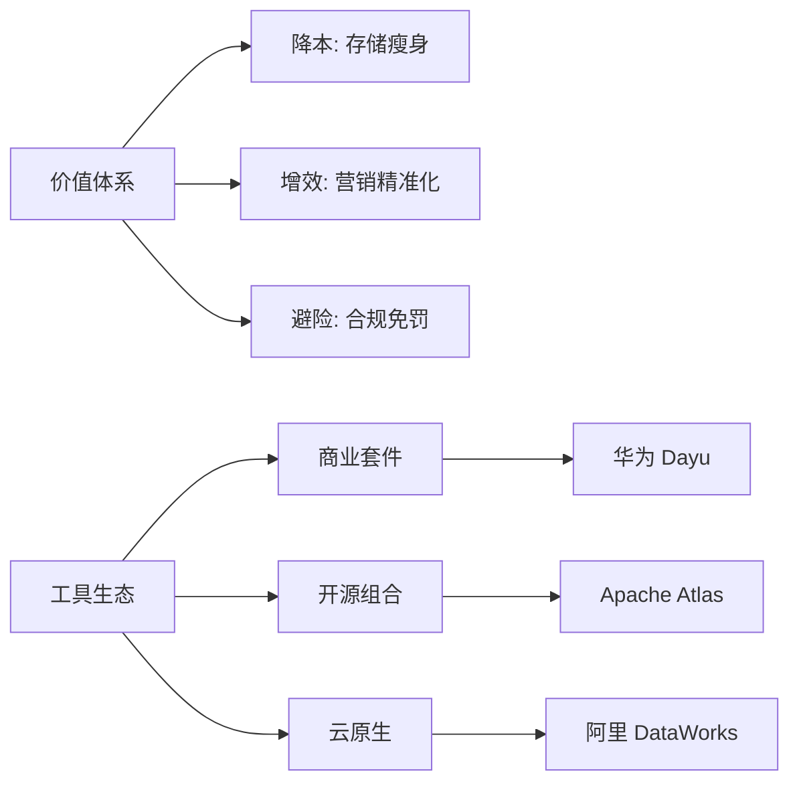

# 📘 07. 数据治理价值变现与工具生态适配 (Value & Tools)

## 🏙️ 1. 业界背景与工具战争

数据治理的终极拷问是：“你给公司赚了多少钱？”如果不能回答这个问题，治理团队迟早会被裁撤。与价值变现相伴而生的是治理工具的“军备竞赛”。

### 工具生态图谱
*   **重装甲**: Huawei FusionInsight, IBM InfoSphere. 功能全，但贵且重。
*   **云原生**: Aliyun DataWorks, AWS Glue. 开箱即用，按量付费。
*   **开源帮**: Apache Atlas (血缘), Griffin (质量), DolphinScheduler (调度). 灵活但维护成本高。

---

## 🎯 2. 本章课题描述 (Chapter Objectives)

本章旨在解决两个最务实的问题：1. 怎么算账（ROI）？ 2. 怎么选型？

**核心课题**:
1.  **价值量化**: 学习三种 ROI 计算模型（降本法、增效法、避险法）。
2.  **工具选型**: 根据企业规模和预算，推荐最优的技术栈组合。
3.  **变现路径**: 从“内部赋能”到“外部售卖”的演进路径。

---

## 🏗️ 3. 整体知识框架 (Overall Framework)

### 3.1 价值评估模型 (ROI Model)

| 价值类型 | 计算公式 | 举例 |
| :--- | :--- | :--- |
| **存储成本节约** | `(清理存储量 TB) * (单位存储价格) * 年数` | 删除了 1PB 垃圾数据，省 200 万 |
| **人力效率提升** | `(节省人天) * (人员日薪)` | 报表开发从 5 天缩短到 1 天 |
| **业务增收贡献** | `(业务增量) * (数据贡献权重 %)` | 营销转化率提升带来 1000 万，数据占 20% |

---

## 🧭 4. 目录导航 (Section Navigation)

*   [7.1-数据价值变现的核心路径](./7.1-%E6%95%B0%E6%8D%AE%E4%BB%B7%E5%80%BC%E5%8F%98%E7%8E%B0%E7%9A%84%E6%A0%B8%E5%BF%83%E8%B7%AF%E5%BE%84.md)
    *   _Note: 千万别只盯着技术指标（DQ Score），要盯着业务指标（GMV, CTR）。_
*   [7.2-数据治理工具平台生态与选型适配](./7.2-%E6%95%B0%E6%8D%AE%E6%B2%BB%E7%90%86%E5%B7%A5%E5%85%B7%E5%B9%B3%E5%8F%B0%E7%94%9F%E6%80%81%E4%B8%8E%E9%80%89%E5%9E%8B%E9%80%82%E9%85%8D.md)
    *   _Note: 没钱怎么做治理？送给中小企业的开源全家桶指南。_

---

## 📚 5. 扩展阅读与参考文献 (References)

> [!TIP]
> 选工具就像选鞋子，合脚比名牌更重要。

1.  **Gartner**. _Magic Quadrant for Data Quality Solutions_.
2.  **Gartner**. _Magic Quadrant for Metadata Management Solutions_.
