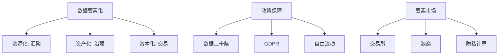

# 08. 数据要素化治理与政策体系 (Data Elements & Policy)

## 1. 业界背景与政策红利

2020 年，中国中央文件正式将数据列为继土地、劳动力、资本、技术之后的**第五大生产要素**。这标志着数据治理进入了“资本化”的新纪元。

### 核心转变
*   **过去**: 数据是资产负债表之外的“账外资产”。
*   **现在**: 财政部《企业数据资源相关会计处理暂行规定》允许数据**入表**（计入无形资产或存货）。这意味着数据治理做得好，可以直接提升公司股价。

---

## 2. 本章课题描述 (Chapter Objectives)

本章探讨数据如何从“资源”变成“资产”，再变成“资本”。

**核心课题**:
1.  **根本逻辑**: 理解“三权分置”（持有权、加工权、经营权）如何解决了确权难题。
2.  **政策解读**: 深度解读“数据二十条”与 GDPR 的异同。
3.  **交易市场**: 数据交易所是怎么运作的？数商（Data Broker）是什么角色？

---

## 3. 整体知识框架 (Overall Framework)

### 3.1 要素化三部曲

| 阶段 | 关键动作 | 治理重点 | 标志性成果 |
| :--- | :--- | :--- | :--- |
| **资源化** | 把数据存起来 | 物理汇聚、消除孤岛 | 数据湖 (Data Lake) |
| **资产化** | 把数据管起来 | 质量清洗、标准确权 | 数据资产目录 (Catalog) |
| **资本化** | 把数据卖出去 | 估值定价、流通交易 | 数据产品上架交易所 |

---

## 4. 目录导航 (Section Navigation)

*   [8.1-数据要素化的核心逻辑与治理内涵](./8.1-%E6%95%B0%E6%8D%AE%E8%A6%81%E7%B4%A0%E5%8C%96%E7%9A%84%E6%A0%B8%E5%BF%83%E9%80%BB%E8%BE%91%E4%B8%8E%E6%B2%BB%E7%90%86%E5%86%85%E6%B6%B5.md)
    *   _Note: 为什么说“入表”是 CIO 和 CFO 对话的共同语言？_
*   [8.2-国内外数据要素治理政策体系与演进](./8.2-%E5%9B%BD%E5%86%85%E5%A4%96%E6%95%B0%E6%8D%AE%E8%A6%81%E7%B4%A0%E6%B2%BB%E7%90%86%E6%94%BF%E7%AD%96%E4%BD%93%E7%B3%BB%E4%B8%8E%E6%BC%94%E8%BF%9B.md)
    *   _Note: 对比中欧美三种不同的治理哲学：发展优先 vs 隐私优先 vs 商业优先。_
*   [8.3-数据要素市场建设与治理协同](./8.3-%E6%95%B0%E6%8D%AE%E8%A6%81%E7%B4%A0%E5%B8%82%E5%9C%BA%E5%BB%BA%E8%AE%BE%E4%B8%8E%E6%B2%BB%E7%90%86%E5%8D%8F%E5%90%8C.md)
    *   _Note: 了解数据交易所的“撮合”与“凭证”机制。_

---

## 5. 扩展阅读与参考文献 (References)

> [!NOTE]
> 数据要素是典型的“中国特色”理论创新，在这方面中国走在世界前列。

1.  **中共中央、国务院**. _关于构建数据基础制度更好发挥数据要素作用的意见_ (数据二十条).
2.  **财政部**. _企业数据资源相关会计处理暂行规定_.
