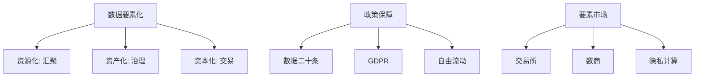

# 📘 08. 数据要素化治理与政策体系 (Data Elements & Policy)

## 🏙️ 1. 业界背景与政策红利

2020 年，中国中央文件正式将数据列为继土地、劳动力、资本、技术之后的**第五大生产要素**。这标志着数据治理进入了“资本化”的新纪元。

### 核心转变
*   **过去**: 数据是资产负债表之外的“账外资产”。
*   **现在**: 财政部《企业数据资源相关会计处理暂行规定》允许数据**入表**（计入无形资产或存货）。这意味着数据治理做得好，可以直接提升公司股价。

---

## 🎯 2. 本章课题描述 (Chapter Objectives)

本章探讨数据如何从“资源”变成“资产”，再变成“资本”。

**核心课题**:
1.  **根本逻辑**: 理解“三权分置”（持有权、加工权、经营权）如何解决了确权难题。
2.  **政策解读**: 深度解读“数据二十条”与 GDPR 的异同。
3.  **交易市场**: 数据交易所是怎么运作的？数商（Data Broker）是什么角色？

---

## 🏗️ 3. 整体知识框架 (Overall Framework)

### 3.1 要素化三部曲

| 阶段 | 关键动作 | 治理重点 | 标志性成果 |
| :--- | :--- | :--- | :--- |
| **资源化** | 把数据存起来 | 物理汇聚、消除孤岛 | 数据湖 (Data Lake) |
| **资产化** | 把数据管起来 | 质量清洗、标准确权 | 数据资产目录 (Catalog) |
| **资本化** | 把数据卖出去 | 估值定价、流通交易 | 数据产品上架交易所 |

---

## 🧭 4. 目录导航 (Section Navigation)

*   [8.1-数据要素化的核心逻辑与治理内涵](./8.1-%E6%95%B0%E6%8D%AE%E8%A6%81%E7%B4%A0%E5%8C%96%E7%9A%84%E6%A0%B8%E5%BF%83%E9%80%BB%E8%BE%91%E4%B8%8E%E6%B2%BB%E7%90%86%E5%86%85%E6%B6%B5.md)
    *   _Note: 为什么说“入表”是 CIO 和 CFO 对话的共同语言？_
*   [8.2-国内外数据要素治理政策体系与演进](./8.2-%E5%9B%BD%E5%86%85%E5%A4%96%E6%95%B0%E6%8D%AE%E8%A6%81%E7%B4%A0%E6%B2%BB%E7%90%86%E6%94%BF%E7%AD%96%E4%BD%93%E7%B3%BB%E4%B8%8E%E6%BC%94%E8%BF%9B.md)
    *   _Note: 对比中欧美三种不同的治理哲学：发展优先 vs 隐私优先 vs 商业优先。_
*   [8.3-数据要素市场建设与治理协同](./8.3-%E6%95%B0%E6%8D%AE%E8%A6%81%E7%B4%A0%E5%B8%82%E5%9C%BA%E5%BB%BA%E8%AE%BE%E4%B8%8E%E6%B2%BB%E7%90%86%E5%8D%8F%E5%90%8C.md)
    *   _Note: 了解数据交易所的“撮合”与“凭证”机制。_

---

## ❓ 5. 常见问题 (FAQ)
### Q1: 什么是“数据入表”？
**A:** 财政部规定，企业可以将符合条件的数据资源，作为“无形资产”或“存货”列入资产负债表。这意味着数据真的变成了“钱”。
### Q2: "数据二十条"的核心是什么？
**A:** 以前纠结“数据属于谁”（所有权），现在搁置所有权，强调“持有权、加工使用权、产品经营权”（三权分置），促进流通。

---

## 📚 6. 参考文档 (References)

> [!NOTE]
> 本列表收录了该领域的核心文献。您可以点击链接购买书籍或查看原文。

| 标题 (Title) | 作者 (Author) | 日期 (Date) | | 简介 (Summary) |
| :--- | :--- | :--- | :--- | :--- |
| 数据二十条 | 中共中央国务院 | 2022 | | 构建数据基础制度。 |
| 企业数据资源相关会计处理暂行规定 | 财政部 | 2023 | | 入表新规。 |
| GDPR | EU Parliament | 2018 | | 通用数据保护条例。 |
| PIPL | NPC China | 2021 | | 个人信息保护法。 |
| CCPA | California | 2018 | | 加州隐私法。 |
| Data as Capital | MIT Review | 2021 | | 数据资本化。 |
| Shanghai Data Exchange | SDE | 2022 | | 上海数交所。 |
| Privacy Preserving Computing | IEEE | 2020 | | 隐私计算综述。 |
| Factor Market Policy | NDRC | 2020 | | 要素市场文件。 |
| Cross-border Data Flow | OECD | 2021 | | 跨境流转报告。 |

---

## 📝 7. 章节测验 (Quiz)

### 7.1 第一部分：判断题 (True/False)
1. **[判断]** 数据被中国定义为第五大生产要素。
    * ( ) 对
    * ( ) 错

2. **[判断]** 出售未经授权的个人隐私数据是违法的。
    * ( ) 对
    * ( ) 错

3. **[判断]** 数据入表可以增加企业资产总额。
    * ( ) 对
    * ( ) 错

4. **[判断]** GDPR 是中国的法律。
    * ( ) 对
    * ( ) 错

### 7.2 第二部分：选择题 (Multiple Choice)
5. **[单选]** 三权分置不包含？
    * A. 数据持有权
    * B. 加工使用权
    * C. 产品经营权
    * D. 绝对所有权

6. **[单选]** 财政部新规允许数据计入？
    * A. 无形资产 / 存货
    * B. 现金
    * C. 固定资产
    * D. 负债

7. **[单选]** GDPR 违规最高罚款？
    * A. 100元
    * B. 全球营收 4% 或 2000万欧元
    * C. 坐牢
    * D. 口头警告

8. **[多选]** 数据要素特征？
    * A. 易复制
    * B. 非消耗性
    * C. 边际成本低
    * D. 独占性强

9. **[单选]** 数商（Data Merchant）的主要功能？
    * A. 数据中介与服务
    * B. 制造硬盘
    * C. 打击犯罪
    * D. 玩游戏

---

### 7.3 答案与解析 (Answers & Analysis)

1. **对**。解析：土地、劳动力、资本、技术、数据。
2. **对**。解析：必须合规。
3. **对**。解析：改善财务报表。
4. **错**。解析：欧洲的。
5. **D**。解析：淡化了所有权。
6. **A**。解析：会计准则。
7. **B**。解析：全球最严。
8. **ABC**。解析：D 不准确，数据易共享。
9. **A**。解析：生态服务者。
