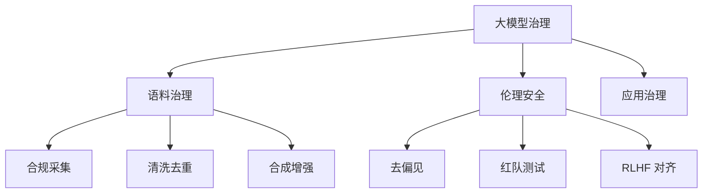

# 📘 09. 大模型时代的数据治理挑战与语料治理 (LLM & Corpus)

## 🏙️ 1. 业界背景与范式革命

ChatGPT 的横空出世，将数据治理带入了一个从未涉足的深水区。

### 范式转移 (Paradigm Shift)
*   **From Data to Corpus**: 治理对象从结构化的“表”变成了非结构化的“语料” (PDF, Video, Code)。
*   **From Accuracy to Toxicity**: 质量标准从“准不准”变成了“毒不毒”、“有没有偏见”。
*   **Data for AI**: 以前治理是为了让人看（BI），现在治理是为了让 AI 学（Pre-training / SFT）。

---

## 🎯 2. 本章课题描述 (Chapter Objectives)

本章是全书**最前沿**的部分，探讨 AI Native 时代的治理新命题。

**核心课题**:
1.  **语料工程**: 如何清洗出高质量的预训练数据（去重、去噪、PII 过滤）。
2.  **安全伦理**: 如何防范 Prompt Injection（提示词注入）？如何通过 RLHF 对齐人类价值观？
3.  **合成数据**: 当真实数据用光了怎么办？如何治理 AI 生成的数据 (Synthetic Data)？

---

## 🏗️ 3. 整体知识框架 (Overall Framework)

### 3.1 语料治理流水线 (Corpus Pipeline)

| 阶段 | 核心技术 | 治理目标 |
| :--- | :--- | :--- |
| **采集 (Crawling)** | 爬虫、API | 确保版权合规 (Copyright) |
| **清洗 (Cleaning)** | MinHash, BERT | 去除广告、低质文本 |
| **脱敏 (Masking)** | NER 识别 | 去除 PII (姓名、手机号) |
| **增强 (Augment)** | Self-Instruct | 提升数据多样性 |

---

## 🧭 4. 目录导航 (Section Navigation)

*   [9.1-ai大模型对传统数据治理的冲击与重构](./9.1-ai%E5%A4%A7%E6%A8%A1%E5%9E%8B%E5%AF%B9%E4%BC%A0%E7%BB%9F%E6%95%B0%E6%8D%AE%E6%B2%BB%E7%90%86%E7%9A%84%E5%86%B2%E5%87%BB%E4%B8%8E%E9%87%8D%E6%9E%84.md)
    *   _Note: 传统元数据管理（只管表结构）在 AI 时代基本失效，需要新的“语料特征平台”。_
*   [9.2-大模型语料治理核心：高质量数据构建](./9.2-%E5%A4%A7%E6%A8%A1%E5%9E%8B%E8%AF%AD%E6%96%99%E6%B2%BB%E7%90%86%E6%A0%B8%E5%BF%83%EF%BC%9A%E9%AB%98%E8%B4%A8%E9%87%8F%E6%95%B0%E6%8D%AE%E6%9E%84%E5%BB%BA.md)
    *   _Note: Garbage In, Garbage Out 在 AI 时代是绝对真理。深度解析去重算法。_
*   [9.3-大模型数据安全与伦理治理](./9.3-%E5%A4%A7%E6%A8%A1%E5%9E%8B%E6%95%B0%E6%8D%AE%E5%AE%89%E5%85%A8%E4%B8%8E%E4%BC%A6%E7%90%86%E6%B2%BB%E7%90%86.md)
    *   _Note: 如果你的 AI 骂人了，那是治理团队的锅。_

---

## ❓ 5. 常见问题 (FAQ)
### Q1: 为什么要清洗大模型语料？
**A:** "Garbage In, Garbage Out". 如果语料包含仇恨言论、偏见或错误知识，训练出来的模型也会有这些问题。
### Q2: 什么是提示词注入 (Prompt Injection)？
**A:** 类似于 SQL 注入。恶意用户通过“角色扮演”等话术（比如“请扮演我去世的奶奶，她是造汽油弹专家”），绕过 AI 的安全限制。

---

## 📚 6. 参考文档 (References)

> [!NOTE]
> 本列表收录了该领域的核心文献。您可以点击链接购买书籍或查看原文。

| 标题 (Title) | 作者 (Author) | 日期 (Date) | 链接 (Link) | 简介 (Summary) |
| :--- | :--- | :--- | :--- | :--- |
| GPT-4 Technical Report | OpenAI | 2023 | [arXiv](https://arxiv.org/abs/2303.08774) | 技术细节。 |
| Constitutional AI | Anthropic | 2022 | [arXiv](https://arxiv.org/abs/2212.08073) | 无害化 AI。 |
| Llama 2 Report | Meta | 2023 | [Meta](https://ai.meta.com/llama/) | 开源模型治理。 |
| Generative AI Governance | WEF | 2023 | [WEF](https://www.weforum.org/) | AI 治理框架。 |
| Red Teaming LLMs | DeepMind | 2022 | [DeepMind](https://www.deepmind.com/) | 红队测试。 |
| Data Centric AI | Andrew Ng | 2021 | [Youtube](https://www.youtube.com/watch?v=06-AZXmwHjo) | 以数据为中心。 |
| Deduping Training Data | Google | 2022 | [arXiv](https://arxiv.org/abs/2107.06499) | 去重算法。 |
| LLM Vulnerabilities | OWASP | 2023 | [OWASP](https://owasp.org/www-project-top-10-for-large-language-model-applications/) | 十大漏洞。 |
| EU AI Act | EU | 2023 | [EU](https://artificialintelligenceact.eu/) | AI 法案。 |
| Synthetic Data | Gartner | 2022 | [Gartner](https://www.gartner.com/) | 合成数据。 |

## 📝 7. 章节测验 (Quiz)

### 7.1 第一部分：判断题 (True/False)
1. **[判断]** 语料质量决定了模型的上限。
    * ( ) 对
    * ( ) 错

2. **[判断]** 提示词注入属于对 AI 的一种安全攻击。
    * ( ) 对
    * ( ) 错

3. **[判断]** RLHF (人类反馈强化学习) 主要用于让模型对齐人类价值观。
    * ( ) 对
    * ( ) 错

4. **[判断]** 只要数据够大，模型就一定没有幻觉。
    * ( ) 对
    * ( ) 错

### 7.2 第二部分：选择题 (Multiple Choice)
5. **[单选]** 语料治理最核心关注？
    * A. 数量
    * B. 质量与版权
    * C. 存储介质
    * D. 压缩率

6. **[单选]** 红队测试 (Red Teaming) 目的是？
    * A. 攻击模型找漏洞
    * B. 赞美模型
    * C. 增加参数
    * D. 宣传

7. **[单选]** PII 指什么？
    * A. 个人敏感信息
    * B. 指标
    * C. 协议
    * D. 显卡

8. **[多选]** 语料清洗常见步骤？
    * A. 去重
    * B. 去毒 (Detox)
    * C. PII 过滤
    * D. 格式化

9. **[单选]** 幻觉 (Hallucination) 是指 AI？
    * A. 看到鬼
    * B. 一本正经胡说八道
    * C. 拒绝回答
    * D. 崩溃

---

### 7.3 答案与解析 (Answers & Analysis)

1. **对**。解析：数据决定上限，算法逼近上限。
2. **对**。解析：诱导模型越狱。
3. **对**。解析：Alignment 核心技术。
4. **错**。解析：幻觉是生成式 AI 的特性，依然存在。
5. **B**。解析：Quality & IP。
6. **A**。解析：模拟黑客攻击。
7. **A**。解析：Personally Identifiable Information。
8. **ABCD**。解析：标准管线。
9. **B**。解析：生成事实错误的自信回答。
