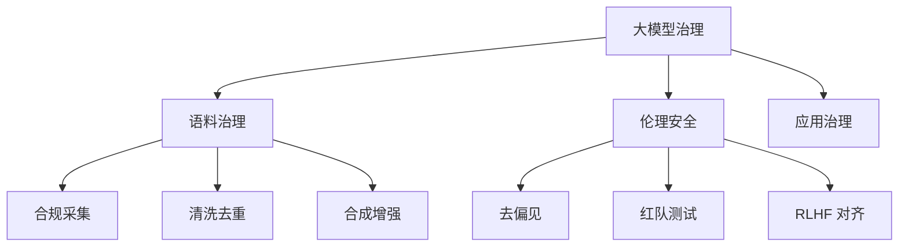

# 09. 大模型时代的数据治理挑战与语料治理 (LLM & Corpus)

## 1. 业界背景与范式革命

ChatGPT 的横空出世，将数据治理带入了一个从未涉足的深水区。

### 范式转移 (Paradigm Shift)
*   **From Data to Corpus**: 治理对象从结构化的“表”变成了非结构化的“语料” (PDF, Video, Code)。
*   **From Accuracy to Toxicity**: 质量标准从“准不准”变成了“毒不毒”、“有没有偏见”。
*   **Data for AI**: 以前治理是为了让人看（BI），现在治理是为了让 AI 学（Pre-training / SFT）。

---

## 2. 本章课题描述 (Chapter Objectives)

本章是全书**最前沿**的部分，探讨 AI Native 时代的治理新命题。

**核心课题**:
1.  **语料工程**: 如何清洗出高质量的预训练数据（去重、去噪、PII 过滤）。
2.  **安全伦理**: 如何防范 Prompt Injection（提示词注入）？如何通过 RLHF 对齐人类价值观？
3.  **合成数据**: 当真实数据用光了怎么办？如何治理 AI 生成的数据 (Synthetic Data)？

---

## 3. 整体知识框架 (Overall Framework)

### 3.1 语料治理流水线 (Corpus Pipeline)

| 阶段 | 核心技术 | 治理目标 |
| :--- | :--- | :--- |
| **采集 (Crawling)** | 爬虫、API | 确保版权合规 (Copyright) |
| **清洗 (Cleaning)** | MinHash, BERT | 去除广告、低质文本 |
| **脱敏 (Masking)** | NER 识别 | 去除 PII (姓名、手机号) |
| **增强 (Augment)** | Self-Instruct | 提升数据多样性 |

---

## 4. 目录导航 (Section Navigation)

*   [9.1-ai大模型对传统数据治理的冲击与重构](./9.1-ai%E5%A4%A7%E6%A8%A1%E5%9E%8B%E5%AF%B9%E4%BC%A0%E7%BB%9F%E6%95%B0%E6%8D%AE%E6%B2%BB%E7%90%86%E7%9A%84%E5%86%B2%E5%87%BB%E4%B8%8E%E9%87%8D%E6%9E%84.md)
    *   _Note: 传统元数据管理（只管表结构）在 AI 时代基本失效，需要新的“语料特征平台”。_
*   [9.2-大模型语料治理核心：高质量数据构建](./9.2-%E5%A4%A7%E6%A8%A1%E5%9E%8B%E8%AF%AD%E6%96%99%E6%B2%BB%E7%90%86%E6%A0%B8%E5%BF%83%EF%BC%9A%E9%AB%98%E8%B4%A8%E9%87%8F%E6%95%B0%E6%8D%AE%E6%9E%84%E5%BB%BA.md)
    *   _Note: Garbage In, Garbage Out 在 AI 时代是绝对真理。深度解析去重算法。_
*   [9.3-大模型数据安全与伦理治理](./9.3-%E5%A4%A7%E6%A8%A1%E5%9E%8B%E6%95%B0%E6%8D%AE%E5%AE%89%E5%85%A8%E4%B8%8E%E4%BC%A6%E7%90%86%E6%B2%BB%E7%90%86.md)
    *   _Note: 如果你的 AI 骂人了，那是治理团队的锅。_

---

## 5. 扩展阅读与参考文献 (References)

> [!WARNING]
> 当下的最佳实践，下个月可能就过时了。保持持续学习。

1.  **OpenAI**. _GPT-4 Technical Report_. (虽然细节不多，但方向性极强)
2.  **Anthropic**. _Constitutional AI: Harmlessness from AI Feedback_. (RLHF 的进阶版)
3.  **HuggingFace**. _Open LLM Leaderboard_. (关注数据对模型得分的影响)
