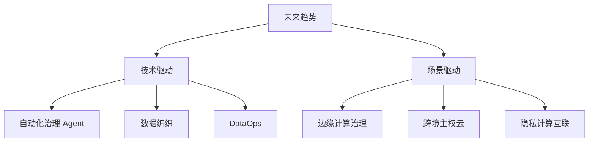

# 📘 10. 数据治理未来趋势与研究方向 (Future Trends)

## 🏙️ 1. 业界背景与技术展望

站在 2026 年的节点展望未来，数据治理正处于技术大爆炸的前夜。Agentic AI (智能体) 的普及将彻底改变治理的运作模式。

### 三大趋势
1.  **Auto-Governance**: 人工治理将消亡。AI 自动发现质量问题，自动生成修复代码，自动执行。
2.  **治理下沉 (Edge)**: 随着 IoT 设备增多，治理将发生在数据产生的那一刻（边缘端），而不是传输到云端之后。
3.  **零拷贝 (Zero-Copy)**: Data Fabric 技术的成熟，使得我们不需要搬运数据就能治理数据。

---

## 🎯 2. 本章课题描述 (Chapter Objectives)

本章为研究者和高级架构师准备，探讨未来的可能性。

**核心课题**:
1.  **DataOps**: 如何将 DevOps 的敏捷思想引入数据开发？
2.  **Data Fabric**: 这种“虚拟化”的数据管理架构是否会取代数据湖？
3.  **前沿研究**: 遗忘学习 (Machine Unlearning)、同态加密等学术界热点。

---

## 🏗️ 3. 整体知识框架 (Overall Framework)

### 3.1 治理进化论

| 时代 | 治理主体 | 治理方式 | 治理周期 |
| :--- | :--- | :--- | :--- |
| **手工时代** | 几个 Excel 表哥 | 人工核对 | 月度/季度 |
| **平台时代** | 专门的数据团队 | 规则配置+工单 | T+1 天 |
| **智能时代** | **AI Agent** | **自愈 (Self-Healing)** | **实时 (Real-time)** |

---

## 🧭 4. 目录导航 (Section Navigation)

*   [10.1-数据治理未来趋势与研究方向](./10.1-%E6%95%B0%E6%8D%AE%E6%B2%BB%E7%90%86%E6%9C%AA%E6%9D%A5%E8%B6%8B%E5%8A%BF%E4%B8%8E%E7%A0%94%E7%A9%B6%E6%96%B9%E5%90%91.md)
    *   _Note: 包含给硕士研究生的论文选题建议。_

---

## ❓ 5. 常见问题 (FAQ)
### Q1: Auto-Governance (自动化治理) 是什么？
**A:** 利用 AI Agent 自动扫描数据、发现异常（如空值激增），甚至自动生成修复代码。人类只需要审批。
### Q2: 什么是零拷贝 (Zero-Copy)？
**A:** 以前做分析要把数据从数据库搬到数仓。Zero-Copy 技术允许不同的计算引擎直接读取同一份底层存储（如 S3 上的 Parquet），无需搬运，大大节省存储和时间。

---

## 📚 6. 参考文档 (References)

> [!NOTE]
> 本列表收录了该领域的核心文献。您可以点击链接购买书籍或查看原文。

| 标题 (Title) | 作者 (Author) | 日期 (Date) | 链接 (Link) | 简介 (Summary) |
| :--- | :--- | :--- | :--- | :--- |
| Top Strategic Tech Trends | Gartner | 2026 | [Gartner](https://www.gartner.com/) | 未来预测。 |
| DataOps Manifesto | DataOps.org | 2019 | [Website](https://dataopsmanifesto.org/) | 敏捷宣言。 |
| Machine Unlearning | Google | 2021 | [arXiv](https://arxiv.org/abs/1912.03817) | 机器遗忘。 |
| Edge Computing Governance | IEEE | 2022 | [IEEE](https://ieeexplore.ieee.org/) | 边缘治理。 |
| Zero Copy Data Sharing | Snowflake | 2023 | [Snowflake](https://www.snowflake.com/) | 零拷贝。 |
| Autonomous Data Management | Oracle | 2022 | [Oracle](https://www.oracle.com/database/autonomous-database/) | 自治数据库。 |
| Privacy Enhancing Tech | UK Gov | 2023 | [Gov.uk](https://www.gov.uk/) | PETs。 |
| Active Metadata | Atlan | 2022 | [Atlan](https://atlan.com/active-metadata-management/) | 主动元数据。 |
| Quantum Safe Cryptography | NIST | 2023 | [NIST](https://csrc.nist.gov/) | 后量子密码。 |
| Augmented Data Quality | Gartner | 2022 | [Gartner](https://www.gartner.com/) | 增强型质量。 |

## 📝 7. 章节测验 (Quiz)

### 7.1 第一部分：判断题 (True/False)
1. **[判断]** AI Agent 将辅助甚至自动化部分治理工作。
    * ( ) 对
    * ( ) 错

2. **[判断]** 治理将下沉到边缘端 (Edge)。
    * ( ) 对
    * ( ) 错

3. **[判断]** 零拷贝技术能减少数据冗余。
    * ( ) 对
    * ( ) 错

4. **[判断]** DataOps 的核心理念是敏捷与自动化。
    * ( ) 对
    * ( ) 错

### 7.2 第二部分：选择题 (Multiple Choice)
5. **[单选]** Auto-Governance 依赖的核心技术？
    * A. AI / ML
    * B. 手工 Excel
    * C. 纸笔
    * D. 电话

6. **[单选]** 边缘计算治理的优势？
    * A. 高延迟
    * B. 低延时与隐私
    * C. 增加成本
    * D. 无论

7. **[单选]** 遗忘学习 (Machine Unlearning) 主要为了满足？
    * A. 备份
    * B. 扩容
    * C. 用户删除权 (RTVF)
    * D. 加密

8. **[多选]** 未来技术趋势？
    * A. 数据编织
    * B. 增强分析
    * C. 隐私计算
    * D. 量子安全

9. **[单选]** 治理的周期将变为？
    * A. 每年一次
    * B. 每月一次
    * C. 实时/准实时
    * D. 永不

---

### 7.3 答案与解析 (Answers & Analysis)

1. **对**。解析：Auto-correction。
2. **对**。解析：数据产生即治理。
3. **对**。解析：Single storage。
4. **对**。解析：DevOps for Data。
5. **A**。解析：智能体驱动。
6. **B**。解析：Data gravity at edge。
7. **C**。解析：Right to be Forgotten。
8. **ABCD**。解析：Gartner 预测。
9. **C**。解析：Active Governance。
