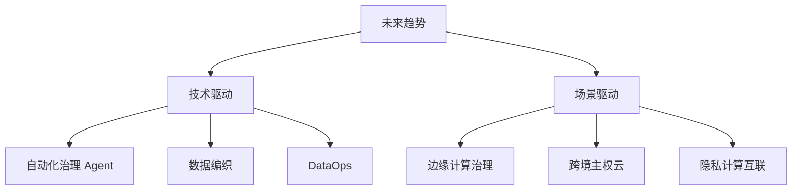

# 10. 数据治理未来趋势与研究方向 (Future Trends)

## 1. 业界背景与技术展望

站在 2026 年的节点展望未来，数据治理正处于技术大爆炸的前夜。Agentic AI (智能体) 的普及将彻底改变治理的运作模式。

### 三大趋势
1.  **Auto-Governance**: 人工治理将消亡。AI 自动发现质量问题，自动生成修复代码，自动执行。
2.  **治理下沉 (Edge)**: 随着 IoT 设备增多，治理将发生在数据产生的那一刻（边缘端），而不是传输到云端之后。
3.  **零拷贝 (Zero-Copy)**: Data Fabric 技术的成熟，使得我们不需要搬运数据就能治理数据。

---

## 2. 本章课题描述 (Chapter Objectives)

本章为研究者和高级架构师准备，探讨未来的可能性。

**核心课题**:
1.  **DataOps**: 如何将 DevOps 的敏捷思想引入数据开发？
2.  **Data Fabric**: 这种“虚拟化”的数据管理架构是否会取代数据湖？
3.  **前沿研究**: 遗忘学习 (Machine Unlearning)、同态加密等学术界热点。

---

## 3. 整体知识框架 (Overall Framework)

### 3.1 治理进化论

| 时代 | 治理主体 | 治理方式 | 治理周期 |
| :--- | :--- | :--- | :--- |
| **手工时代** | 几个 Excel 表哥 | 人工核对 | 月度/季度 |
| **平台时代** | 专门的数据团队 | 规则配置+工单 | T+1 天 |
| **智能时代** | **AI Agent** | **自愈 (Self-Healing)** | **实时 (Real-time)** |

---

## 4. 目录导航 (Section Navigation)

*   [10.1-数据治理未来趋势与研究方向](./10.1-%E6%95%B0%E6%8D%AE%E6%B2%BB%E7%90%86%E6%9C%AA%E6%9D%A5%E8%B6%8B%E5%8A%BF%E4%B8%8E%E7%A0%94%E7%A9%B6%E6%96%B9%E5%90%91.md)
    *   _Note: 包含给硕士研究生的论文选题建议。_

---

## 5. 扩展阅读与参考文献 (References)

> [!NOTE]
> 预测未来最好的方式，就是去创造它。

1.  **Gartner**. _Top Strategic Technology Trends for 2026_.
2.  **DataOps Manifesto**. (dataopsmanifesto.org)
