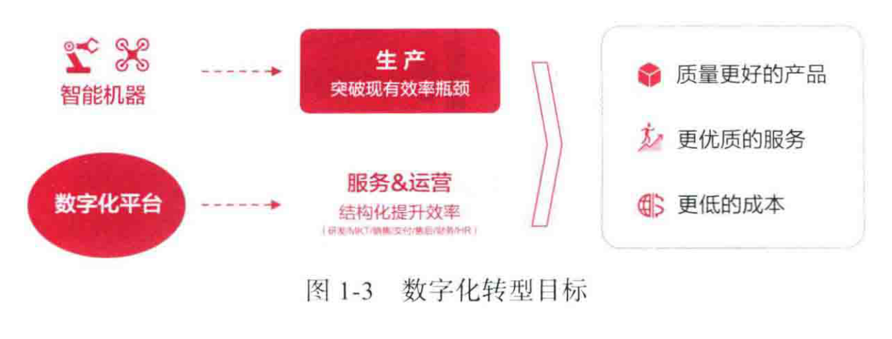
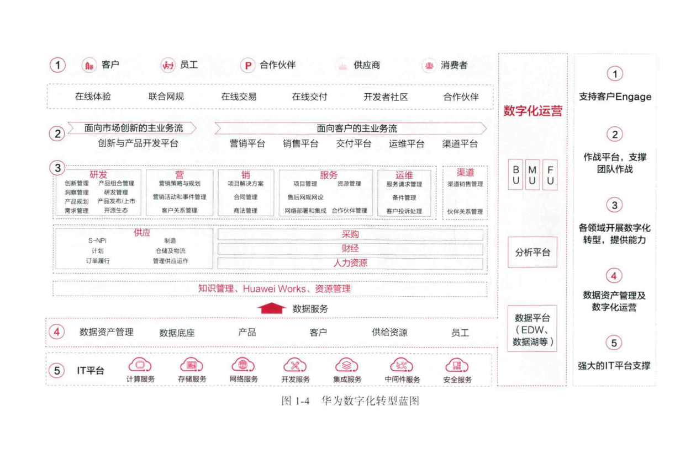
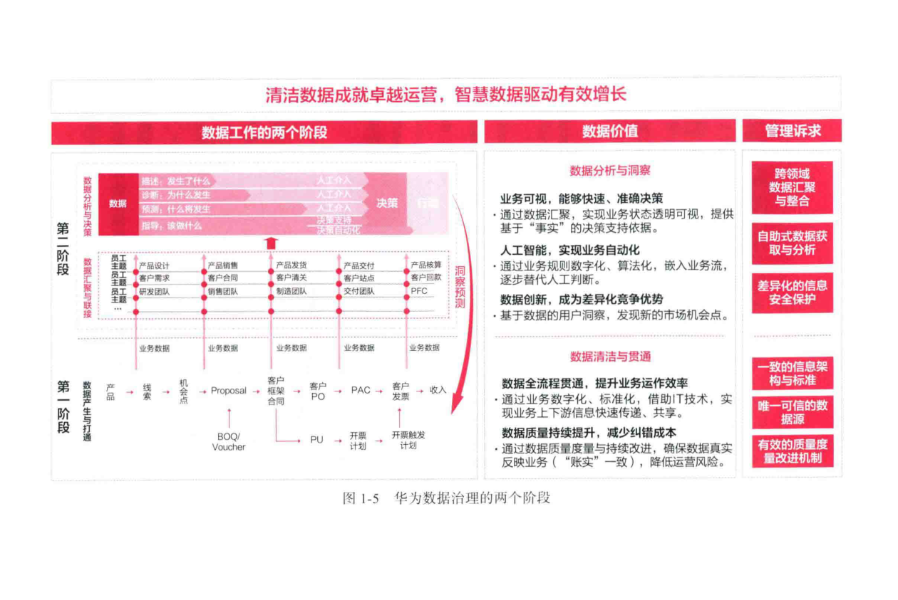
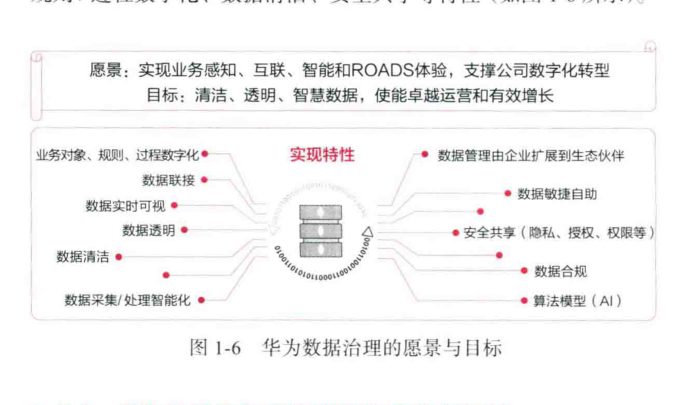
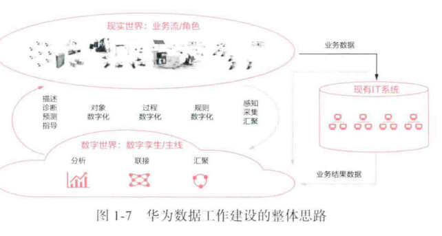
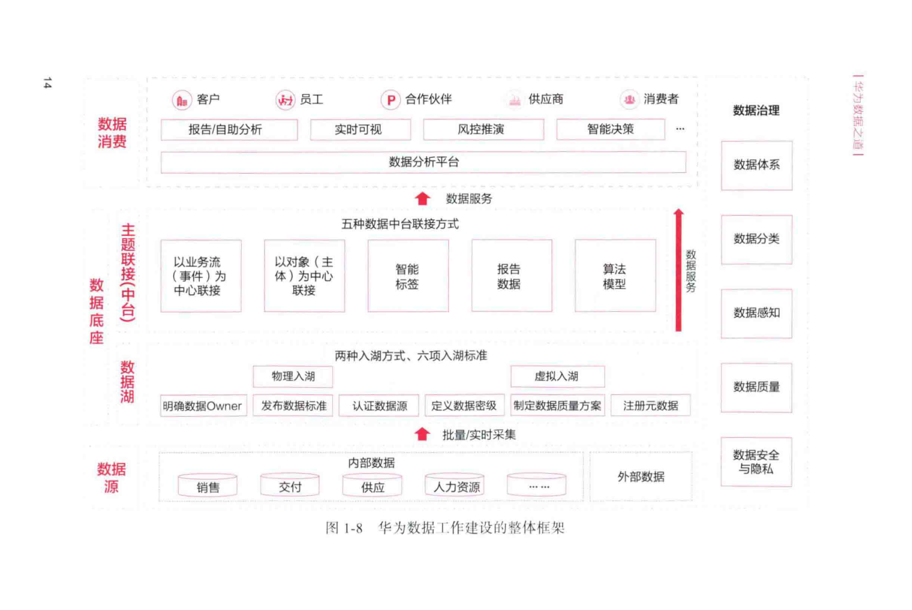

# 第1章 数据驱动的企业数字化转型

随着通信与数字技术的发展，网络化和数字化为人类带来了更多的精彩和无限的可能，推动我们进入全联接的信息时代和大数据时代。在这样的背景下，**数字化转型**正在改变许多企业和行业的运作模式。无论是**数字原生企业**，还是**非数字原生企业**，都在积极探索数字化转型。社会经济大环境的变化、竞争对手的压力、公司的战略优化、自身经营的改善等是企业数字化转型最主要的驱动力。

企业要想在数字时代生存下来，要么是数字原生企业，要么就要数字化转型成功，成为重生后的数字企业。

## 1.1 非数字原生企业的数字化转型挑战

**数字原生企业**在设立之初就以数字世界为中心构建，生成了以软件和数据平台为核心的数字世界入口，便捷地获取和存储了大量的数据，并开始尝试通过机器学习等人工智能技术分析这些数据，以便更好地理解用户需求，增强数字化创新能力。

与数字原生企业不同，**非数字原生企业**在成立之时，基本都是以物理世界为中心来构建的。绝大部分企业在创建的时候，是围绕生产、流通、服务等具体的经济活动展开的，天然缺乏以软件和数据平台为核心的数字世界入口，这也造就了非数字原生企业与数字原生企业之间的显著差异。因此，在数字化转型过程中，非数字原生企业面临着更大的挑战。

### 1.1.1 业态特征：产业链条长、多业态并存

非数字原生企业，特别是大中型生产企业，往往有较长的业务链条，从研发到销售全产业链覆盖。
*   **传统钢铁企业示例**：完整的工艺包括采矿、选矿、烧结、炼铁、炼钢、热轧、冷轧、硅钢等，辅助生产工艺包括焦化、制氧、燃气、自备电、动力等，在各个工艺流程中沉淀着大量的复杂数据。
*   **华为实践**：华为在构建面向客户价值流的过程中，同样形成了从研发到销售、供应、交付、运维的长链条，同时产品类型包括电信基站、服务器、CPU、电脑、手机、耳机等，横跨多个产业。这在某种程度上造成了各条块分割、业务组织强势、变革困难、变革复杂度极高等问题。

### 1.1.2 运营环境：数据交互和共享风险高

非数字原生企业，特别是注重实物生产、交易的大中型企业，还面临着场景复杂的特点，比如交易复杂、风险周期长、内外部风险多等。
*   **生产过程**：需要关注原材料供应、人工成本、物流过程；交易过程中涉及进出口的还需要关注外汇汇率、当地政治环境、海关、法律法规、安全隐私、环境保护等多种信息。
*   **设备安装**：对于设备异地安装的情况，还需要考虑地理环境、道路环境、施工条件、运输条件、用工政策和安全防护等复杂因素。
*   **华为实践**：华为公司的服务对象从运营商、企业客户到个人消费者，服务范围和雇员遍布全球100多个国家和地区，需要严格遵守各个国家和地区的进出口管制措施、环保条例、安全隐私法规等。这些业务形态上的特点，导致包括华为在内的诸多非数字原生企业对数据共享（特别是生产、销售侧数据的对外共享）有更多顾虑，更容易形成客观上的“**数据孤岛**”。

### 1.1.3 IT建设过程：数据复杂、历史包袱重

非数字原生企业普遍有较长的历史，组织架构和人员配置都围绕着线下业务开展，大都经历过信息化过程。很多制造型企业随着不同阶段的发展需求，保留着各个版本的ERP软件和各种不同类型的数据存储环境，导致数据来源多样，独立封装和存储的数据难以集中共享，也不敢随意改造或替换，IT系统历史包袱沉重。
*   **华为实践**：华为公司的主业务流程中存在几十个系统模块，有多个版本的ERP，多种集成方式，系统间存在大量复杂的集成和嵌套。各业务领域开发了上千个应用系统模块，包含上百万张物理表、几千万个字段，这些数据又分别存储在上千个不同数据库中，共享困难；数据链路呈“长网”状，典型链路达12层以上，部分链路甚至高达22层。

### 1.1.4 数据质量：数据可信和一致化的要求程度高

基于业务特征和运营环境的特点，非数字原生企业对数据生成质量有更高的要求。数据产生时的质量高低不仅直接影响产品质量，而且直接影响整个内部业务的运作效率和成本。
*   **质量要求**：公司会对合同录入质量进行严格度量和控制，以确保下游各环节能够及时、准确、完整地获得所需数据，并在整个端到端链条中对异常数据进行严格监控。数据质量要求严格，需要配置多重精确规则，基于客观事实多重校验，确保数据可信、一致。
*   **场景聚焦**：非数字原生企业在消费数据时对数据质量的要求也更高，一般会更聚焦于与业务流程相关的特定场景，更关注业务流程中间问题的根因和偏差，数据挖掘、推理、人工智能都能聚焦于对业务的理解，面向业务去定制化、精细化的算法管理，因此消费数据时的质量容错空间非常小。

## 1.2 华为数字化转型与数据治理

传统企业通过制造先进的机器来提升生产效率，但是未来，如何结构性地提升服务和运营效率、如何用更低的成本获取更好的产品，成了时代性的问题。数字化转型归根结底就是要解决企业的两大问题：**成本**和**效率**，并围绕“多打粮食，增加土地肥力”而开展。

### 1.2.1 华为数字化转型整体目标

*   **2016年变革战略**：明确要面向用户（企业客户、消费者、员工、合作伙伴、供应商）实现 **ROADS** 体验，持续提升效率、效益和客户满意度。明确要用五年时间完成业务数字化转型，数字化转型成为华为唯一的变革。
*   **2017年新愿景**：“把数字世界带入每个人、每个家庭、每个组织，构建万物互联的智能世界”。同时，华为公司董事、CIO陶景文提出了“实现全联接的智能华为，成为行业标杆”的数字化转型目标。

**数字化转型目标模型 (图1-3)**
该模型展示了转型的驱动力和期望成果：
1.  **驱动层**：
    *   **智能机器** -> **生产**：突破现有效率瓶颈。
    *   **数字化平台** -> **服务&运营**：结构化提升效率。
2.  **成果层**：
    *   **质量更好的产品**
    *   **更优质的服务**
    *   **更低的成本**

### 1.2.2 华为数字化转型蓝图及对数据治理的要求

2017年，华为基于愿景确定了数字化转型的蓝图和框架，统一规划、分层开展，最终实现客户交互方式的转变，实现内部运营效率和效益的提升。华为数字化转型蓝图包括5项举措。

**华为数字化转型蓝图 (图1-4)**

这是一个分层架构图，描述了华为数字化转型的整体结构：
*   **顶层（数字化运营）**：面向客户、员工、合作伙伴、供应商、开发者社区、消费者，实现 **支持/Engage**、**作战平台，支撑团队作战**、**各领域开展数字化转型，提炼能力**、**数据资产管理及数字化作战**、**强大的IT平台支撑**。
*   **中层（业务流与平台）**：
    *   **面向市场创造价值的主业务流**：包括研发、营销、销售、供应、服务、采购、财经、人力资源等。
    *   **创新产品与平台开发**
*   **底层（资产与平台）**：
    *   **数据资产管理**：知识管理、Huawei Works、资源管理、数据服务。
    *   **IT平台**：计算服务、存储服务、网络服务、开发服务、集成服务、中间件服务、安全服务。
    *   **数据平台 (EDW、数据湖等)**

**五大转型举措**：
1.  **举措1**：实现“**客户交互方式**”的转变，用数字化手段做厚、做深客户界面，做生意更简单、更高效、更安全，提升客户体验满意度，帮助客户解决问题。
2.  **举措2**：实现“**作战模式**”的转变，围绕两大主业务流，以项目为中心，对准一线精兵团队作战，率先实现基于ROADS的体验，达到领先于行业的运营效率。
3.  **举措3**：实现“**平台能力**”提供方式的转变，实现关键业务对象的数字化并不断汇聚数据，实现流程数字化能力和服务化，支撑一线作战人员和客户的全联接。
4.  **举措4**：实现“**运营模式**”的转变，基于统一**数据底座**，实现数字化运营与决策，简化管理，加大对一线人员的授权。
5.  **举措5**：**云化、服务化**的IT基础设施和IT应用，统一公司IT平台，同时构建智能服务。

_其中，举措4涉及数据治理和数字化运营，是华为数字化转型的关键，承接了打破数据孤岛、确保源头数据准确、促进数据共享、保障数据隐私与安全等目标。_

**对数据治理的要求**：
1.  基于统一的数据管理规则，确保数据源头质量以及数据入湖、形成清洁、完整、一致的数据湖，这是华为数字化转型的基础。
2.  业务与数据双驱动，加强数据联接建设，并能够以数据服务方式，灵活满足业务自助式的数据消费诉求。
3.  针对汇聚的海量内外部数据，能够确保数据安全合规。
4.  不断完善业务对象、过程与规则数字化，提升数据自动采集能力，减少人工录入。

## 1.3 华为数据治理实践

华为从2007年开始启动**数据治理**，历经两个阶段的持续变革，系统地建立了华为数据管理体系。

### 1.3.1 华为数据治理历程

1.  **第一阶段：2007 ~ 2016年**
    *   **行动**：设立数据管理专业组织，建立数据管理框架，发布数据管理政策，任命 **Data Owner**，通过统一信息架构与标准、唯一可信的数据源、有效的数据质量度量改进机制，实现以下目标。
    *   **目标**：
        *   持续提升数据质量，减少纠错成本：通过数据质量度量与持续改进，确保数据真实反映业务，降低运营风险。
        *   数据全流程贯通，提升运作效率：通过业务数字化、标准化，借助IT技术，实现业务上下游信息快速传递、共享。

2.  **第二阶段：2017年至今**
    *   **行动**：建设**数据底座**，汇聚企业全域数据并对数据进行联接，通过数据服务、数据地图、数据安全防护与隐私保护，实现了数据随需共享、敏捷自助、安全透明的目标，支撑着华为数字化转型，实现了如下的数据价值。
    *   **目标**：
        *   **业务可视**，能够快速、准确决策：通过数据汇聚，实现业务状态透明可视，提供基于“事实”的决策支持依据。
        *   **人工智能**，实现业务自动化：通过业务规则数字化、算法化，嵌入业务流，逐步替代人工判断。
        *   **数据创新**，成为差异化竞争优势：基于数据的用户洞察，发现新的市场机会点。

**华为数据治理的两个阶段 (图1-5)**

该图表对比了两个阶段在数据工作、数据价值和管理诉求上的差异：
*   **第一阶段 (数据产生与打通)**
    *   **数据工作**：聚焦于数据产生环节，解决“搞清楚、是什么、为什么发生、谁来确认”等问题。数据流主要在业务流程内部，如商机->线索->客户->...->收入。
    *   **数据价值 (数据清洁与贯通)**：数据全流程贯通，提升业务运作效率；数据质量持续提升，减少纠错成本。
    *   **管理诉求**：一致的数据架构与标准；唯一可信的数据源；有效的质量度量改进机制。
*   **第二阶段 (清洁数据成就卓越运营，智慧数据驱动有效增长)**
    *   **数据工作**：聚焦于数据消费环节，通过决策、执行、行动实现数据价值闭环。
    *   **数据价值 (数据分析与洞察)**：业务可视，能够快速、准确决策；人工智能，实现业务自动化；数据创新，成为差异化竞争优势。
    *   **管理诉求**：跨领域数据汇聚与整合；自助式数据获取与分析；差异化的信息安全保护。

### 1.3.2 华为数据工作的愿景与目标

*   **愿景**：实现业务感知、互联、智能和ROADS体验，支撑公司数字化转型。
*   **目标**：清洁、透明、智慧数据，使能卓越运营和有效增长。

为确保数据工作的愿景与目标达成，需要实现数据自动采集、对象/规则/过程数字化、数据清洁、安全共享等特性。

**华为数据治理的愿景与目标 (图1-6)**

这是一个中心辐射图，核心是愿景和目标，周围环绕着实现这些目标所需的特性和管理扩展：
*   **实现特性**：业务对象、规则、过程数字化；数据联接；数据实时可视；数据透明；数据清洁；数据采集/处理智能化。
*   **管理扩展**：数据管理由企业扩展到生态伙伴；数据敏捷自助；安全共享（隐私、授权、权限等）；数据合规；算法模型（AI）。

### 1.3.3 华为数据工作建设的整体思路和框架

作为非数字原生企业，我们认为数字化转型的关键要素之一是在现实世界的基础上构建一个跨越孤立系统、承载业务的“**数字孪生**”的数字世界。通过在数字世界汇聚、联接与分析数据，进行描述、诊断和预测，最终指导IT系统的改进。

**华为数据工作建设的整体思路 (图1-7)**

该图描绘了现实世界与数字世界的交互：
1.  **现实世界 (业务流/角色)**：存在业务数据和业务结果数据。
2.  **数字化过程**：通过“描述、检测、诊断、预测”等手段，将现实世界的“对象”、“过程”、“规则”进行数字化，并感知汇聚到数字世界。
3.  **数字世界 (数字孪生/主线)**：进行数据“分析”、“联接”、“汇聚”。
4.  **反馈循环**：数字世界的分析结果作用于“现有IT系统”，从而影响“业务结果数据”，形成闭环。

**华为数据工作建设框架**
华为经过多年实践，形成了一套数据工作框架：
1.  **数据源**：业务数字化是数据工作的前提，通过业务对象、规则与过程数字化，不断提升数据质量，建立清洁、可靠的数据源。
2.  **数据湖**：基于“统筹推动、以用促建”的建设策略，严格按六项标准，通过物理与虚拟两种入湖方式，汇聚华为内部和外部的海量数据，形成清洁、完整、一致的数据湖。
3.  **数据主题联接**：通过五种数据联接方式，规划和需求双驱动，建立数据主题联接，并通过服务方式支撑数据消费。
4.  **数据消费**：对准数据消费场景，通过提供统一的数据分析平台，满足自助式数据消费需求。
5.  **数据治理**：为保障各业务领域数据工作的有序开展，需建立统一的数据治理能力，如数据体系、数据分类、数据感知、数据质量、安全与隐私等。

**华为数据工作建设的整体框架图 (图1-8)**

这是一个详细的架构图，自下而上分为多个层次：
*   **数据源**：包括销售、交付、供应、人力资源等内部数据，以及外部数据。
*   **数据湖**：通过明确数据Owner、发布数据标准、认证数据源、定义数据密级、制定数据质量方案、注册元数据等方式，将数据源的数据通过物理入湖和虚拟入湖两种方式汇入。
*   **数据底座 (主题联接-平台)**：以业务流（事件）为中心联接，或以对象、主体为中心联接。
*   **数据服务**：提供智能标签、报告数据、算法模型等服务，通过数据分析平台对外提供。
*   **数据消费**：面向客户、员工、合作伙伴、供应商、消费者，提供报告自助分析、实时可视、风控推演、智能决策等能力。
*   **数据治理 (贯穿始终)**：包括数据体系、数据分类、数据感知、数据质量、数据法律、数据安全与隐私。

## 1.4 本章小结

本章是华为数据治理方法论和数据建设实践经验的总结，从宏观上介绍了华为在数字化转型和数据治理方面面临的挑战和整体策略。后续内容将从数据体系建设和数据分类开始，围绕信息架构、数据服务建设，结合数据感知、数据质量和安全合规能力打造，详细阐述华为在数据治理和数字化转型方面的经验。