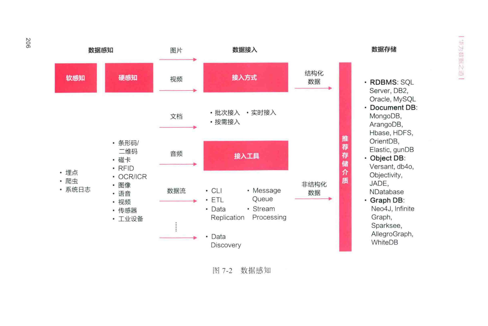
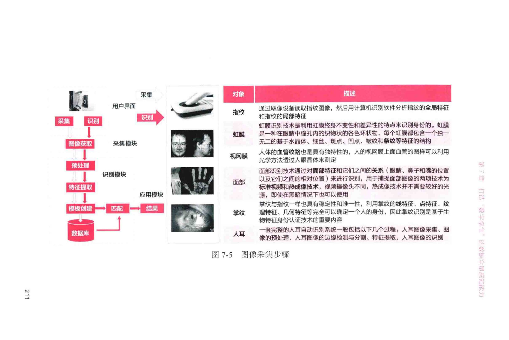
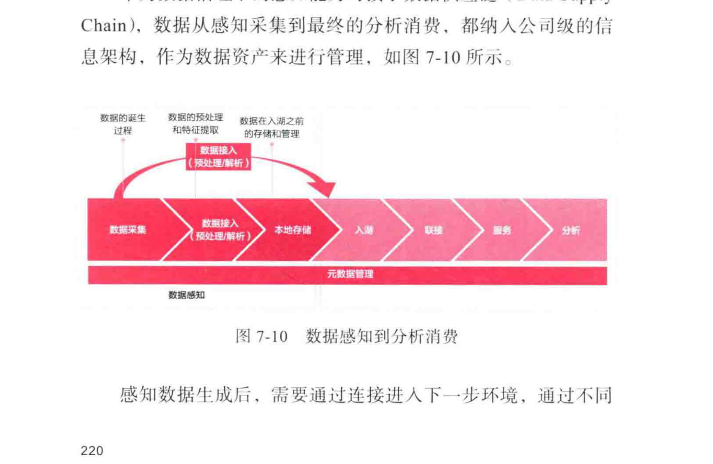

# 7. 打造“数字孪生”的数据全量感知能力

在信息化时代构建的IT系统，基本上是功能化、烟囱化、封闭式的，只能给企业内部经过培训的专业人员使用，所有的决策数据和我们信任的IT系统基本都是靠人来录入数据。_但是，人如果犯错呢？_

**数字化转型**是在解决工业革命时代没有解决的效率和成本问题，所以如果转型模型依赖的数据，还是需要组织大量专业人员去录入、去校验，那么就没有从源头上解决**数字化转型**要解决的效率和成本问题。**数字化转型**要从根本上加强数据的可获得性，围绕我们构建的数据主题和对象丰富数据感知渠道。要追求更加实时、全面、有效、安全的数据获取。

## 1. “全量、无接触”的数据感知能力框架

### 1.1 数据感知能力的需求起源：数字孪生

2003年，Michael Grieves教授首次提出了“与物理产品等价的虚拟数字化表达”的概念，并给出定义：一个或一组特定装置的数字复制品，能够抽象表达真实装置并可以此为基础进行真实条件或模拟条件下的测试。该概念源于对装置的信息和数据进行更清晰的表达的期望，希望能够将所有信息放在一起进行更高层次的分析。**数字孪生 (Digital Twin, DT)** 即由此概念衍生而出并沿用至今。

在复杂的企业**数字化转型**变革过程中，非数字原生企业往往需要协调众多业务流，极具挑战性，但同时也是成功转型的关键。所以基于**DT**衍生出来的**DTO (Digital Twin of an Organization，企业数字孪生体)** 是一种动态的软件模型。模型需要输入组织的运营及其他类型的相关数据，以实现组织运营模型在虚拟世界中的映射，并能更新实时状态、应对外界变化、部署相应资源和产生预期客户价值。

**DTO**虽然概念脱胎于**DT**，但是两者之间在适用对象、模型数据等方面，有着显著的差异，Gartner的 文章对此进行了归纳，如下表所示：

**表7-1 DT 和 DTO 对比**

| 起源 | 适用对象 | 模型数据 | 运作方式 | 目的意义 |
| :--- | :--- | :--- | :--- | :--- |
| **DT** | 涵盖物理、人、流程，地点、对象等几乎所有物理实体。在物理实体中选择产品全生命周期管理的问题。产品只是它们组合的组合。 | 多来自历史数据，如CAD、BOM清单等。支持物理对象的实时功能模拟，支持物理对象发展趋势的预测。产品应用系统、维护日志等。 | 利用人工智能、机器学习对数字孪生对象进行仿真、控制和仿真。 | 用以实时监控物理对象的运作、使用和分析，实现对物理对象的预测、控制以及优化。 |
| **DTO** | 主要集中在企业这一复杂对象的数字化，并将其中各个流程、运营和绩效指标之间组织至组织的全貌，并将其中各个流程、运营和绩效指标之间的相互关系，是DT将概念在组织管理间的延伸，将人“这一元素融入数字孪生中。 | 企业内部组织运营数据，如来自流程、交易流、指标等。数据来源领域包括例如客户和外部用户，如客户市场行为变化等。 | 制定战略目标，设定实现这一目标的价值链，建立多指标数字经营模型，以衡量企业经营状况，并对不确定情景做出决策，并决策提供决策支持。 | 帮助管理者实时了解企业经营情况，为企业经营决策提供建议，并对不确定的情景做出决策，为决策提供决策支持。 |

Gartner预测2020年将有超过200亿个联网的传感器和端点，将会有数十亿个物件存在**数字孪生**。企业领导者开始有意识构建并不断改进企业的数据感知能力，希望提高物理对象的操作意识，并力求优化与这些对象的变化状态相关的决策，提升产品全生命周期数据收集和可视化能力，运用合适的分析工具和规则，高效地达成业务目标。

### 1.2 数据感知能力架构

随着企业业务**数字化转型**的推进，非数字原生企业对数据的感知和获取提出了新的要求和挑战，原有信息化平台的数据输出和人工录入能力已经远远满足不了企业内部组织在数字化下的运作需求。企业需要构建**数据感知能力**，采用现代化手段采集和获取数据，减少人工录入。

**数据感知**可分为“**硬感知**”和“**软感知**”，面向不同场景。“**硬感知**”主要利用设备或装置进行数据的收集，收集对象为物理世界中的物理实体，或者是物理实体为载体的信息、事件、流程等。而“**软感知**”使用软件或者各种技术进行数据收集，收集的对象存在于数字世界，通常不依赖物理设备进行收集。

**

 数据感知架构图文字复现**
该架构图展示了数据从感知到存储的完整流程：
1.  **数据感知层 (左侧)**:
    *   **软感知**: 包括埋点、爬虫、系统日志等方式，主要采集文本、音频、视频等非结构化数据。
    *   **硬感知**: 包括条形码/二维码、磁卡、RFID、OCR/ICR、语音、视频、传感器、工业设备等，主要采集图片、视频等非结构化数据。
2.  **数据接入层 (中间)**:
    *   **接入方式**: 分为批次接入、实时接入和按需接入。
    *   **接入工具**: 包括CLI、ETL、Data Replication、Message Queue、Stream Processing、Data Discovery等。
3.  **数据存储层 (右侧)**:
    *   **结构化数据**: 推荐存储介质包括RDBMS (如SQL Server, Oracle, MySQL)、Document DB (如MongoDB)、Graph DB (如Neo4j)。
    *   **非结构化数据**: 推荐存储介质包括HBase, HDFS, OrientDB, Elastic, gunDB, Object DB, Versant, db4o, Objectivity, JADE, NDatabase, Infinite Graph, Sparksee, AllegroGraph, WhiteDB。

_当然，这一切的最终目的是生成企业级的数据感知数据，形成数字孪生的基础，满足企业利用人工智能、机器学习对数字孪生对象进行仿真分析、控制并优化战略目标的需求，帮助企业动态把握组织所处的环境，帮助管理者实时了解运营情况，为企业数字化变革提供建议，通过这些数字化的手段持续变革创新、获取业务价值。_

## 2. 基于物理世界的“硬感知”能力

**数据采集**方式主要经历了人工采集和自动采集两个阶段。自动采集技术仍在发展中，不同的应用领域所使用的具体技术手段也不同。基于物理世界的“**硬感知**”依靠的就是数据采集，是将物理对象镜像到数字世界中的主要通道，是构建数据感知能力的关键，是实现人工智能的基础。

### 2.1 “硬感知”能力的分类

基于当前的技术水平和应用场景，我们将“**硬感知**”分为9类，每一类感知方式都有自身的特点和应用场景。

1.  **条形码与二维码**: 通过一定规则的图形排列来表达一组信息。信息量有限，但应用广泛。
2.  **磁卡**: 一种卡片状的磁性记录介质，利用磁性载体记录字符与数字信息。成本低，但保密性和安全性较差。
3.  **RFID (Radio Frequency Identification)**: 无线射频识别，一种非接触式的自动识别技术。基于此发展出了**NFC (Near Field Communication)**，安全性高，应用广泛。
4.  **OCR (Optical Character Recognition) 与 ICR (Intelligent Character Recognition)**: 光学字符识别，指电子设备扫描纸上打印的字符，通过模式识别将其翻译成计算机文字。**ICR**是更先进的版本，植入了深度学习技术。
5.  **图像数据采集**: 指利用计算机对图像进行采集、处理、分析和理解，以识别不同模式的目标和对象的技术。
6.  **音频数据采集**: 也称语音识别 (ASR)，可将人类语音中的词汇内容转换为计算机可读的输入。
7.  **视频数据采集**: 视频是动态的数据，内容随时间而变化，声音与运动图像同步。
8.  **传感器数据采集**: 一种检测装置，能感受到被检测的信息，并能将检测到的信息按一定规律变换成信号或其他所需形式的信息输出。
9.  **工业设备数据采集**: 对工业机器设备产生的系统数据进行统一的采集、存储、加工、传输。

### 2.2 “硬感知”能力在华为的实践

“**硬感知**”在非数字原生企业有广阔的前景，因为在数字化时代，非数字原生企业大量存在的产品、产线、流程工艺、实体货物、物流设备等，都需要通过“**硬感知**”来实现数据的感知和采集。华为作为典型的非数字原生企业，9类“**硬感知**”能力在各领域中都得到了一定的应用，并已发挥了实际的业务价值。

#### 1. 门店数字化

如

所示，采用7种数据采集方式，支持持续提升运营效率与消费者体验。
*   **环境数据**: 通过光线传感器和温度传感器，自动调节窗帘、灯光、温度。
*   **消费者行为**: 通过智能系统联动，实现实体物理感知，自动申报位置与状态，异常告警。
*   **客流分析**: 通过视频感知客流与热区，管理门店各片区人流密度与停留时间，优化陈列与营销，实时调整服务人力与资源配置。

**

 门店数字化流程与数据采集点文字复现**
*   **探索阶段**: 官网、APP或社交媒体交互，采集环境数据（温度、亮度、湿度）。
*   **到店阶段**: 消费者行为（样品体验数据、样机体验偏好）。
*   **体验阶段**: 访问客户，导购介绍，自助体验，采集设备状态（是否开机、是否在原位置、连接销售）。
*   **购买阶段**: 选购商品/配件，购买及支付，采集消费者行为（产品点击率、产品停留时长、使用率高低、连接销售）。
*   **获取阶段**: 提货、快递配送，采集体验顾问服务（物品完好、产品偏好、服务满意度、服务态度）。
*   **服务阶段**: 售后服务，采集库存（库存数量、周转长度、实时数量、实验数据）。

#### 2. 站点数字化

如图7-7所示，站点主要在高层或者在野外环境中，勘测和日常维护难度都比较大。通过360度全景拍照和OCR，构建站点物理对象完整的围栏尺寸、塔高、机房尺寸、设备尺寸、天线挂高、走线距离、天线的方位角、下倾角、扇区等数字镜像，实现在数字化站点勘测规划，现实站点直接施工，避免在现场反复勘测、设计调整。

## 3. 基于数字世界的“软感知”能力

物理世界的“**硬感知**”是将物理对象构建到数字世界中的主要通道，是构建**数字孪生**的关键，而已存在于数字世界中的那些分散、异构信息，可通过“**软感知**”能力来利用。目前“**软感知**”比较成熟，并随着数字原生企业的崛起而得到了广泛的应用。

### 3.1 “软感知”能力的分类

我们将“**软感知**”分为3类。

1.  **埋点**: 数据采集领域，尤其是用户行为数据采集领域的术语，指的是针对特定用户行为或事件进行捕获的相关技术。
    *   **代码埋点**: 比较主流的埋点方式，业务人员根据自己的统计需求选择需要埋点的区域及埋点方式，由技术人员手工将统计代码添加到要获取数据的统计点上。
    *   **可视化埋点**: 通过可视化页面设定埋点区域和事件ID，从而在用户操作时记录操作行为。
    *   **全埋点**: 在SDK部署时做统一的埋点，将App或应用程序的 操作尽量多地采集下来。
2.  **日志数据采集**: 日志收集是实时收集服务器、应用程序、网络设备等生成的日志记录，此过程的目的是识别运行错误、配置错误、入侵尝试、策略违反或安全问题。
    *   **操作日志**: 指系统用户使用过程中的一系列的操作记录。
    *   **运行日志**: 用于记录网页设备或应用程序在运行过程中的状况和信息。
    *   **安全日志**: 用于记录在设备侧发生的安全事件，如登录、权限等。
3.  **网络爬虫 (Web Crawler)**: 又称为网页蜘蛛、网络机器人，是按照一定的规则自动抓取网页信息的程序或者脚本。

### 3.2 “软感知”能力在华为的实践

“**软感知**”主要面向产品持续运营提供服务，基于对产品日志、用户行为的感知，改善产品功能。以华为内部数据管理平台为例，需要识别用户行为，进而提升运营效率与用户数据消费的体验。通过对平台埋点，捕捉用户在界面上从数据定位到最终消费的浏览过程和停留时间等信息，并关联用户的部门、职位、所在地等信息，自动生成用户画像和数据画像，确定细分用户范围，界定相同背景和业务场景的用户，提供可识别的分类资产用于搜索，界定数据资产分类，面向不同用户界定不同的资产范围，减少匹配差异和搜索繁杂度，训练搜索和推荐算法，提供最优数据推荐结果和排序位置。

## 4. 通过感知能力推进企业业务数字化

### 7.4.1 感知数据在华为信息架构中的位置

感知可以应用于广泛的物理世界和数字世界，感知范围可以从人、物、作业、地点扩展到复杂环境。成熟的用例倾向于以物和人为中心。而在企业中，只有将感知数据纳入整体的数据体系中，才能发挥感知数据的价值。

**数据感知**治理下的感知能力对接了数据供应链（**Data Supply Chain**），数据从感知采集到最终的分析消费，都纳入公司级的信息架构，作为数据资产来进行管理。

**

 数据感知到分析消费流程文字复现**
这是一个线性的数据流：
**数据感知** -> **数据接入 (预处理/解析)** -> **本地存储** -> **入湖** -> **联接** -> **服务** -> **分析**
其中，**元数据管理**贯穿了从数据接入到分析的整个过程。

在确定数据接入方式之前，需要重点考虑以下几个问题：
*   数据源的可用性。
*   接入的数据量大小。
*   数据接入过程是连续的还是按一定的时间间隔进行。
*   数据接入是拉(Pull)的方式还是推(Push)的方式。
*   在数据接入的过程中，是否需要做数据校验或数据标准化。
*   在接入的过程中，是否需要做进一步的处理，如数据聚合、数据分类等。

### 7.4.2 非数字原生企业数据感知能力的建设

因为非数字原生企业的业务特征、数字化基础和数据管理阶段都不一样，数据感知和采集工具的成熟度也不一致，考虑技术发展和成本的制约因素，企业一般会逐步构建感知能力，完善企业数据感知能力。我们参考埃森哲关于**数字孪生**的调查总结出了下图所示的**数字孪生**成熟阶段。

**图7-13 数字孪生成熟阶段文字复现**
这是一个五阶段的成熟度模型：
1.  **基础数字孪生**:
    *   传统的格式，存储一些物理实体相关的元数据、特征值、参数等。
    *   通常是通过建立数据接口技术获取的一个点的数据。
    *   可以作为面向特定数字孪生应用的基础。
2.  **联动数字孪生**:
    *   提供了实体在某个时间点的感知视图。
    *   存在于物理模型、设计视图。
    *   无法保证数字孪生模型的参数是最新更新的，所以无法建立物理实体和数字模型之间的关联。
    *   使用扫描技术和数据管理实践的突破，将这些变化实时反馈到数字孪生。
3.  **动态数字孪生**:
    *   3D数字模型和物理实体之间的映射关系。
    *   数字模型实时体现物理实体的状态。
    *   来自传感器/IoT的实时数据提供了物理实体状态，但物理实体是如何变化的却是未知的。
4.  **智能数字孪生**:
    *   物理实体和数字孪生模型实现双向的数据流通，通过改变数字模型来控制改变物理实体。
    *   在设计工程工具使用计算机辅助工程生成实体实例的3D模型，模型可以自动解释物理要素(BOM、模块等)并进行仿真推导。
5.  **智能的数字孪生**:
    *   数字孪生数据和物理实体世界的数据实现实时同步，数字模型可以进行物理实体相关的仿真和行为。
    *   可以控制空间空间进行数字模型，通过模型分析执行物理实体的未来分析方案，进而预测物理实体未来的变化。

如果非数字原生企业需要构建感知能力，可以考虑从以下几个方向来选择，关键是能力的构建始终要贴合业务，尽快促成业务价值的呈现。
*   开发一个独特的物理对象感知能力可以获得收益的方向，包括改善运营、降低运营风险、降低成本、更好地为客户服务的机会、或者通过拥有质量更高、更全面的数据来进行更好的业务决策。
*   在更复杂、更昂贵的环境（例如工业机器和企业资产）中，更有可能抵消感知能力构建的实现成本。
*   组织是否拥有相关感知能力的前身，比如可以利用现有的、详细的元数据和模型（例如BOM、CAD和仿真模型）。
*   需要一个模型来支持极端的操作环境，比如远程或环境恶劣的地方。
*   探索技术或商业模式的创新，比如增强现实的应用，或者实现资产货币化的新方法，或者提供前所未有的、差异化的服务水平等。

## 5. 本章小结

随着非数字原生企业**数字化转型**项目的推进，**感知能力**构建的最终对象还远未从单一节点发展到获得完整物理对象的**数字孪生**。考虑到物理对象的维度和可能的数据量，构建一个全量感知的企业**数字孪生**的成本可能会相当惊人。所以一个成功的**数字化转型**项目要构建的感知规模一定要面向应用，由业务价值驱动。

非数字原生企业不可能构建物理对象100%的镜像**数字孪生**，也完全没必要这么做。每个**数字孪生**实际上只是对象的最有业务价值的一个或几个方面的数字模型，我们只需利用适当的技术满足特定的业务目标，优化回报，分阶段利用感知获取的数据创造价值，同时最大限度地降低成本，逐步完成全量的数据感知能力，打造“孪生”的数字世界。