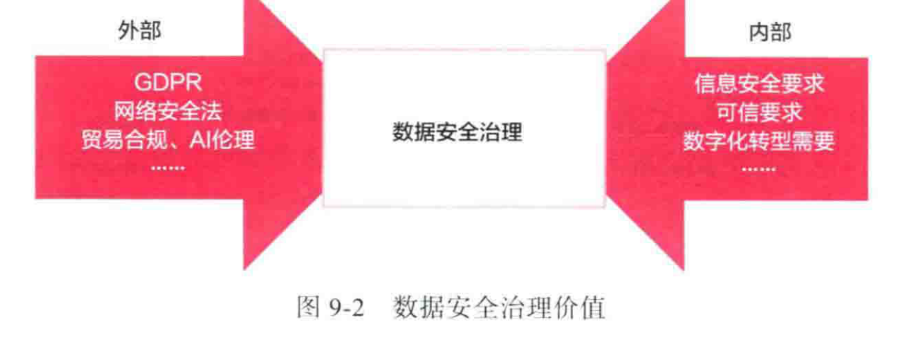
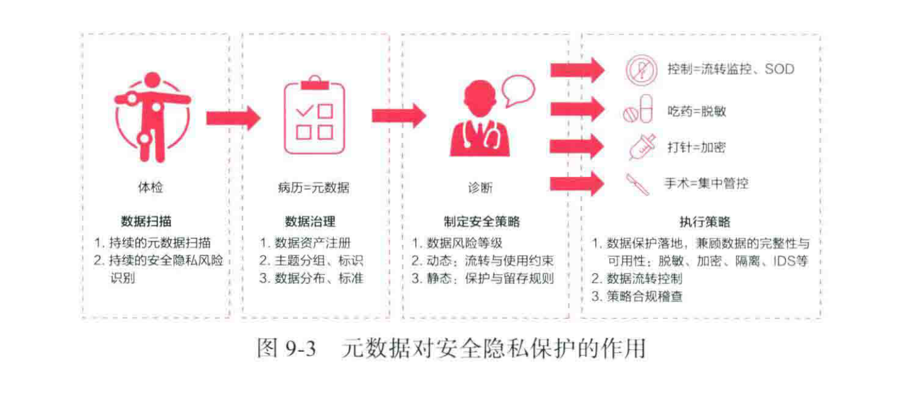
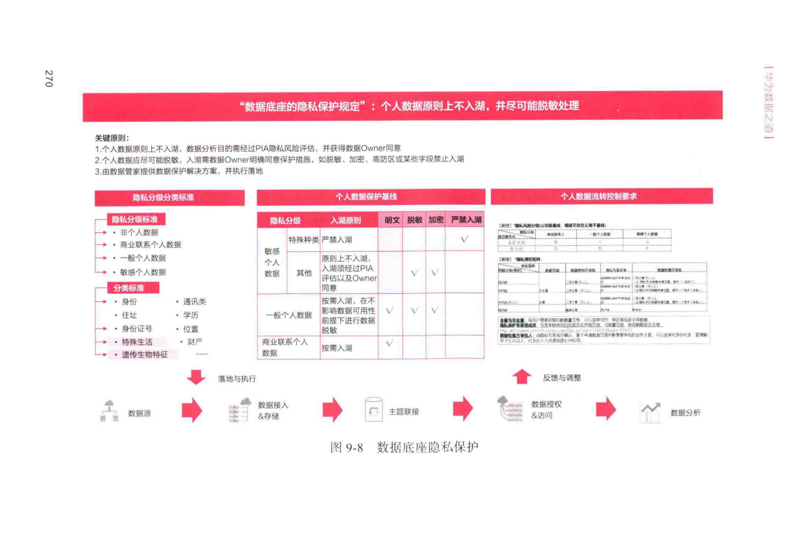
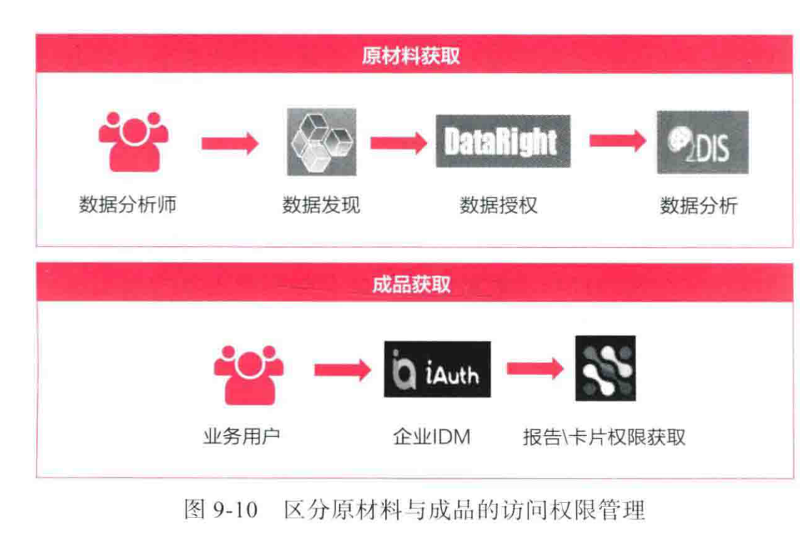

# 9. 打造“安全合规”的数据可控共享能力

在企业进行数据治理、开展数据底座建设工作之前，用户经常面临的一个问题是：使用数据做分析洞察的时候找不到数据，数据分散，或数据获取困难。为了消除**数据孤岛**，华为构建了公司统一的**数据底座**，汇聚、联接了大量的企业数据。然而，大量数据的汇集在一个湖中，如何在内外部合规的基础上，确保业务能够迅速获得所需数据，可控共享，是数字化转型中的关键问题。_如果数据安全问题得不到妥善解决，那么宁愿数字化转型慢一点，也不能在错误的方向上渐行渐远。_

## 1. 内外部安全形势，驱动数据安全治理发展

### 1.1 数据安全成为国家竞争的新战场

随着近年来大数据、数字化转型的兴起，数据的价值获得了极大提升，数据已成为企业和国家的“**战略资源**”和“**生产要素**”。数据管控将成为衡量国家竞争力的重要指标。通过分析各国对网络安全、数据保护、隐私保护的立法进展，可以看出各国的立法进度都在加快。**隐私保护**立法都在向欧盟 **GDPR** 看齐，从原来依靠道德约束保护隐私，上升至法律约束。

### 1.2 数字时代数据安全的新变化

伴随着大数据、人工智能、区块链、物联网、5G等新技术的快速迭代和持续创新，各种新兴技术被越来越广泛地应用到各行各业。我们一定要认识到，现在的网络是不安全的，包括“云”也不是绝对安全的。2019年以来数据泄露事件频发，从数据上看，勒索软件、网络攻击的次数与2018年相比翻了25倍。_“网络不安全”不再是偶然，而是常态，不容忽视。_

数据泄露的路径越来越多元，已经不再限于“黑客攻击”，更多的是企业内部人员、离职员工、第三方外包的泄露行为。可以说“堡垒再坚固，也容易从内部攻破”。这些泄露不是由技能高超的黑客造成的，而是因为企业自身安全管理上的疏忽。

> [!NOTE]
> _根据《数据安全治理白皮书》中关于数据泄露的相关案例统计，泄露源头多样，包括内部人员、合作方、黑客等，涉及政府、教育、社保、医疗等多个领域，说明数据泄露风险普遍存在。_

## 2. 数字化转型下的数据安全共享

**数据安全**是从决策到技术、从管理制度到工具支撑，自上而下贯穿整个组织的全套完整链条。非数字原生企业信息化程度差，存在割裂的信息孤岛，阻碍了企业的数字化转型。随着非数字原生企业的逐步转型，企业拥有的数据资产越来越庞大。商品价值原理告诉我们：“买方的市场需求决定一件商品的价值。”那数据安全的**核心价值**就是“**让数据使用更安全**”。换句话说，数据安全与隐私保护的目标就是解决如何在安全前提下充分共享数据。

**数据安全治理价值模型（文字复现

）**
该模型展示了数据安全治理的核心作用，它位于外部需求和内部需求之间，通过数据治理实现平衡。
*   **外部需求**:
    *   **GDPR**
    *   **网络安全法**
    *   **贸易合规、AI伦理**
*   **内部需求**:
    *   **信息安全要求**
    *   **可信要求**
    *   **数字化转型需要**
*   **中心**: **数据安全治理**

华为在最近几年推进数字化转型，并梳理全部数据资产，明确了数据分类、数据标准、数据分布、元数据注册、访问方式、使用频率等。**数据底座**、生成“**数据地图**”“**数据随需共享**”，成了华为数据治理的主要目标，让数据充分共享并为业务带来价值是数据治理的主题。华为在全球范围内共享的数据服务有几万个，覆盖全球多个国家和不同的业务场景。

_数据是不能藏起来的，数据存储起来就是为了消费，为了创造价值，支撑业务的决策、运营、经营、现场作业。_ 大量的共享对更高要求的、安全合规的基础上的共享提出了更高要求，才能共享数据。

## 3. 构建以元数据为基础的安全隐私保护框架

### 3.1 以元数据为基础的安全隐私治理

在决策层的公司高层已经意识到安全隐私的重要性，在变革指导委员会以及各个高层会议纪要中都明确指明安全隐私是变革优先级非常高的主题，**安全是一切业务的保障**。

基于这个大前提，华为构建了以**元数据**为基础的安全隐私保护框架。在实际的治理过程中，如何利用元数据来管理好我们的安全隐私呢？安全隐私保护好比治疗过程，我们需要先做全面的**体检**（元数据发现），建立**病历**（信息架构、数据分类等），然后由专业医生给出**诊断**（制定策略），也就是策略制定与执行**保护和控制**。整个过程都是以元数据为基础的。

**元数据对安全隐私保护的作用模型（文字复现

）**
这是一个四阶段流程模型，展示了如何基于元数据实现安全隐私保护。
1.  **体检（Physical Exam）**:
    *   **数据扫描**: 持续扫描数据源。
    *   **持续识别**: 持续识别安全隐私风险。
2.  **病历-元数据（Medical Record - Metadata）**:
    *   **数据治理**: 主题分组、数据分类、数据分布、标准。
3.  **诊断（Diagnosis）**:
    *   **制定安全策略**:
        1.  数据保护与存储策略。
        2.  动态、静态与使用约束。
        3.  静态、保留与留存规则。
4.  **执行策略（Execute Strategy）**:
    *   **执行策略**:
        1.  数据保护策略：数据源的完整性与可用性；脱敏、加密、隔离、IDS等。
        2.  数据流转控制。
        3.  数据访问控制。
    *   **输出**: 控制=流转监控、SOD。吃药=报警。打针=加密。手术=集中管控。

**元数据**就是描述数据的数据，即数据的上下文。而数据的管理要求、信息安全要求、网络安全要求、隐私保护要求、法务合规要求等，都是数据的管理要素，当然也可以由元数据承载，用元数据来组织、来描述安全隐私管理策略和约束。

**元数据承载管理要素模型（文字复现图9-4）**
该模型展示了元数据作为核心，承载了多个维度的管理要素。
*   **中心**: **元数据承载管理要素**
*   **关联要素**:
    *   **数据管理**: 完整性、一致性、可用性。
    *   **信息安全**: 保密性。
    *   **全球网络安全与用户隐私保护**: 隐私保护、（客户）网络安全。
    *   **法务合规**: 贸易合规、商业秘密。

### 3.2 数据安全隐私分层分级管控策略

在数据安全隐私管理政策一致性上，全球网络安全与隐私保护办公室和公司信息安全部发布了整体的管理策略，对整个信息安全管理、隐私保护治理体系进行了分层映射，共同管理。

从公司层面，通过对整体内外部安全隐私管理政策的解读，将**信息密级**维度分为五类，要求组织间共享时一致遵从。
1.  **外部公开**: 指可以在公司外部公开发布的信息，不属于保密信息。
2.  **内部公开**: 指可以在全公司范围内公开，但不应向公司外部扩散的信息。
3.  **秘密**: 是公司较为重要或敏感的信息，其泄露会使公司利益遭受损害，且影响范围较大。
4.  **机密**: 是公司非常重要或敏感的信息，其泄露会使公司利益遭受较大损害，且影响范围广泛。
5.  **绝密**: 是公司最重要或敏感的信息，其泄露会使公司利益遭受巨大损害，且影响范围巨大。

基于业务管理的诉求，以内部信息密级维度为基础，从资产的维度增加两类划分，进行针对性管理。
*   **核心资产**: 对应绝密信息，特指公司真正具有商业价值的信息资产。
*   **关键资产**: 属于机密信息，特指对我司在消费者BG、5G领域领先战略竞争对手，在市场竞争中获胜起决定性作用的信息资产。

基于对 **GDPR** 的解读和企业内部的管理需求，将涉及潜在隐私管控需求的数据分为五类进行管理。
1.  **个人数据**: 与一个身份已被识别或身份可被识别的自然人（数据主体）相关的任何信息。
2.  **敏感个人数据**: 指在个人基本权利和自由方面极其敏感，一旦泄露可能会造成人身伤害、财务损失、名誉损害、身份盗窃或欺诈、歧视性待遇等的个人数据。
3.  **商业联系人数据**: 指自然人基于商业联系目的提供的可识别到个人的数据。
4.  **一般个人数据**: 除敏感个人数据、商业联系人以外的个人数据，作为一般个人数据。
5.  **特种个人数据**: GDPR法律中明文确定的特殊种类个人数据，严禁物理入湖，严禁共享及分析。

### 9.3.3 数据底座安全隐私分级管控方案

**数据底座**是“数据随需共享”的关键。但在数据底座建设工作开始之前，业务经常面临的一个问题是，在做数据分析洞察时数据获取艰难，甚至有时即使知道数据在哪里也拿不到。

但在数据底座建设好以后，我们又面临另一个重大问题，那就是在大量的数据汇聚到数据底座之后，如何才能保证这些数据的安全？当前在数据底座中已有超过数万个逻辑实体，上百万张物理表，如果没有任何完善的安全管理措施，这些数据一旦泄露将会是一个巨大的灾难。

所以公司数据底座从建设起，就与公司安全、隐私治理体系之间建立了紧密的关系，在遵从公司安全隐私管理策略的同时，数据底座根据根源操作流程、规范，指导数据工作。在应用数据安全与隐私保护框架和方法基础上，构建了数据底座安全隐私五个方案包。
1.  **数据底座安全隐私管理政策**
2.  **数据风险标识方案**
3.  **数据保护能力架构**
4.  **数据组织授权管理**
5.  **数据个人权限管理**

**数据底座安全隐私保护方案（文字复现

）**
这是一个全面的流程和能力框架图，分为四个主要部分和若干子方案。
*   **管理与控制（顶层）**:
    *   **数据源**: 各级CC、变革项目
    *   **数据消费**: 盘点报告、自助分析、分析结果与密级上线
    *   **数据底座**: 盘点报告、自助分析、分析结果与密级上线
    *   **13项文件支撑**
*   **数据源（左侧）**:
    *   **接入**: 接入数据时分类分级，并对敏感信息进行脱敏、加密、清洗、追溯、满足合规要求。
*   **数据底座（中间）**:
    *   **存储**: 自动分类分级存储，实现数据安全存储。
    *   **低一级授权**: 统一授权。
    *   **分级分析方案**:
        *   **批量联接**: 虚拟联接
        *   **加工**: 数据湖
        *   **数据服务**: 数据服务
*   **数据消费（右侧）**:
    *   **输出**: 根据组合后的密级要求提供数据，并支持审计、水追溯、防拷贝、防截屏、防下载等组织级授权控制。
    *   **使用**: 面向个人分析安全沙箱/个人方案，满足安全要求。

**数据底座安全管理基本原则（文字复现图9-7）**
该原则基于一个矩阵，核心是“**核心资产安全优先，非核心资产效率优先**”。
*   **原则**:
    1.  绝密数据禁止入湖，入湖数据最高密级为机密。
    2.  数据消费方使用数据时遵循最小授权原则，并对数据进行脱敏、加密、清洗、追溯。
    3.  主数据源系统必须承担数据安全与隐私保护责任。
*   **矩阵**:
    *   **行（信息安全密级）**: 绝密、机密、秘密、内部公开、外部公开。
    *   **列（使用场景）**: 核心资产、关键资产、内部资产、外部资产。
    *   **内容**: 矩阵中定义了不同密级和场景组合下的管控策略（如：V表示允许，但需遵从必要措施）。

**数据底座隐私保护管理原则（文字复现图9-8）**
该原则基于一个矩阵，核心是“**个人数据原则上不入湖，并尽可能脱敏处理**”。
*   **原则**:
    1.  个人数据原则上不入湖，数据分析时经PIA及DPIA评估，并获得Owner同意。
    2.  由数据管理责任主体对PIA及DPIA负责，并执行评估。
*   **矩阵**:
    *   **行（隐私分类标准）**: 非个人数据、商业联系人数据、一般个人数据、敏感个人数据、特种个人数据。
    *   **列（个人数据防护措施）**: 特种个人数据入湖、一般个人数据入湖、商业联系人数据入湖、脱敏、加密、加载、严格入湖。
    *   **内容**: 矩阵中定义了不同隐私类型数据的处理方式（如：V表示允许，但需遵从必要措施）。

### 9.3.4 分级标识数据安全隐私

在明确数据分类分级标准的基础上，还需要有具体的平台支撑数据风险标识管理。这就包括传统的元数据人工标识方案以及通过规则、AI自动推荐方案。
1.  **人工识别数据风险**: 数据安全隐私分级标识必须基于元数据平台，在平台中构建对数据字段级的风险标识。
2.  **基于规则与AI的自动识别**: 在数字时代，随着数据资产的膨胀，数据风险标识工作量非常巨大。需要通过工具，基于规则（正则表达式）以及AI机器学习的方式，构建自动推荐、识别风险标识的能力。

## 4. “静”“动”结合的数据保护与授权管理

### 9.4.1 静态控制：数据保护能力架构

在充分识别数据风险并标识数据安全隐私后，数据底座产品还需要提供不同程度的数据保护能力。数据保护能力包括**存储保护**、**访问控制**、**可追溯**三种，每种保护能力都面向不同的业务管理需求。

1.  **存储保护**:
    *   **高防区隔离**: 通过在数据底座独立部署单独的防火墙以及配合流向控制、堡垒机等措施，对高密资产重点防护。
    *   **透明加密**: 透明加密就是对表空间进行加密，进入表空间的数据自动加密，主要是用于防止黑客把库文件搬走。
    *   **对称加密**: 对称加密指应用对数据字段应用对称算法进行加密，需要配合统一的密钥管理服务使用。
    *   **静态脱敏**: 首先需要从技术角度制定出脱敏标准。脱敏不是单一的技术能力，而是多种脱敏算法的合集。

2.  **访问控制**:
    *   **动态脱敏**: 是一项基于身份的访问控制。通常Web应用都是使用自己的菜单和角色权限进行职责分离，对于数据权限，很难做到字段级别的控制。而动态脱敏可以对某些数据表、数据字段根据身份进行脱敏，从而做到更细颗粒度的保护。

3.  **可追溯**:
    *   业界有比较成熟的**数据水印**技术。简单来说，是直接改动数据，在数据行、数据列中增加水印，不影响数据的关联与计算，适用于核心资产或敏感个人数据。一旦发生泄露，可以溯源定责。

### 9.4.2 动态控制：数据授权与权限管理

对数据的保护，只是采取合理和适当的措施保护信息资源，但是数据在组织内部肯定是需要流动的，需要被加工、消费，需要创造价值。

1.  **数据授权管理**:
    *   **数据授权**和**数据权限**是两个不同的概念。数据授权主要是面向组织，指数据Owner对组织授予数据访问权的过程。
    *   **数据加工授权**: 由于数据主题联接资产建设中需要跨组织进行数据联接、加工、训练需要转移数据而产生的数据授权场景。
    *   **数据消费授权**: 由于业务用户数据的分析需要订阅数据服务而产生的数据授权服务。

2.  **数据权限管理**:
    *   **数据权限管理**是基于访问管控规范，对授予的数据访问权限进行管理的过程。
    *   **面向个人**: 指业务制定数据访问管控规范，授予个人数据访问权限的过程，具有与个人绑定、短期有效的特点。
    *   **面向岗位**: 基于IAM（身份识别与访问管理）和IDM（账号权限管理），结合数据分级管理机制，让数据权限随人员流动而改变，并统一规则、集中管控高风险数据，实现对个人权限授予、销权、调动全生命周期集中管控。

**区分原材料与成品的访问权限管理（文字复现

）**
该模型展示了两种不同角色的数据访问路径。
*   **原材料获取（面向数据分析师）**:
    *   数据分析师 -> 数据发现 -> **DataRight** (数据授权) -> **DIS** (数据服务) -> 数据分析
*   **成品获取（面向业务用户）**:
    *   业务用户 -> 企业IDM -> **iAuth** (权限申请) -> 报告/卡片权限获取

## 5. 本章小结

数字技术正在构建一个全新世界。在数字时代这个大风暴中，数据的安全隐私管理无异于风暴之眼，纷乱的外部因素与企业自身特定的安全威胁正在共同影响着整体安全隐私态势。所以数据保护和数据共享作为一对矛盾体，将不断引入新的理念。国际数据空间技术、“链条控制”转向“集中管控”、构建基于元数据的管理、影响小、非介入式的公司级数据安全隐私保护平台，都会在数字时代不断演进，不断发展。