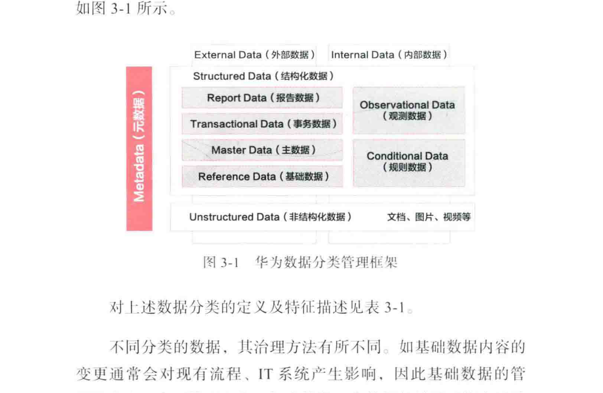
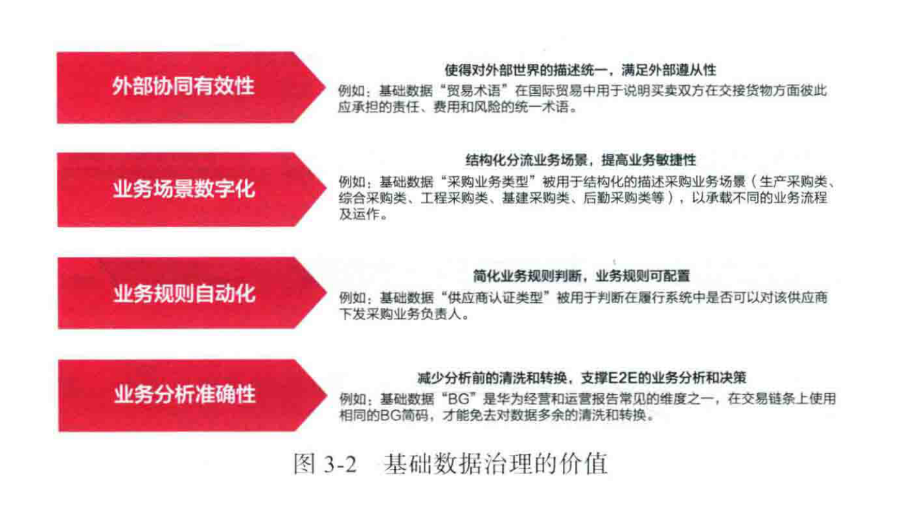
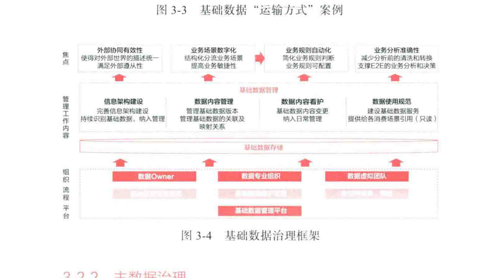
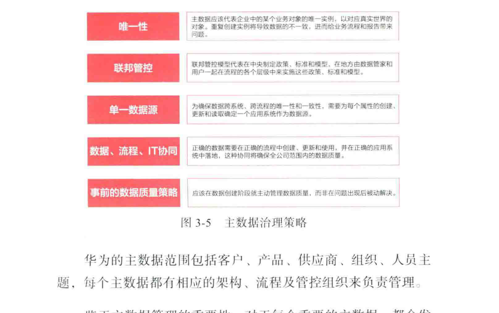
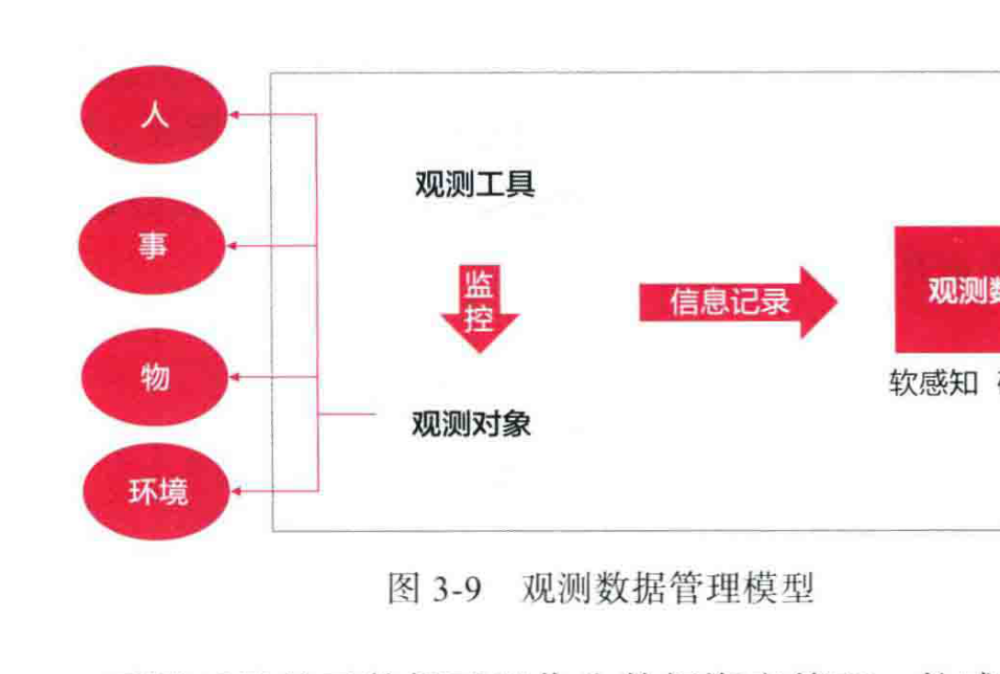

# 华为数据之道：第三章 - 差异化的企业数据分类管理框架

不同的企业或组织基于不同的目的，可以从多个角度对数据进行分类，如结构化数据和非结构化数据、内部数据和外部数据、原始数据和衍生数据、明细数据和汇总数据等。华为在业界的数据分类基础上，结合自身多年的实践，已形成完整的**数据分类管理框架**。华为对数据进行分类的目的，是为了针对不同特性的数据采取不同的管理策略，以期实现最大的投入产出比。

---

## 1. 基于数据特性的分类管理框架

华为根据数据特性及治理方法的不同对数据进行了分类定义：**内部数据**和**外部数据**、**结构化数据**和**非结构化数据**、**元数据**。其中，结构化数据又进一步划分为**基础数据**、**主数据**、**事务数据**、**报告数据**、**观测数据**和**规则数据**。

**华为数据分类管理框架（
.png)
](images/.png)
 复现）**

该框架是一个层级化的分类体系：
*   **顶层分类**：将数据分为**外部数据 (External Data)** 和 **内部数据 (Internal Data)**。
*   **内部数据分类**：进一步分为**结构化数据 (Structured Data)** 和 **非结构化数据 (Unstructured Data)**。
    *   **结构化数据**包含六个子类：
        1.  **报告数据 (Report Data)**
        2.  **观测数据 (Observational Data)**
        3.  **事务数据 (Transactional Data)**
        4.  **规则数据 (Conditional Data)**
        5.  **主数据 (Master Data)**
        6.  **基础数据 (Reference Data)**
    *   **非结构化数据**包含的示例：文档、图片、视频等。
*   **元数据 (Metadata)**：作为一个贯穿所有数据类型的特殊类别，它描述了其他所有数据。

**数据分类定义及特征描述（表 3-1 复现）**

| 分类维度 | 数据分类名称 | 定义 | 特征 | 举例 |
| :--- | :--- | :--- | :--- | :--- |
| 按数据主权所属分类 | **External Data** (外部数据) | 华为通过合法渠道获取的非华为数据 | 客观存在，其产生、修改及失效的影响在华为外部 | 国家、币种、汇率 |
| 按内部/外部划分 | **Internal Data** (内部数据) | 企业内部经营产生的数据 | 在企业的业务流程中产生或业务管理规定中定义，受企业经营影响 | 合同、项目、组织 |
| 从数据存储结构和非结构化分类 | **Structured Data** (结构化数据) | 可存储在关系数据库里，用二维表结构来表达实现的数据 | 1. 可以用关系模型来操作和存储 2. 先有数据结构，再产生数据 | 国家、币种、组织、产品、客户 |
| | **Unstructured Data** (非结构化数据) | 形式和相对不固定，不方便使用数据库二维逻辑表来表现的数据 | 1. 形式多样，无法用关系数据模型存储 2. 数据通常非常庞大 | 网页、图片、视频、音频、XML |
| 从数据存在特性、结构化或非结构化分类 | **Reference Data** (基础数据) | 用以给结构化的语言描述提供统一、有价值的限定范围的数据，是实现业务规则的核心数据 | 1. 通常有一个有限的允许值范围 2. 静态数据，非常稳定，很少变化 3. IT的开关、职责、权限的划分或分发审计报告的维度 | 合同类型、职级、国家、币种 |
| | **Master Data** (主数据) | 具有高业务价值的、可在企业内跨流程系统被重复使用的数据，具有唯一、权威的数据源 | 1. 通常是业务事件的参与方，可以跨流程、跨系统查询和浏览 2. 取值不受限于预先定义的规定范围 3. 在业务事件发生之前就客观存在，比较稳定 4. 主数据的补充描述通过专门的人工数据范围 | 实体组织、客户、人员基础数据 |
| | **Transactional Data** (事务数据) | 用于记录企业经营过程中的业务事件，其实质是数据之间活动产生的数据 | 1. 有较强的时间有效性，通常是一次性的 2. 事务数据无法被竞争主数据独立存在 | BOQ、支付指令、生产计划 |
| | **Observational Data** (观测数据) | 观测者通过观测工具获取的对行为过程的记录数据 | 1. 通常数据量较大 2. 数据是过程性的，主要用于性能分析 3. 可以由机器自动采集 | 系统日志、物联网数据、运输过程中产生的GPS数据 |
| | **Conditional Data** (规则数据) | 结构化描述业务规则，关联关系（一般为决策关系、关联关系表、评分卡等形式）的数据，是实现业务规则的核心数据 | 1. 规则数据不实例化 2. 规则数据的结构在纵向和横向两个维度是相对稳定的，变化形式多为内容刷新 3. 规则数据的变化对业务活动的影响是大的范围的 | 员工报销遵从性评分规则、出差补助规则 |
| 从描述数据的手段上分类 | **Meta-data** (元数据) | 是指对数据进行处理加工后，用作业务决策依据的数据 | 1. 通常需要对数据进行加工处理 2. 通常需要对不可来源的数据进行清洗、转换、聚合、以更好地进行分析 3. 维度、指标是报告数据 | 收入、成本 |
| | **Meta-data** (元数据) | 定义一个企业所使用的数据，是有描述性标签，描述了数据（数据仓库、业务流程、数据模型、相关概念（如业务术语、数据指标、技术架构）以及数据规则和约束的数据）的物理和逻辑结构的信息 | 是描述数据的数据，是有关数据的数据 | 数据标准、业务术语、数据模型、数据标准、业务规则、数据沿袭、数据安全、技术架构 |

---

## 2. 以统一语言为核心的结构化数据管理

结构化数据包括基础数据、主数据、事务数据、报告数据、观测数据、规则数据。结构化数据的共同特点是以信息架构为基础，建立统一的数据资产目录、数据标准与模型。

### 2.1 基础数据治理

**基础数据**通常是静态的（如国家、币种），也称作参考数据。在业务事件发生之前就已经预先定义。它的可选值数量有限，可以用来作为业务或IT的开关和判断条件。

**基础数据治理的价值（

 复现）**
*   **外部协同有效性**：例如，基础数据“贸易遵从”用于说明国家间交互货物的遵从性、费用和风险的统一术语。
*   **业务场景数字化**：例如，基础数据“采购业务场景”用于结构化描述采购业务场景，以承载不同的业务流程及运作。
*   **业务规则自动化**：例如，基础数据“供应商认证类型”被用于判断在履行系统中的供应商是否可以下达采购业务订单。
*   **业务分析准确性**：例如，基础数据“BG”是华为经营和运营报告常见的维度之一，在交易链上使用相同的BG编码，才能免去对数据多余的清洗和转换。

**基础数据治理框架（

 复现）**
华为构建了完整的**基础数据管理框架**，通过明确各方的管理责任、发布相关的流程和规范以及建立基础数据管理平台等来确保基础数据的有效管理。
*   **治理层面**：
    *   **信息架构建设**：完善信息架构，纳入管理范围。
    *   **数据内容管理**：管理基础数据版本及变更，提高业务敏捷性。
    *   **数据内容看护**：基础数据内容变更要纳入IT看管。
    *   **数据使用规范**：建设基础数据服务，提供给消费者订阅（只读）。
*   **存储层面**：**基础数据存储**。
*   **平台层面**：**基础数据管理平台**。
*   **组织层面**：**数据Owner**、**数据专业组织**、**数据虚拟团队**。

### 2.2 主数据治理

**主数据**是参与业务事件的主体或资源，是具有高业务价值的、跨流程和跨系统复用的数据。主数据的错误可能导致成百上千的事务数据错误，因此最重要的管理要求是确保同源多用和重点进行数据内容的校验。

**主数据治理策略（

 复现）**
1.  **唯一性**：主数据应该代表企业中的某个业务对象的唯一、真实世界的一致对应，进而给业务带来价值。
2.  **联邦管控**：采用联邦管控模式，在地方由数据管家和用户一起在流程的各个层级中来实施这些政策、标准和模型。
3.  **单一数据源**：为确保数据系统、跨流程的唯一性和一致性，需要为每个属性的创建、更新和读取确定一个应用系统作为数据源。
4.  **数据、流程、IT协同**：正确的数据需要在正确的流程中创建、更新和使用，并在正确的应用系统中落地，这种协同将确保跨公司范围的数据质量。
5.  **事前的数据质量策略**：应该在数据创建阶段就主动管理主数据质量，而非在问题出现后被动解决。

**华为客户主数据治理实践**
*   **背景与挑战**：在治理前，一个客户编码存在多个BG属性，导致无法直接基于客户维度生成BG报告；下游系统违规录入客户数据，影响财报准确性；客户信息不完整，数据架构不灵活。
*   **解决方案**：
    1.  **架构重构**：制订了客户数据管理及服务化架构方案，以客户数据质量为核心，严控数据流入与流出端口，搭建客户数据管理及服务平台，统一数据架构和标准。
    2.  **两级架构**：制订了 **Account & Legal Entity** 两级架构。
        *   **Account**：用于华为公司市场拓展、销售管理及数据归集等内部经营管理，是不具备与华为公司签约资格的对象。
        *   **Legal Entity (法人客户)**：是依法具有民事权利能力和民事行为能力，依法独立享有民事权利和承担民事义务，具备与华为公司签约资格的对象。
*   **治理成果**：
    1.  **实现“数出一孔”，提高数据质量**：提高了数据准确性与及时性，减少了不同部门之间的对账成本。
    2.  **满足内外部遵从的要求**：实现数据“一点录入，多点调用”，满足财报内控及内外部审计要求。
    3.  **支持交易易流打通**：满足各流程对客户数据的要求，降低合同非正常变更及退票风险。
    4.  **支持经营分析和价值评价**：支持基于客户视角生成BG管理报告与各业务部门经营管理分析。
    5.  **支持价值挖掘，聚焦优质客户**：支持客户360度分析，驱动优质资源瞄准优质客户。

### 2.3 事务数据治理

**事务数据**在业务和流程中产生，是业务事件的记录，其本身就是业务运作的一部分。事务数据是具有较强时效性的一次性业务事件，通常在事件结束后不再更新。事务数据的治理重点就是管理好事务数据对主数据和基础数据的调用，以及事务数据之间的关联关系，确保上下游信息传递通畅。

### 2.4 报告数据治理

**报告数据**指对数据进行处理加工后，用作业务决策依据的数据。它用于支持报告和报表的生成。报告数据涵盖的范围较广，其组成部分包括：
*   **事实表**：从业务活动或者事件中提炼出来的性能度量。
*   **维度**：用于观察和分析业务数据的视角，支持对数据进行汇聚、钻取、切片分析。
*   **统计型函数**：与指标高度相关，是对指标数量特征进一步的数学统计，例如均值、中位数、总和、方差等。
*   **趋势型函数**：反映指标在时间维度上变化情况的统计方式，例如同比、环比、定基比等。
*   **报告规则数据**：一种描述业务决策或过程的陈述，通常是基于某些约束下产生结论或需要采取的某种措施。
*   **序列关系数据**：反映报告中指标与其他数据序列关系的数据。

### 2.5 观测数据治理

**观测数据**是通过观测工具获取的数据，观测对象一般为人、物、事、环境。其特点是数据量较大且是过程性的，由机器自动采集生成。
*   **感知方式**：
    *   **软感知**：使用软件或者各种技术进行数据收集，采集的对象存在于数字世界，通常不依赖于物理设备。
    *   **硬感知**：利用设备或装置进行数据收集，采集的对象为物理世界中的物理实体。
*   **管理模型（

 复现）**：
    *   输入：人、事、物、环境。
    *   工具：通过**观测工具**（如监控探头）进行观测。
    *   记录：生成**信息记录**。
    *   输出：形成**观测数据**（软感知/硬感知）。
*   **治理原则**：_原则上，观测对象要定义成业务对象进行管理，这是观测数据管理的前提条件。_

### 2.6 规则数据治理

**规则数据**是结构化描述业务规则变量的数据，是实现业务规则的核心数据。
*   **特征**：
    1.  规则数据不可实例化。
    2.  规则数据包含判断条件和决策结果两部分信息。
    3.  规则数据的结构在纵向（列）、横向（行）两个维度上相对稳定，变化形式多为内容刷新。
    4.  规则数据的变更对业务活动的影响是大范围的。
*   **基本原则**：
    1.  规则数据的管理是为了支撑业务规则的结构化、信息化、数字化，目标是实现规则的可配置、可视化、可追溯。
    2.  规则数据的管理具有轻量化、分级的特点。
    3.  业务规则在架构层次上与流程中的业务活动相关联。
    4.  业务规则包含规则变量和变量之间的关系。

---

## 3. 以特征提取为核心的非结构化数据管理

随着大数据分析需求的日益增长，**非结构化数据**的管理逐渐成为数据管理的重要组成部分。非结构化数据的核心是对其基本特征与内容进行提取，并通过元数据落地来开展的。

**非结构化数据管理模型（
.png)
](images/.png)
1 复现）**
1.  **数据源**：非结构化数据（文档、音频、视频等）。
2.  **元数据管理**：通过**元数据**（基本特征类、内容增强类）对数据进行**描述**和**解析**。
3.  **补充/增强**：对解析后的元数据进行补充和增强。
4.  **Data Lab**：将增强后的元数据送入**数据实验室 (Data Lab)**，利用**分析算法和技术**（如NLP、分类、聚类）进行深度分析，实现对全企业非结构化数据内容的搜索、查询。

**非结构化数据处理流程（
.png)
](images/.png)
2 复现）**
这是一个从原始数据到可视化的完整流程：
1.  **Collect**：从各种来源（如社交媒体、网站、文件）收集非结构化数据。
2.  **Information Extraction**：提取信息。
3.  **Standardize & Consolidation**：标准化与整合。
4.  **Filter & Prioritize**：过滤与排序。
5.  **Reporting & Visualization**：报告与可视化。
*   _注：在此过程中，元数据（基本特征、内容增强）存储在**关系型数据库 (Relational DB)** 中，而结构化后的数据分析则利用**图数据库 (Graph DB, 如Neo4j)** 进行。_

---

## 4. 以确保合规遵从为核心的外部数据管理

**外部数据**是指华为公司引入的外部组织或者个人拥有处置权的数据，如供应商资质证明、消费者洞察报告等。外部数据治理的出发点是合规遵从优先，与内部数据治理的目的不同。

**外部数据管理的主要原则**：
1.  **合规优先原则**：遵从法律法规、采购合同、客户授权、公司信息安全与公司隐私保护政策等相关规定。
2.  **责任明确原则**：所有引入的外部数据都要有明确的管理责任主体，承担数据引入方式、数据安全要求、数据隐私要求、数据共享范围、数据使用授权、数据质量监管、数据退出销毁等责任。
3.  **有效流动原则**：使用方优先使用公司已有数据资产，避免重复采购、重复建设。
4.  **可审计、可追溯原则**：控制访问权限，留存访问日志，做到外部数据使用有记录、可审计、可追溯。
5.  **受控审批原则**：在授权范围内，外部数据管理责任主体应合理审批使用方的数据获取要求。

---

## 5. 作用于数据价值流的元数据管理

无论是结构化数据、非结构化数据，或者外部数据，最终都会通过**元数据治理**贯穿整个数据价值流，覆盖从数据产生、汇聚、加工到消费的全生命周期。

### 5.1 元数据治理面临的挑战

在进行元数据治理以前，华为遇到的痛点主要表现为**数据找不到、读不懂、不可信**。
*   **场景一**：某子公司需要从发货数据里对设备保修和维保进行区分，用来对不过保设备进行服务场景分析。为此，数据分析师需要面对几十个IT系统，不知道该从哪里拿到合适的数据。
*   **场景二**：因盘点内部要货的研发领料情况，需要从IT系统中获取研发内部内部的要货数据，面对复杂的数据库存储结构，业务部门的数据分析师无法读懂物理层数据，只能提出需求向IT系统求助。

### 5.2 元数据架构及策略

为解决以上痛点，华为建立了公司级的元数据管理机制，制定了统一的元数据管理方法、机制和平台，拉通业务语言和机器语言。**“入湖有依，出湖可检”** 成为华为元数据管理的使命与目标。

**元数据分类**
*   **业务元数据**：用户访问数据时了解业务含义的途径，包括资产目录、Owner、数据密级等。
*   **技术元数据**：实施人员开发系统时使用的数据，包括物理模型的表与字段、ETL规则、集成关系等。
*   **操作元数据**：数据处理日志及运营情况数据，包括调度频度、访问记录等。

**元数据管理整体方案（
.png)
](images/.png)
4 复现）**
该方案围绕一个**元数据中心**展开，包含四大核心流程和两大规范：
*   **四大流程**：
    1.  **产生元数据**：在IT产品开发过程中实现业务元数据与技术元数据的连接。
    2.  **采集元数据**：通过统一的元模型从各类IT系统中自动采集元数据。
    3.  **注册元数据**：基于增量与存量两种场景，制定元数据注册方法，完成底座元数据注册工作。
    4.  **运维元数据**：打造公司元数据中心，管理元数据产生、采集、注册的全过程，实现元数据运维。
*   **两大规范**：**管理流程** 和 **管理规范**。
*   **消费端**：提供元数据查询/搜索、血缘分析、影响分析、数据标准合规检查等服务。

### 5.3 元数据管理

#### 1. 产生元数据
*   **数据资产编码规范（表 3-2 复现）**：华为为数据资产编码定义了业务元数据和技术元数据两大类。
    *   **业务元数据**：主题域分组、主题域、业务对象、逻辑实体、属性、数据标准。
    *   **技术元数据**：数据库、Schema、表、字段。
*   **数据资产编码原则**：
    *   **统一性原则**：华为公司内部只能使用一套数据资产编码。
    *   **唯一性原则**：每一个数据资产